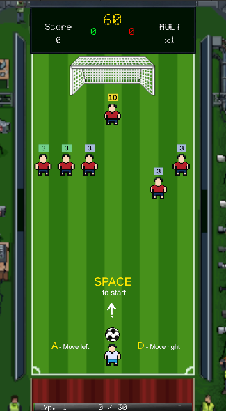

<div align="center">

# ⚽ Futboloid

**Arkanoid meets football. You are the goalkeeper-paddle.**

[](https://unity.com/)
[](https://unity.com/srp/universal-render-pipeline)
[](https://docs.microsoft.com/en-us/dotnet/csharp/)
[](https://github.com/DeployChef/Futboloid)

*A fast-paced arcade roguelite where you defend your goal, smash through the opposition, and score — one bounce at a time.*

[Gameplay](#-gameplay) · [Features](#-features) · [Controls](#-controls) · [Tech Stack](#-tech-stack) · [Getting Started](#-getting-started)

</div>

---

## 📸 Screenshot

<div align="center">



*Level 1 kickoff. Clear the defenders, chain combos, and find the back of the net before time runs out.*

</div>

---

## 🎮 Gameplay

**Futboloid** is a high-energy mashup of classic **Arkanoid**, **football**, and **roguelite** progression.

You play as a **goalkeeper-paddle** at the bottom of the pitch. The ball ricochets automatically off you — your job is to **position**, **aim**, and **control the chaos** as it tears through the enemy line.

### Core loop

```
Serve the ball → Bounce & chain hits → Score goals → Reshuffle the pitch → Repeat
```

| Phase | What happens |
|-------|--------------|
| **Kickoff** | Press `Space` to put the ball in play. The 90-second match timer starts on first serve. |
| **Rally** | The ball speeds up with every keeper touch. Hit defenders to earn points and build your combo multiplier. |
| **Goal** | Score past the enemy goalkeeper — defenders reshuffle, dead players stay out, survivors heal 25%. |
| **Level-up** | Earn run XP from hits and kills. Pause mid-match and pick **1 of 3** perk cards. |
| **Victory** | Win by goals when time expires — or wipe the entire squad for an early finish. |

### Combo system

Each ball rally is a scoring session. Chain hits and goals to raise your **MULT** — but the multiplier resets the moment the ball returns to your keeper. Risk long rallies for massive payoffs.

### Enemy squad

Every opponent is a single **Defender** entity — field players and goalkeepers share the same DNA, only their **role** changes:

- **Field players** patrol, wander, chase, or hold position — each with unique HP and behavior
- **Goalkeeper** guards the top goal on a parabolic path along the goal line
- **Kill the GK?** A living field player sprints to replace them — leaving the net wide open until they arrive

---

## ✨ Features

- 🕹️ **Instant arcade feel** — kinetic ball physics without Rigidbody chaos; pure direction + speed simulation
- ⚡ **Escalating tempo** — ball acceleration, defender reshuffles, and goalkeeper substitutions keep pressure high
- 🔥 **Combo multiplier** — score big by chaining hits and goals within a single rally
- 🃏 **Roguelite perks** — stack run-long upgrades picked from random card offers during matches
- 🏆 **Tournament runs** — fight through a generated bracket of opponents across a full run
- 🎨 **Retro pixel-art pitch** — stadium sidelines, animated crowd, crisp HUD with score, timer, and XP bar
- 🔊 **Dynamic audio** — layered SFX with priority mixing tied to gameplay events
- 🧩 **Modular architecture** — event bus, DI containers, and layered FSMs built for iteration

---

## 🕹️ Controls

| Input | Action |
|-------|--------|
| `A` / `←` | Move keeper left |
| `D` / `→` | Move keeper right |
| `Space` | Serve ball / kickoff after goal |
| `Esc` | Pause |

> Touch and gamepad support are planned. The game boots straight onto the pitch — no main-menu friction.

---

## 🛠️ Tech Stack

| Layer | Technology |
|-------|------------|
| **Engine** | Unity 6 (6000.4.0f1) |
| **Rendering** | Universal Render Pipeline (URP) |
| **Input** | Unity Input System |
| **DI** | [VContainer](https://github.com/hadashiA/VContainer) |
| **Async** | [UniTask](https://github.com/Cysharp/UniTask) |
| **Animation / Tween** | DOTween, Unity 2D Animation |
| **Art pipeline** | Aseprite, PSD Importer, Sprite Shape |

### Code architecture

The project is split into focused assemblies under `Assets/_Projects/Code/`:

```
Futboloid.Core      → Event bus, run progression, status effects, shared contracts
Futboloid.Main      → Startup, GameDirector, app-level FSM, DI root scopes
Futboloid.Gameplay  → Ball motion, keeper, defenders, match flow, pitch FSM
Futboloid.UI        → HUD, overlays, menus, scene transitions
Futboloid.Editor    → Custom inspectors and authoring tools
```

Key design choices:

- **Event-driven** — gameplay systems communicate through a typed event bus (`DefenderHitEvent`, `GoalScoredEvent`, `BallServedEvent`, …)
- **Service + View** — match logic lives in DI-registered services; `MonoBehaviour` views handle presentation
- **Dual FSM** — one state machine for app navigation, another for pitch phases (`KickoffWait` → `Simulating` → `Reshuffle` → `BonusPick`)
- **Kinematic ball** — `CircleCast` reflection with configurable hit behaviors per defender archetype

---

## 🚀 Getting Started

### Prerequisites

- [Unity Hub](https://unity.com/download) with **Unity 6000.4.0f1** (or compatible Unity 6 editor)
- Git LFS *(if used for large assets)*

### Clone & open

```bash
git clone https://github.com/DeployChef/Futboloid.git
cd Futboloid
```

Open the project folder in Unity Hub. On first launch, Unity will resolve packages from `Packages/manifest.json` (VContainer, UniTask, URP, Input System, etc.).

### Run the game

1. Open `Assets/_Projects/Scenes/Root.unity`
2. Press **Play**
3. Hit **Space** to serve — the match begins

Build settings include `Root.unity` and `Game.unity` (loaded additively at runtime).

---

## 📁 Project Structure

```
Futboloid/
├── Assets/
│   └── _Projects/
│       ├── Code/           # C# assemblies (Core, Main, Gameplay, UI, Editor)
│       ├── Scenes/         # Root + Game scenes
│       ├── Resources/      # Prefabs, fonts, ScriptableObject data
│       ├── Art/            # Sprites, animations, VFX
│       ├── Audio/          # SFX, music, mixers
│       └── Prefabs/        # Runtime prefabs
├── Packages/               # Unity package manifest
├── ProjectSettings/
├── Wiki/                   # Internal GDD & architecture docs (Obsidian)
└── docs/                   # README assets
```

> Internal design documentation lives in `Wiki/FutboloidWiki/` — game design, architecture decisions, audio catalog, and system maps.

---

## 🗺️ Roadmap

Futboloid is in active development. Systems on the horizon:

- [ ] Tribune hazards — objects thrown from the crowd
- [ ] Referee interference — unpredictable pitch events
- [ ] Full tournament bracket UI with comeback mechanics
- [ ] Touch & gamepad input profiles
- [ ] Expanded perk pool with risk/reward trade-offs
- [ ] WebGL / mobile builds

---

## 🤝 Contributing

Contributions are welcome! If you'd like to help:

1. Fork the repository
2. Create a feature branch (`git checkout -b feature/amazing-thing`)
3. Commit your changes with a clear message
4. Open a Pull Request

Please keep changes scoped and aligned with the existing architecture (event bus, VContainer scopes, asmdef boundaries).

---

## 📬 Contact

Questions, feedback, or collab ideas? Open an [issue](https://github.com/DeployChef/Futboloid/issues) or reach out directly.

---

<div align="center">

**Built with ⚽ and pixels.**

*Futboloid — control the chaos.*

</div>
