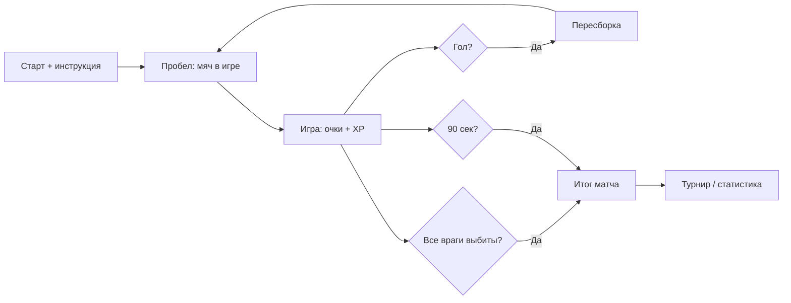

---
tags:
  - gdd
  - core-loop
---

# 2. Игровой цикл (Core Loop)

← [[01 Обзор и философия]] | [[Индекс GDD v6]] | Далее: [[03 Физика и управление вратарём]]

## Core Loop (один матч)

### Старт

- Игрок видит персонажа
- Показывается инструкция:
  - **A / D** — движение
  - **Пробел** — ввод мяча в игру

### Процесс

- Набивание очков: выбивание защитников, забивание голов
- Мяч **автоматически** отскакивает от вратаря
- Сбор **XP** с поверженных врагов

### Пересборка (после гола)

> Мгновенный сброс позиций.

| Категория защитников | Поведение |
|---------------------|-----------|
| **Живые** | Восстанавливают здоровье, возвращаются на места |
| **Уничтоженные** | Выбывают до конца матча |

После пересборки — снова ввод мяча: игрок может пнуть в **окне ввода**; если не успел — **автосерв** (идея, см. [[../Архитектура/MatchFlow и таймер#KickoffWait: окно ввода (идея, не реализовано)|архитектура]]). См. [[03 Физика и управление вратарём#Ввод мяча в игру]].

### Окончание матча

Матч заканчивается **двумя** способами:

| Условие | Исход |
|---------|--------|
| Истекло **90 секунд** (+ добавочное время) | Победитель по **счёту голов** |
| **Все** футболисты соперника выбиты до истечения таймера | **Досрочная победа игрока** (счёт голов может быть любым) |

При досрочной победе:

- Таймер останавливается, фаза → `MatchEnded`.
- Возможен **бонус к очкам / XP** за «чистую зачистку» — **TBD**, решим при внедрении системы очков ([[04 Механики мяча и комбо]], `ComboScoreService`).

> «Все враги» = нет живых `DefenderView` соперника (включая вратаря в режиме `Goalkeeper`). Подробнее: [[07 Противник — вратарь и футболисты#Досрочная победа (вайп команды)]].

После любого окончания:

- Подсчёт итога (голы + будущие бонусы)
- Переход к мета-циклу (турнир / статистика)

## Мета-цикл

После матча:

1. Переход к **турнирной сетке**
2. Отображение **статистики**
3. Подготовка к **следующему противнику**

См. [[05 Меню UI и переходы#5.1. Главное меню|главное меню]] и турнир.

## Диаграмма фаз матча

## Связанные системы

- [[04 Механики мяча и комбо]] — очки и множитель в процессе
- [[07 Противник — вратарь и футболисты]] — футболисты, пересборка, **досрочная победа**
- [[Составляющие (карта систем)#5. Защитники и поле|Защитники]] — карта систем
- [[06 HUD и визуальный фидбек#Таймер матча|HUD: таймер]]
