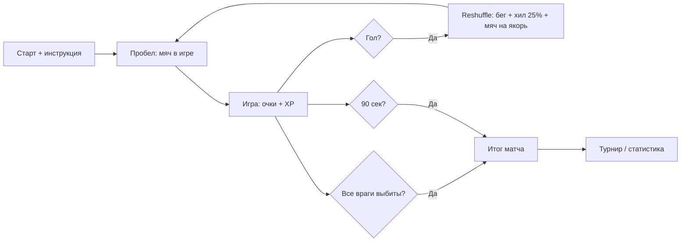

---
tags:
  - gdd
  - core-loop
---

# 2. Игровой цикл (Core Loop)

← [[01 Обзор и философия]] | [[Индекс GDD v6]] | Далее: [[03 Физика и управление вратарём]]

## Core Loop (один матч)

### Старт

- Игрок видит персонажа
- Показывается инструкция:
  - **A / D** — движение
  - **Пробел** — ввод мяча в игру

### Процесс

- Набивание очков: выбивание защитников, забивание голов
- Мяч **автоматически** отскакивает от вратаря
- Сбор **XP** с поверженных врагов

### Пересборка (после гола)

Фаза **`Reshuffle`** — **не** мгновенный телепорт. Мяч **анимируется** на кик-офф (не в симуляции отскоков). **Таймер матча не останавливается** — как в футболе, игра не на паузе.

| Категория | Поведение |
|-----------|-----------|
| **Убитые за матч** | **Не** воскрешаются, слот пустой |
| **Живые** | **+25%** от max HP (не полное лечение), бегут на **свои** места |
| **Текущий вратарь** | Если жив (в т.ч. бывший полевой после замены) — остаётся вратарём у ворот, **стартового GK не воскрешаем** |
| **Мяч** | Анимация перелёта на `BallKickoffAnchor` |

**Анимации:** футболисты перебегают на слоты / ворота, короткий VFX хила (+25%). См. [[06 HUD и визуальный фидбек#Выход и возврат защитников]], [[../Архитектура/Машины состояний#Reshuffle (после гола)]].

После `Reshuffle` → `KickoffWait` — снова окно ввода (Пробел / автосерв).

### Окончание матча

Матч заканчивается **двумя** способами:

| Условие | Исход |
|---------|--------|
| Истекло **90 секунд** (+ добавочное время) | Победитель по **счёту голов** |
| **Все** футболисты соперника выбиты до истечения таймера | **Досрочная победа игрока** (счёт голов может быть любым) |

При досрочной победе:

- Таймер останавливается, фаза → `MatchEnded`.
- **Анимация / фидбек** «досрочная победа, врагов не осталось».
- Бонус к очкам / XP — **TBD** (отдельная задача по скорингу).

> «Все враги» = нет живых `DefenderView` соперника (включая вратаря в режиме `Goalkeeper`). Подробнее: [[07 Противник — вратарь и футболисты#Досрочная победа (вайп команды)]].

После любого окончания:

- Подсчёт итога (голы + будущие бонусы)
- Переход к мета-циклу (турнир / статистика)

## Мета-цикл

После матча:

1. Переход к **турнирной сетке**
2. Отображение **статистики**
3. Подготовка к **следующему противнику**

См. [[05 Меню UI и переходы#5.1. Главное меню|главное меню]] и турнир.

## Диаграмма фаз матча

## Связанные системы

- [[04 Механики мяча и комбо]] — очки и множитель в процессе
- [[07 Противник — вратарь и футболисты]] — футболисты, пересборка, **досрочная победа**
- [[Составляющие (карта систем)#5. Защитники и поле|Защитники]] — карта систем
- [[06 HUD и визуальный фидбек#Таймер матча|HUD: таймер]]
