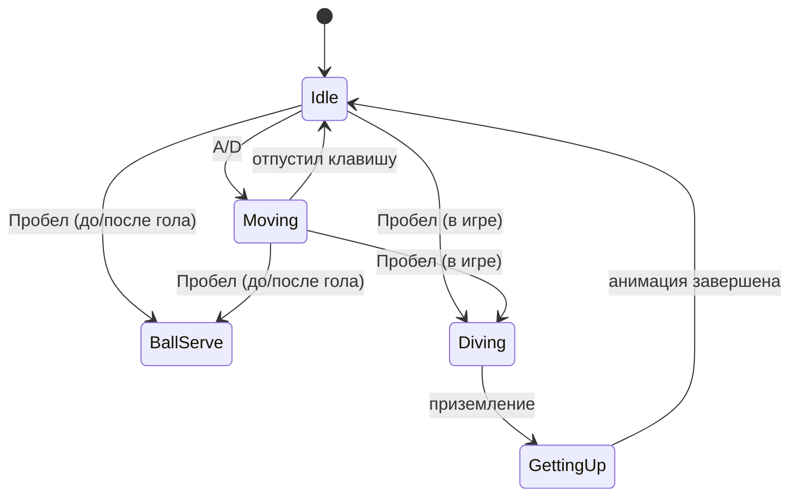

---
tags:
  - gdd
  - player
  - controls
---

# 3. Физика и управление персонажем (Вратарём)

← [[02 Игровой цикл]] | [[Индекс GDD v6]] | Далее: [[04 Механики мяча и комбо]]

## Управление

| Ввод | Контекст | Действие |
|------|----------|----------|
| **A / D** | Всегда (кроме lockdown) | Горизонтальное движение |
| **Пробел** | Начало матча / после гола | Ввод мяча в игру |
| **Пробел** | Во время игры | Прыжок / сейв (Dive) |

## Челночный бег (инерция)

Персонаж **не** меняет направление мгновенно.

При смене вектора движения:

1. **Торможение**
2. **Остановка**
3. **Разгон** в новом направлении

> [!tip] Реализация
> Процедурная анимация через DOTween — см. [[06 HUD и визуальный фидбек#Анимация вратаря]].

## Ввод мяча в игру

- **Когда:** начало матча или сразу после гола (после [[02 Игровой цикл#Пересборка (после гола)|пересборки]])
- **Как:** нажатие Пробела
- **Результат:** мяч запускается в игру

Связь с [[04 Механики мяча и комбо#Сессия мяча|сессией мяча]] — новая сессия начинается с отскока от вратаря.

## Прыжок / сейв (Dive)

- **Когда:** Пробел **во время активной игры** (мяч уже в полёте)
- **Направление:** в сторону текущего движения
- **Назначение:** экстренный рывок для сейва

## Штраф за прыжок

После dive вратарь **падает**:

| Фаза | Состояние игрока |
|------|-----------------|
| Падение | Анимация |
| Подъём | **Обездвижен** — нельзя двигаться и, вероятно, нельзя повторить dive |
| Готов | Возврат к обычному управлению |

## Состояния вратаря (черновик для кода)

## Связанные системы

- [[04 Механики мяча и комбо]] — отскок от хитбокса, сброс комбо при касании
- [[Составляющие (карта систем)#2. Игрок (вратарь-ракетка)|Карта систем: игрок]]
