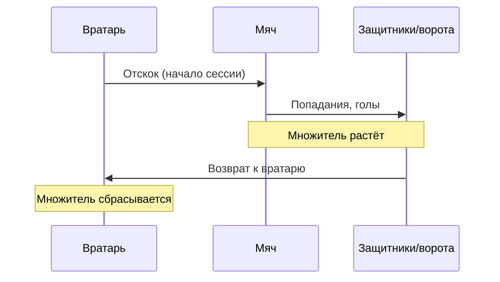

---
tags:
  - gdd
  - ball
  - combo
---

# 4. Механики мяча и комбо-система

← [[03 Физика и управление вратарём]] | [[Индекс GDD v6]] | Далее: [[05 Меню UI и переходы]]

## Отскок и ускорение

> [!note] Реализация
> **Не Unity Physics 2D** — кинематическое движение, своя модель скорости и отражений. См. [[../Архитектура/Движение мяча|Движение мяча]].

| Правило | Описание |
|---------|----------|
| Движение | `position += direction * speed`; скорость — число, не `Rigidbody` |
| Автоотбив | При касании вратаря — пересчёт `direction` (reflect), **буст** `speed` |
| Ускорение от касания | `speed += keeperBoost`, clamp до `maxSpeed` |
| Затухание | Каждый кадр `speed` плавно к `baseSpeed` |

## Сессия мяча

**Определение:** время от отскока от вратаря до **следующего** возврата мяча к вратарю.

## Мультипликатор очков

Внутри **одной сессии мяча**:

| Событие | Эффект на множитель |
|---------|---------------------|
| Попадание по врагу | Множитель **увеличивается** |
| Забитый гол | Множитель **увеличивается** |
| Касание вратаря | Множитель **сбрасывается** |

### Пример

1. Отскок от вратаря → сессия началась, X1
2. Попадание по защитнику → X2
3. Ещё попадание → X3
4. Гол → X4 (или +1 к текущему — уточнить при балансе)
5. Мяч вернулся к вратарю → **сброс до X1**

## Визуал

- Счётчик комбо на HUD: [[06 HUD и визуальный фидбек#Счётчик комбо]]
- Анимация очков: [[06 HUD и визуальный фидбек#Сочные очки]]

## Связанные системы

- [[02 Игровой цикл#Процесс|Сбор XP]] с поверженных врагов
- [[03 Физика и управление вратарём]] — касания вратаря
- [[Составляющие (карта систем)#4. Комбо и очки|Карта систем: комбо]]
