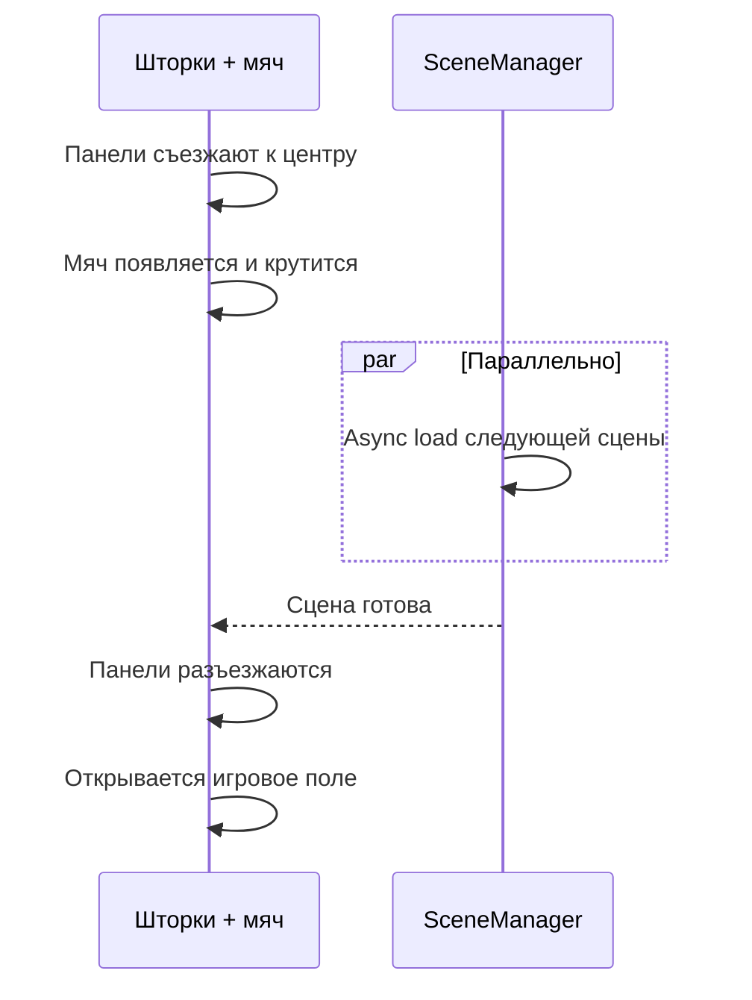

---
tags:
  - gdd
  - ui
  - scenes
---

# 5. Структура меню, UI и переходы

← [[04 Механики мяча и комбо]] | [[Индекс GDD v6]] | Далее: [[06 HUD и визуальный фидбек]]

## 5.1. Главное меню

> [!note] Архитектура (актуально)
> Меню — **оверлей на Root**, не отдельная сцена. На фоне — живое поле с **ботами** (мяч пинают, без счёта и таймера). **Паузы в главном меню нет.** Подробнее: [[../Архитектура/UI и оверлеи#Главное меню ≠ пауза|UI и оверлеи]].

Элементы:

| Элемент | Функция |
|---------|---------|
| **Зал славы** | Таблица лучших результатов, рекордов, карьерных очков |
| **Настройки** | Язык, громкость, управление |
| **Играть** | Запуск турнирной сетки |

Связь с [[02 Игровой цикл#Мета-цикл|мета-циклом]].

## 5.2. Внутриигровое меню (Pause overlay)

- **Вызов:** `Escape` **только во время активного забега** (турнирный run)
- **Не** то же самое, что главное меню: отдельный виджет, Match HUD виден под оверлеем
- **Пауза:** `Time.timeScale = 0` — матч заморожен

| Опция | Действие |
|-------|----------|
| Продолжить | Снять паузу → `OnField` |
| Настройки | Язык, звук |
| Начать турнир заново | Restart забега |
| Выйти в главное меню | Сброс run, фоновые боты, лидерборд |

> [!warning] Техническая заметка
> При `timeScale = 0` анимации DOTween и UI должны использовать `SetUpdate(true)` или unscaled time — зафиксировать при проектировании [[../Архитектура/Индекс архитектуры|архитектуры]].

## 5.3. Анимация перехода между сценами (Scene Transition)

Единый паттерн для всех переходов между сценами:

### Этапы

1. С краёв экрана к центру сдвигаются **массивные панели** (шторки)
2. В центре смыкания появляется **футбольный мяч**, непрерывно вращается
3. **Асинхронно** загружается следующая сцена
4. После загрузки панели **плавно разъезжаются**, открывая поле

## Карта сцен (черновик)

| Сцена | Назначение |
|-------|------------|
| MainMenu | Главное меню, зал славы, настройки |
| Match / Gameplay | Матч (текущая `SampleScene`?) |
| Tournament | Турнирная сетка (TBD) |

## Связанные системы

- [[Составляющие (карта систем)#6. UI и навигация|Карта систем: UI]]
- [[../Архитектура/Индекс архитектуры|Архитектура]] — `SceneTransition`, `PauseMenu`
