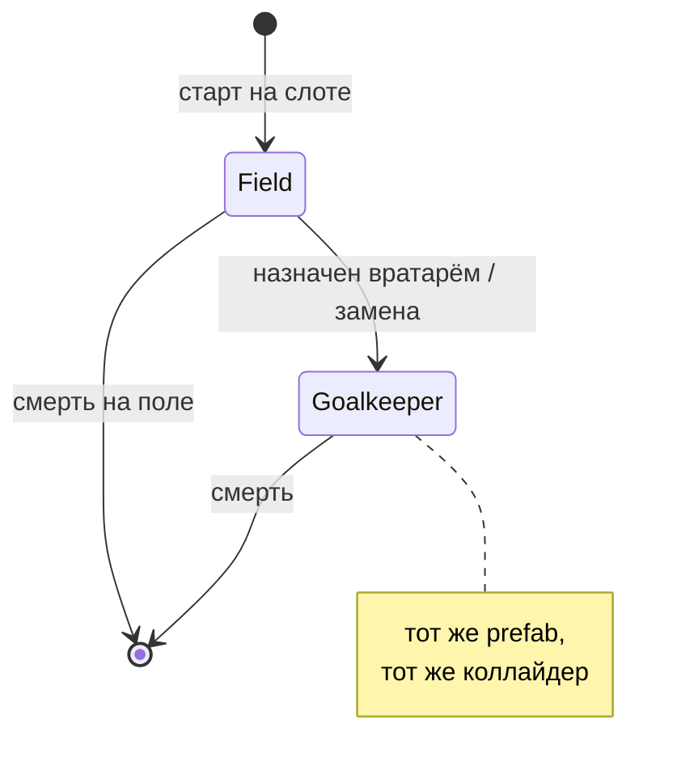
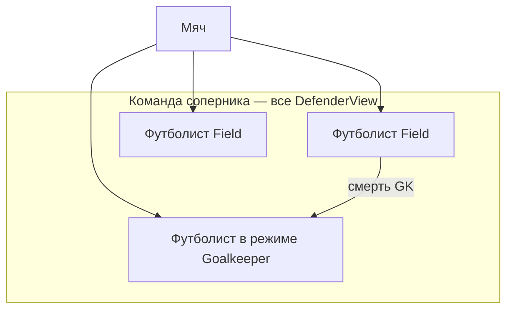
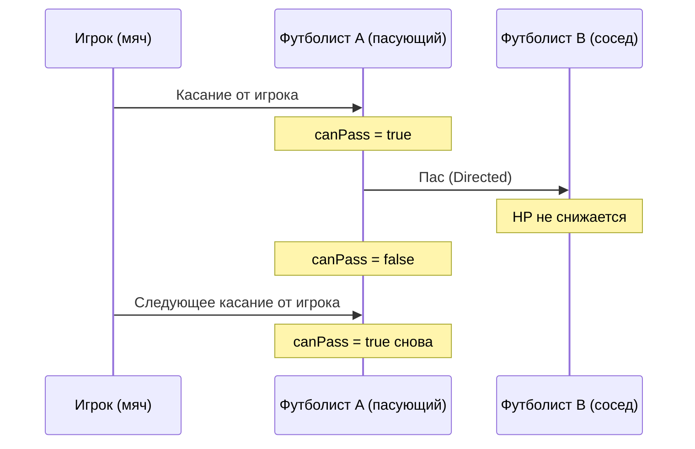
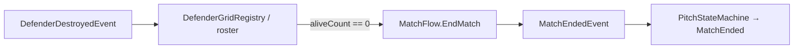

---
tags:
  - gdd
  - enemies
  - defenders
aliases:
  - Враги
  - Противник
  - Защитники
---

# 7. Противник: футболисты соперника

← [[06 HUD и визуальный фидбек]] | [[Индекс GDD v6]] | Архитектура: [[../Архитектура/Враги и защитники|Враги и защитники]]

Команда **соперника** на поле. Игрок бьёт по ним мячом, зарабатывает очки и XP.

> [!important] Одна сущность
> **Вратарь и полевой игрок — не два типа объектов.** Это один **футболист** (`Defender`): один prefab, один коллайдер. Меняется **режим** (`Field` / `Goalkeeper`). Внешний вид задаётся во **view** (разные спрайты/скины на том же prefab).

---

## Режимы футболиста

| Режим | Где | Движение |
|-------|-----|----------|
| **`Goalkeeper`** | У ворот соперника (верх) | Гипербола вдоль линии ворот |
| **`Field`** | Слот на поле | ИИ: стоит / патруль / random / chase |



В матче **один** футболист в режиме `Goalkeeper` (стартовый вратарь). Остальные — `Field`.

---

## Состав на поле



Каждый экземпляр — **тот же prefab**. Отличия: режим, SO движения/удара, визуал во view.

---

## Смерть вратаря → замена

1. Футболист в режиме **`Goalkeeper`** умирает.
2. Выбирается **живой** футболист в режиме **`Field`**.
3. Он **бежит** к воротам (`GoalAnchor`).
4. По прибытии: `SetRole(Goalkeeper)` — переключение режима, гипербола, тот же коллайдер.
5. Его **полевой слот** освобождается до конца матча (или по правилам пересборки).

> [!question] Выбор кандидата
> **MVP:** ближайший живой полевой футболист к воротам.

**После гола (пересборка):** живые возвращаются на слоты, лечатся ([[02 Игровой цикл#Пересборка (после гола)|GDD §2]]). Убитые не возвращаются. Правило воскрешения стартового вратаря vs сохранение замены — **на баланс при реализации пересборки**.

---

## Движение в режиме Goalkeeper

Вратарь **не** бегает случайно — двигается вдоль линии ворот по **гиперболе** (в пределах ширины ворот).

| Параметр | Смысл |
|----------|--------|
| `goalLineY` | Y линии ворот |
| `minX`, `maxX` | Ширина зоны (по ширине ворот) |
| `hyperbolaA` | «Кривизна» — чем больше, тем положе дуга у центра |
| `speed` | Скорость вдоль траектории |

Идея: в центре ворот вратарь чуть **выше** к мячу (ближе к полю), у штанг — ближе к линии ворот. Визуально — «выгибается» навстречу опасной зоне.

```text
        штанга          центр          штанга
          ●──────────────●──────────────●   ← goalLineY
               \            /               ← траектория (гипербола)
                \    GK    /
                 ●────────●
```

Движение **кинематическое** (как у игрока-вратаря), без `Rigidbody2D`. См. [[../Архитектура/Враги и защитники#Движение|архитектура]].

---

## Движение в режиме Field

У каждого футболиста на prefab / в данных слота задаётся **режим движения** (только когда `Role == Field`). Работает в фазе `Simulating` ([[../Архитектура/Машины состояний|Pitch FSM]]).

| # | Режим | Поведение |
|---|--------|-----------|
| 1 | **Стоит** | Позиция = слот (или смещение от слота). Не двигается. |
| 2 | **Патруль по точкам** | Генерируется маршрут из N точек в зоне вокруг слота; бегает по ним по кругу. N задаётся в параметрах. |
| 3 | **Случайный бег** | Выбирает случайную точку в **радиусе** от слота, бежит, ждёт, снова выбирает. |
| 4 | **Преследование мяча** | Если мяч в **радиусе** — бежит к мячу; иначе возврат к слоту или режим по умолчанию (стоит / патруль). |

### Патруль: генерация точек

- Вход: `slotPosition`, `patrolPointCount`, `patrolRadius`, `minDistanceBetweenPoints`.
- Точки генерируются **один раз** при старте матча (или при спавне) внутри круга/прямоугольника вокруг слота.
- Проверка: точки не ближе `minDistanceBetweenPoints`, внутри игровой зоны (не в стене).
- Порядок обхода: по часовой или по индексу (MVP — как сгенерировали).

### Преследование мяча

- Радиус задаётся per-prefab (`chaseRadius`).
- Пока мяч вне радиуса — футболист ведёт себя как в базовом режиме (часто «стоит» или «случайный бег»).
- Не выходить за `playBounds` / не заходить в ворота соперника.

> [!tip] Читаемость
> Для MVP достаточно режимов **1 (стоит)** и **2 (reflect-отбивание)**. Остальное — по одному за итерацию.

---

## Отбивание мяча (типы удара)

При касании мяча футболист или вратарь применяет **поведение удара** (`DefenderHitBehavior`). Три базовых типа:

| # | Тип | Эффект на мяч | HP |
|---|-----|---------------|-----|
| 1 | **Reflect** | Как стена: `Reflect(direction, normal)` | −1 (или по настройке) |
| 2 | **К воротам игрока** | `Directed`: направление в сторону **ворот игрока** (низ экрана), угол прилёта игнорируется | −1 |
| 3 | **Пас соседу** | `Directed` к **соседнему** футболисту; у **получателя паса** HP **не** уменьшается | −1 у **пасующего** |

### Пас соседу — правила



| Правило | Описание |
|---------|----------|
| **Сосед** | Живой футболист в соседних слотах сетки (4/8-связность — зафиксировать в архитектуре). Если соседей несколько — ближайший к направлению отскока или случайный из списка. |
| **Заряд паса** | После **касания мяча игроком** (отскок от вратаря игрока = начало сессии) у **каждого** футболиста с типом «пас» появляется право **одного** паса. |
| **Сброс заряда** | После выполненного паса — `canPass = false` до **следующего** касания мяча **игроком** (вратарём игрока). |
| **Нет соседа** | Fallback: **Reflect** или **К воротам игрока** (настраивается на SO). |
| **Режим Goalkeeper** | Пас **не** использует (только reflect / в ворота игрока), если не задано отдельно на SO. |

Касание «от игрока» для сброса заряда паса = событие `BallReturnedToKeeperEvent` (мяч коснулся вратаря **игрока**). См. [[04 Механики мяча и комбо#Сессия мяча]].

### Связь с комбо и XP

- **Reflect / в ворота игрока:** обычное попадание — множитель комбо растёт, XP при уничтожении.
- **Пас:** попадание по пасующему считается как hit; получатель паса **не** получает урон — комбо не ломается «бесплатным» хитом по соседу.

---

## Урон и смерть (футболист)

| Событие | Результат |
|---------|-----------|
| Мяч попал, тип не «пас на этого» | HP −1 |
| HP = 0 | Смерть: коллайдер off или слой «мёртвый», событие на шине, XP игроку |
| Пас принят соседом | HP соседа **без изменений** |

После смерти футболист **не** участвует в пасах и не двигается. Слот пустой до конца матча (или до пересборки после гола по правилам §2).

---

## Досрочная победа (вайп команды)

Если до истечения таймера **не осталось ни одного живого** футболиста соперника — матч **сразу** заканчивается **победой игрока**.



| Вопрос | Решение |
|--------|---------|
| Кто считает живых? | `DefenderGridRegistry` или лёгкий `OpponentRosterService` — список всех `DefenderView` матча |
| Кто завершает матч? | **`MatchFlow`** (как при таймере 0) — один вход `EndMatch(reason)` |
| Победитель | **Игрок** при `AllDefendersEliminated` (независимо от счёта голов) |
| Бонус очков / XP | **TBD** — отдельный множитель или flat bonus при подсчёте итога; не блокирует MVP |
| UI | Короткий фидбек «Все выбиты!» (опционально, позже) |

Условие срабатывает **после** смерти последнего вратаря (в т.ч. если до этого полевых уже не было). Замена вратаря полевым **не** отменяет правило — пока кто-то жив, матч идёт.

---

## Визуал

Внешний вид **не** привязан к режиму в коде жёстко — задаётся во **view** (дочерний `Visual`, смена спрайта/скина при `SetRole`).

| Момент | Эффект |
|--------|--------|
| Удар мяча | Flash / squash |
| Пас | Короткая линия / стрелка к соседу (опционально) |
| Смерть | Анимация исчезновения / падение |
| Замена вратаря | Полевой бежит к воротам → `SetRole(Goalkeeper)` → смена визуала во view |
| Возврат после гола | Перебег на слот ([[06 HUD и визуальный фидбек#Выход и возврат защитников]]) |

---

## MVP → полная версия

| Этап | Что делаем |
|------|------------|
| **MVP-1** | Один футболист: стоит, Reflect, HP, событие на шине |
| **MVP-2** | Несколько слотов, сетка соседей для паса |
| **MVP-3** | Типы удара: Reflect + «к воротам игрока» |
| **MVP-4** | Пас + заряд после касания игрока |
| **MVP-5** | Режим `Goalkeeper` + гипербола (тот же prefab) |
| **MVP-6** | Замена: полевой → `SetRole(Goalkeeper)` |
| **MVP-7** | ИИ движения: патруль, random, chase |
| **MVP-8** | Пересборка после гола + лечение |

---

## Связанные документы

- [[02 Игровой цикл]] — пересборка, XP
- [[04 Механики мяча и комбо]] — сессия мяча, `BallReturnedToKeeperEvent`
- [[Составляющие (карта систем)#5. Защитники и поле]]
- [[../Архитектура/Враги и защитники]] — код, SO, события
- [[../Архитектура/Движение мяча#Режимы полёта (спец-враги)]] — `Directed` для паса и удара в ворота
