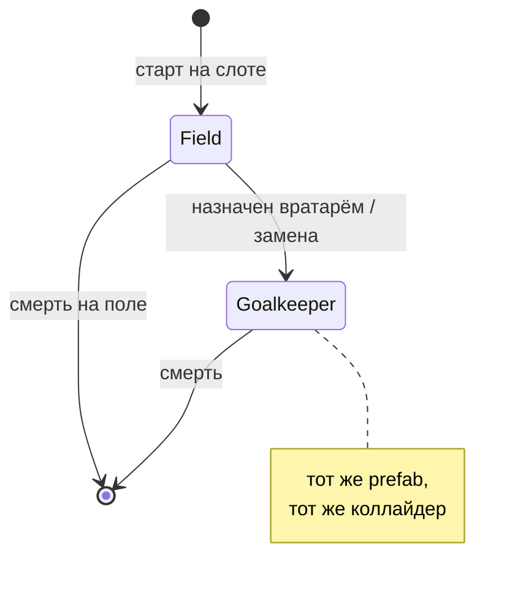
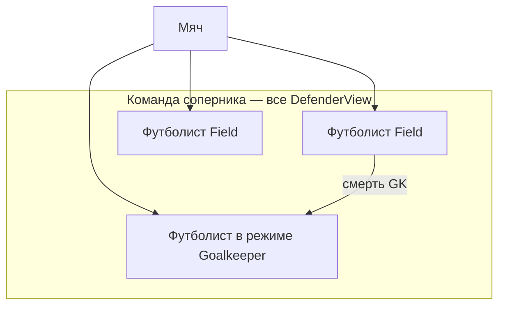
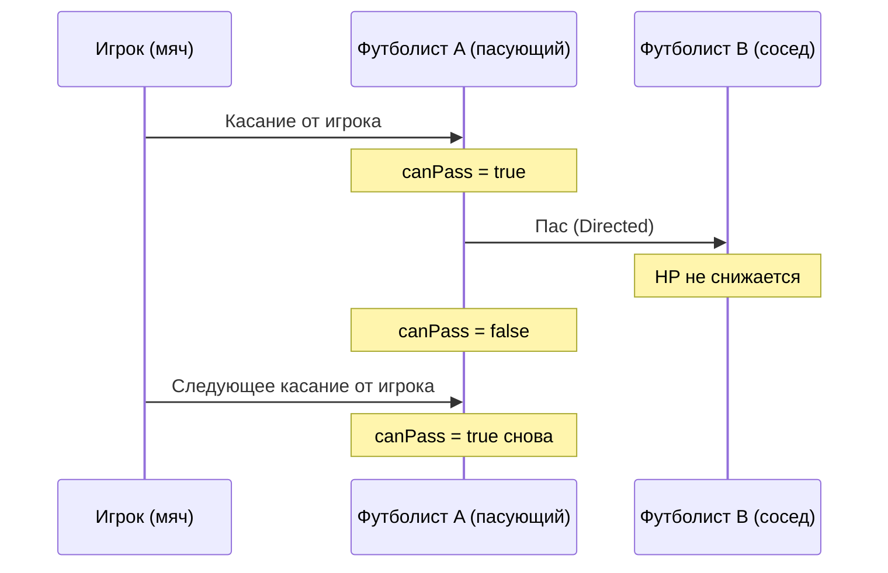
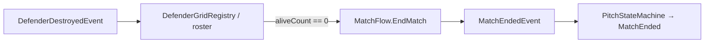

---
tags:
  - gdd
  - enemies
  - defenders
aliases:
  - Враги
  - Противник
  - Защитники
---

# 7. Противник: футболисты соперника

← [[06 HUD и визуальный фидбек]] | [[Индекс GDD v6]] | Архитектура: [[../Архитектура/Враги и защитники|Враги и защитники]]

Команда **соперника** на поле. Игрок бьёт по ним мячом, зарабатывает очки и XP.

> [!important] Одна сущность
> **Вратарь и полевой игрок — не два типа объектов.** Это один **футболист** (`Defender`): один prefab, один коллайдер. Меняется **режим** (`Field` / `Goalkeeper`). Внешний вид задаётся во **view** (разные спрайты/скины на том же prefab).

---

## Режимы футболиста

| Режим | Где | Движение |
|-------|-----|----------|
| **`Goalkeeper`** | У ворот соперника (верх) | Гипербола вдоль линии ворот |
| **`Field`** | Слот на поле | ИИ: стоит / патруль / random / chase |



В матче **один** футболист в режиме `Goalkeeper` (стартовый вратарь). Остальные — `Field`.

---

## Состав на поле



Каждый экземпляр — **тот же prefab**. Отличия: режим, SO движения/удара, визуал во view.

---

## Смерть вратаря → замена

1. Футболист в режиме **`Goalkeeper`** умирает.
2. Выбирается **живой** `Field` (MVP: ближайший к воротам).
3. Назначается бег к `GoalAnchor`. До прибытия — **полевая** логика: тот же коллайдер, пас на него ок, **уязвим**.
4. **Ворота пустые** — можно забить, пока никто не встал на линию.
5. Убили бегущего — берём **следующего** кандидата.
6. Прибыл → `SetRole(Goalkeeper)`, гипербола, визуал во view.

> [!important] Prefab и коллайдер **не** меняются — только роль, motor и анимация бега.

**После гола:** см. [[02 Игровой цикл#Пересборка (после гола)|§2]] — убитых не воскрешаем; живой GK (в т.ч. замена) остаётся GK; хил **25%**.

---

## Движение в режиме Goalkeeper

Вратарь **не** бегает случайно — двигается вдоль линии ворот по **гиперболе** (в пределах ширины ворот).

| Параметр | Смысл |
|----------|--------|
| `goalLineY` | Y линии ворот |
| `minX`, `maxX` | Ширина зоны (по ширине ворот) |
| `hyperbolaA` | «Кривизна» — чем больше, тем положе дуга у центра |
| `speed` | Скорость вдоль траектории |

Идея: в центре ворот вратарь чуть **выше** к мячу (ближе к полю), у штанг — ближе к линии ворот. Визуально — «выгибается» навстречу опасной зоне.

```text
        штанга          центр          штанга
          ●──────────────●──────────────●   ← goalLineY
               \            /               ← траектория (гипербола)
                \    GK    /
                 ●────────●
```

Движение **кинематическое** (как у игрока-вратаря), без `Rigidbody2D`. См. [[../Архитектура/Враги и защитники#Движение|архитектура]].

---

## Движение в режиме Field

У каждого футболиста на prefab / в данных слота задаётся **режим движения** (только когда `Role == Field`). Работает в фазе `Simulating` ([[../Архитектура/Машины состояний|Pitch FSM]]).

| # | Режим | Поведение |
|---|--------|-----------|
| 1 | **Стоит** | Позиция = слот (или смещение от слота). Не двигается. |
| 2 | **Патруль по точкам** | Генерируется маршрут из N точек в зоне вокруг слота; бегает по ним по кругу. N задаётся в параметрах. |
| 3 | **Случайный бег** | Выбирает случайную точку в **радиусе** от слота, бежит, ждёт, снова выбирает. |
| 4 | **Преследование мяча** | Если мяч в **радиусе** — бежит к мячу; иначе возврат к слоту или режим по умолчанию (стоит / патруль). |

### Патруль: генерация точек

- Вход: `slotPosition`, `patrolPointCount`, `patrolRadius`, `minDistanceBetweenPoints`.
- Точки генерируются **один раз** при старте матча (или при спавне) внутри круга/прямоугольника вокруг слота.
- Проверка: точки не ближе `minDistanceBetweenPoints`, внутри игровой зоны (не в стене).
- Порядок обхода: по часовой или по индексу (MVP — как сгенерировали).

### Преследование мяча

- Радиус задаётся per-prefab (`chaseRadius`).
- Мяч **в радиусе** — бежит к мячу; может зайти **на половину игрока**.
- Мяч **вне радиуса** — chase **выключается**, бег **обратно** на свою позицию / слот.
- Не выходить за границы поля (стены).

### Разделение футболистов (anti-stack)

- У каждого — **радиус личного пространства** (`separationRadius`).
- Если другой футболист слишком близко — **отталкивание** (простой separation steer), чтобы не слипались в одной точке.
- Сетка слотов: **гибкая** — расставляем столько, сколько **влезает** на экран; жёсткая 4/8-связность **не** фиксируем заранее. Соседи для паса — по **ближайшим** живым в радиусе или по расстановке (уточним при реализации паса).

> [!tip] Читаемость
> Для MVP достаточно режимов **1 (стоит)** и **2 (reflect-отбивание)**. Остальное — по одному за итерацию.

---

## Отбивание мяча (типы удара)

При касании мяча футболист применяет **`DefenderHitBehavior`**. Это вариант **отбивания**: мяч влетел → футболист **получает урон** (если не особый случай паса-получателя) → мяч улетает по правилу типа.

| # | Тип | Эффект на мяч | HP пасующего / бьющего |
|---|-----|---------------|-------------------------|
| 1 | **Reflect** | `Reflect(direction, normal)` | −1 за касание |
| 2 | **К воротам игрока** | `Directed` вниз; см. варианты ниже | −1 |
| 3 | **Пас** | `Directed` к **ближайшему** футболисту | −1 у **отбивающего**; у **получателя** при прилёте паса **0** |

### «К воротам игрока» — варианты направления

На SO задаём режим или **веса**:

| Вариант | Куда летит мяч |
|---------|----------------|
| **В проём** | «Куда проще» забить — центр / открытая зона `GoalPlayer` |
| **В игрока** | В сторону вратаря **игрока** (сложнее, но опаснее) |
| **Смешанный** (предпочтительно) | **Шансы** на варианты (например 70% в проём / 30% в игрока) — баланс в SO |

### Пас — уточнение

- Пас = обычное **касание-отбивание**: **отбивающий всегда −1 HP**.
- Если **`canPass`** — `Directed` к ближайшему футболисту (в т.ч. бегущему на GK).
- Если пас **на перезарядке** (`canPass == false`) — **Reflect**, как обычная стена.
- Получатель паса при прилёте — **0** урона; дальше отбивает по своему `hitBehavior`.

### Пас соседу — правила



| Правило | Описание |
|---------|----------|
| **Сосед / цель паса** | **Ближайший** живой футболист (не жёсткая сетка). Бегущий на замену GK — валидная цель. |
| **Заряд паса** | После касания мяча **игроком** (`BallReturnedToKeeperEvent`) — `canPass = true` у футболистов с типом «пас». |
| **Сброс заряда** | После выполненного паса — `canPass = false` до следующего касания игрока. |
| **Пас на перезарядке** | Если `canPass == false` — отбивание **как Reflect** (дефолт), не `Directed` к соседу. |
| **Нет цели рядом** | Fallback: **Reflect** или **К воротам игрока** (на SO). |
| **Режим Goalkeeper** | Пас **не** использует (только reflect / в ворота игрока), если не задано отдельно на SO. |

Касание «от игрока» для сброса заряда паса = событие `BallReturnedToKeeperEvent` (мяч коснулся вратаря **игрока**). См. [[04 Механики мяча и комбо#Сессия мяча]].

### Связь с комбо и XP

- Каждое касание-отбивание (reflect, в ворота, пас **отбивающего**) — **рост комбо**.
- Получатель паса: урон 0, но сессия мяча / комбо **не сбрасываются** из‑за «бесплатного» хита.
- XP при **смерти**; система очков матча — **отдельная задача** (TBD).

---

## HP и урон

| Правило | Значение |
|---------|----------|
| **Max HP** | **1…99** per prefab / слот — баланс |
| **Урон** | **Каждое** касание мяча с отбиванием: −1 (кроме прилёта **как пас** к получателю) |
| **Хил после гола** | +25% от max HP у живых |
| **Cooldown слота** | См. [[../Архитектура/Враги и защитники#Анти-дубль урона (per frame)|архитектура]] — не геймплей, только анти-баг. |

---

## Урон и смерть (итог)

| Событие | Результат |
|---------|-----------|
| Мяч попал, тип не «пас на этого» | HP −1 |
| HP = 0 | Смерть: коллайдер off или слой «мёртвый», событие на шине, XP игроку |
| Пас принят соседом | HP соседа **без изменений** |

После смерти футболист **не** участвует в пасах и не двигается. Слот пустой до конца матча (или до пересборки после гола по правилам §2).

---

## Досрочная победа (вайп команды)

Если до истечения таймера **не осталось ни одного живого** футболиста соперника — матч **сразу** заканчивается **победой игрока**.



| Вопрос | Решение |
|--------|---------|
| Кто считает живых? | `DefenderGridRegistry` или лёгкий `OpponentRosterService` — список всех `DefenderView` матча |
| Кто завершает матч? | **`MatchFlow`** (как при таймере 0) — один вход `EndMatch(reason)` |
| Победитель | **Игрок** при `AllDefendersEliminated` (независимо от счёта голов) |
| Бонус очков / XP | **TBD** — отдельная задача по скорингу |
| UI | Анимация **досрочной победы** («врагов не осталось») |

Условие срабатывает **после** смерти последнего вратаря (в т.ч. если до этого полевых уже не было). Замена вратаря полевым **не** отменяет правило — пока кто-то жив, матч идёт.

---

## Визуал

Внешний вид **не** привязан к режиму в коде жёстко — задаётся во **view** (дочерний `Visual`, смена спрайта/скина при `SetRole`).

| Момент | Эффект |
|--------|--------|
| Удар мяча | Flash / squash |
| Пас | Короткая линия / стрелка к соседу (опционально) |
| Смерть | Анимация исчезновения / падение |
| Замена вратаря | Полевой бежит к воротам → `SetRole(Goalkeeper)` → смена визуала во view |
| Возврат после гола | Перебег на слот ([[06 HUD и визуальный фидбек#Выход и возврат защитников]]) |

---

## MVP → полная версия

| Этап | Что делаем |
|------|------------|
| **MVP-1** | Один футболист: стоит, Reflect, HP, событие на шине |
| **MVP-2** | Несколько слотов, сетка соседей для паса |
| **MVP-3** | Типы удара: Reflect + «к воротам игрока» |
| **MVP-4** | Пас + заряд после касания игрока |
| **MVP-5** | Режим `Goalkeeper` + гипербола (тот же prefab) |
| **MVP-6** | Замена: полевой → `SetRole(Goalkeeper)` |
| **MVP-7** | ИИ движения: патруль, random, chase |
| **MVP-8** | `Reshuffle`: бег на места, хил 25%, мяч на якорь |
| **MVP-9** | Separation radius между футболистами |

---

## Связанные документы

- [[02 Игровой цикл]] — пересборка, XP
- [[04 Механики мяча и комбо]] — сессия мяча, `BallReturnedToKeeperEvent`
- [[Составляющие (карта систем)#5. Защитники и поле]]
- [[../Архитектура/Враги и защитники]] — код, SO, события
- [[../Архитектура/Движение мяча#Режимы полёта (спец-враги)]] — `Directed` для паса и удара в ворота
