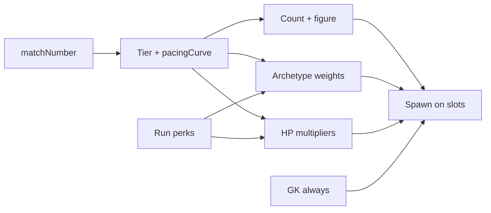

---
tags:
  - gdd
  - difficulty
  - tournament
  - pacing
  - roguelike
aliases:
  - Сложность
  - Pacing
  - Турнир
---

# 8. Сложность, pacing и турнир

← [[07 Противник — вратарь и футболисты]] | [[Индекс GDD v6]] | Архитектура: [[../Архитектура/Генерация врагов|Генерация врагов]]

Как игра **усложняется** от матча к матчу, как устроен **турнир** на ~10+ раундов и что игрок чувствует в **первом матче**.

---

## Целевой масштаб турнира

| Сейчас в коде (MVP) | Цель дизайна |
|---------------------|--------------|
| `matchesToWin = 9` в `GameplaySettings` | **9 побед** на забег (олимпийская сетка линейно) |
| Линейная цепочка, вылет при поражении | **Сетка с возможностью проиграть и вернуться** за очки / «жизни» |

> [!note] Статус
> Возврат в турнир после поражения и полная сетка — **дизайн на будущее**, в коде пока `TournamentRunService` с `Eliminated` без comeback. Документируем цель, чтобы генератор врагов и pacing строились под длинный забег.

### Comeback (концепт)

- У игрока есть **очки турнира** / **жизни** / **билеты на реванш**
- Проиграл матч по таймеру → не всегда мгновенный game over
- Можно **откупиться** или **выиграть утешительный раунд** и вернуться в сетку
- Вайп всех врагов → победа **всегда**, даже при счёте 0:0 или 1:2 ([[02 Игровой цикл#Окончание матча|§2]])

Детали экономики comeback — TBD в GDD перков и мета-прогрессии.

---

## Матч 1 (туториал)

**Всегда лёгкий, предсказуемый, без сюрпризов RNG.**

| Параметр | Значение |
|----------|----------|
| Полевых | **5** (фикс), min 3 HP |
| Фигура | Простая (треугольник / линия / 3 точки) — **случайный якорь** |
| Архетипы | Только `Shield`, `Drifter` |
| Удары | Только Reflect |
| Движение | Idle / лёгкий Wander |
| Модификаторы | **Нет** |
| GK HP | **10** (база) |
| Цель для игрока | Понять: движение, подача, отскок, урон, **вайп = победа** |

Матч 1 **не** участвует в рандоме архетипов; расстановка — через `DefenderFormationComposer` (tier 0).

---

## Рост сложности по матчам

Сложность складывается из:

1. **Больше врагов** на поле  
2. **Плотнее фигуры** у ворот (стена вместо треугольника)  
3. **Опаснее поведение** (ToPlayerGoal, ChaseBall)  
4. **Больше HP** (особенно GK)  
5. **Модификаторы** (Elite, Swift…)  
6. **Перки соперника** (позже) / усиление от pacing-кривой  

### Нелинейная кривая pacing

Не `difficulty = matchNumber * k`.

```text
effectiveDifficulty = pacingCurve(matchNumber) × perkMods × dynamicAdj
```

- **AnimationCurve** в данных: плато в начале, рост в середине, пики перед ключевыми матчами  
- **Перки забега игрока** могут **снижать** `EnemyMaxHp` или шанс Elite — ощущение «я стал сильнее»  
- **Динамическая подстройка** (если игрок проигрывает N раз подряд) — отдельный множитель, позже  

См. [[../Архитектура/Генерация врагов#Кривая pacing (нелинейная сложность)|архитектура: pacing]].

---

## Голкипер и HP

- GK **обязателен** каждый матч  
- HP GK **всегда выше** полевых  
- Старт: **10 HP**; дальше +N за матч (настраивается в `DefenderGenerationSettings`)  
- Полевые: база ниже, растут по tier / кривой  

Визуально пока только цифра HP на prefab; скины архетипов — позже.

---

## Один матч — одна «команда»

- Один prefab `Defender`  
- Различия: **HP + поведение** (hit type, movement, радиусы)  
- Состав генерируется при `PitchReset` — **не** расставляется руками на сцене  
- Слоты на сцене — только **маркеры позиций** (`DefenderSlotLayout`)

---

## Диаграмма: от номера матча к ощущению



---

## HUD / фидбек (позже)

- Имя раунда: «Матч 3 из 12» — уже есть `RoundLabel`  
- Перед матчем: превью фигуры / «сложность ★★☆» — TBD  
- После вайпа: «Полная победа» даже при любом счёте  

---

## Связанные разделы

- [[02 Игровой цикл]] — конец матча, вайп, reshuffle  
- [[07 Противник — вратарь и футболисты]] — поведение, GK  
- [[Составляющие (карта систем)#6. Защитники и поле|Защитники]]  
- [[../Архитектура/Генерация врагов]]  
- [[../Архитектура/Прогрессия и эффекты]]  
