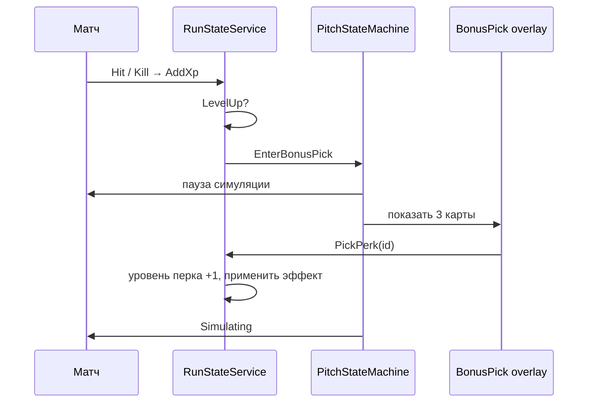

---
tags:
  - gdd
  - progression
  - roguelike
  - perks
aliases:
  - Перки
  - Карточки
  - XP забега
---

# 9. Карточки перков и XP забега

← [[08 Сложность, pacing и турнир]] | [[Индекс GDD v6]]

> **Решение (2026-07):** прогрессия забега — **шкала XP**, level-up **во время матча** с паузой и выбором **1 из 3** случайных карточек. Перки **не всегда положительные**; цвет карточки сигнализирует риск. Перки **стакаются по уровням** (до ~5).

Архитектура: [[../Архитектура/Прогрессия и эффекты|Прогрессия и эффекты]], [[../Архитектура/Машины состояний#Уровень 3: Pitch FSM (PitchStateMachine)|BonusPick]], [[06 HUD и визуальный фидбек#Шкала XP забега|HUD: XP]].

---

## Философия

Рогалик-надстройка поверх арканоида: level-up → **пауза** → **1 из 3** карт. Перки **не обязаны быть положительными** — конкретные эффекты придумываем **по ходу**, когда добавляем каждый перк.

**Цвет карточки** — поле в `PerkDefinition` (SO): зелёный / жёлтый / красный. Меняет **рамку на UI** и подсказку игроку («примерно хорошо / сложнее / рискованно»). Цвет **не** включает автоматическую механику в коде — только данные для отображения.

---

## Шкала XP

### Источники (MVP)

| Событие | XP | Примечание |
|---------|-----|------------|
| **Касание** врага мячом (попадание, без смерти) | мало | `DefenderHitEvent` |
| **Выбивание** врага (HP = 0) | много | отдельное событие смерти / kill |

Числа — в `RunProgressionSettings` (SO), не в коде.

Голы, комбо, досрочная победа — **не в MVP** шкалы XP (можно добавить позже).

### Куда идёт XP

- Только **забег** (`RunStateService`), не карьера.
- Шкала **не сбрасывается между матчами** турнира — копится на весь run.
- Новый турнир → XP и уровни перков **с нуля**.

### Level-up

1. `currentXp >= xpToNextLevel` → порог сдвигается (кривая TBD).
2. Матч **ставится на паузу** (`timeScale = 0` или эквивалент через Pitch FSM).
3. `PitchStateMachine` → **`BonusPick`**.
4. UI: **3 случайные карточки**, игрок выбирает **одну**.
5. Перк применяется → снова **`Simulating`**, пауза снимается.

За один матч может быть **несколько** level-up, если много киллов.



---

## Карточки: цвет (только данные + UI)

В `PerkDefinition`:

```csharp
public enum PerkCardColor { Green, Yellow, Red }
```

| Поле SO | Назначение |
|---------|------------|
| `CardColor` | Какой спрайт рамки / tint показать на prefab карточки |

Ориентир для дизайна (не жёсткие правила кода):

- **Зелёный** — обычно что-то приятное игроку
- **Жёлтый** — обычно усложнение
- **Красный** — обычно риск / «хуже сейчас, что-то взамен» — **что именно**, решаем при создании **этого** перка

На карточке: **иконка**, **название**, **описание** (из SO; уровень можно дописать в runtime).

---

## Уровни перка (стак внутри забега)

Один и тот же перк можно взять **повторно** — растёт **уровень** этого перка в забеге.

| Взятие | Уровень | Пример «+урон мяча» |
|--------|---------|---------------------|
| 1-й раз | 1 | +1 к урону |
| 2-й раз | 2 | +2 (итого +2 от перка) |
| 3-й раз | 3 | +3 |
| … | … | … |
| 5-й раз | 5 (max) | +5 |

**Максимум уровня:** по умолчанию **5** на перк (`PerkDefinition.MaxLevel`).

Если перк на максимуме — **не попадает** в пул ролла (или заменяется другим — решить при балансе).

Отображение на карточке при ролле: «Урон мяча **II**» / «Уровень 2 → 3» — TBD в UI.

## Пул перков и ролл «1 из 3»

При каждом level-up:

1. Берём **все** `PerkDefinition`, зарегистрированные в `PerkCatalog` (SO-список или папка Resources).
2. Фильтр: уровень < `MaxLevel`, опционально tier по `matchNumber`.
3. **Случайно 3** без повторов (если в пуле < 3 — показать сколько есть).

Реролл / пропуск карты — **нет в MVP**. Веса по цвету — **позже**, если понадобится.

---

## Механики перков — по ходу

Единого «движка правил по цвету» **нет**. Каждый перк:

1. SO — id, тексты, иконка, **цвет**, `MaxLevel`, при необходимости числа (`ValuePerLevel`).
2. Код — ветка `ApplyPerkEffect(id, level)` (или маленький handler): что именно меняется в игре.

Примеры идей (не обязательный список на старт): +урон мяча, +скорость вратаря, +HP врагов, +XP с киллов. Добавляем по одному, когда нужен для теста.

---

## UI / сцена (делает игрок в Unity)

| Элемент | Где | Заметки |
|---------|-----|---------|
| **Шкала XP** | Match HUD, `Game.unity` | Fill Image или Slider; слушает `RunXpChangedEvent` |
| **BonusPick overlay** | `Game.unity`, canvas ~130 | Затемнение + 3× prefab карточки |
| **Prefab карточки** | `Assets/_Projects/...` | Один prefab: `Background` (Image), `Icon`, `Title`, `Description`, `Button` |
| **Варианты цвета** | Три спрайта рамки **или** tint | Зелёный / жёлтый / красный фон |
| **PerkDefinition SO** | Папка `Perks/` | Иконка + тексты; по одному ассету на перк |

Код подставляет в карточку данные из SO и цвет из `PerkCardColor`.

---

## Данные — простое добавление перка

> [!important] Без огорода
> Новый перк = **SO с картинкой и текстом** + **одна запись в каталоге** + **применение эффекта в коде** (switch / маленький handler по `id`).

### `PerkDefinition` (ScriptableObject)

| Поле | Назначение |
|------|------------|
| `Id` | Уникальный строковый id (`ball_damage`) |
| `DisplayName` | Заголовок на карточке |
| `Description` | Шаблон или статичный текст; уровень можно дописывать в runtime |
| `Icon` | Sprite на карточке |
| `CardColor` | Green / Yellow / Red |
| `MaxLevel` | Обычно 5 |
| `ValuePerLevel` | Опционально — если перку хватает одного числа |

Нестандартная логика — только в коде по `Id`; SO не обязан всё описывать.

### `PerkCatalog` (ScriptableObject)

- Список ссылок на все `PerkDefinition` для ролла.
- Вешается на сцену или в `GameplaySettings`.

---

## Связь с другими системами

| Система | Связь |
|---------|--------|
| [[02 Игровой цикл]] | Level-up **не** ждёт конца матча |
| [[07 Противник — вратарь и футболисты]] | XP за hit / kill |
| [[08 Сложность, pacing и турнир]] | Жёлтые/красные перки → модификаторы `DefenderGenerationContext` |
| [[06 HUD и визуальный фидбек]] | Шкала XP |
| [[../Архитектура/Генерация врагов]] | Перки забега влияют на состав и статы |
| Timed-баффы в матче | **Отдельно** — трибуна, арбитр (`StatusEffectService`), не путать с картами |

---

## Открытые вопросы

- [ ] Числа XP: hit vs kill, кривая level-up
- [ ] UI: показывать будущий уровень на карточке до клика
- [ ] Конкретные перки и их эффекты — **итеративно**, при добавлении каждого

---

## Чеклист MVP

- [ ] Шкала XP на HUD
- [ ] XP за hit и kill
- [ ] BonusPick: пауза + 3 карты + выбор
- [ ] `PerkDefinition` с полем **цвета** + каталог
- [ ] Уровни 1–5 на одном перке
- [ ] **Один** тестовый перк с реальным эффектом в коде
