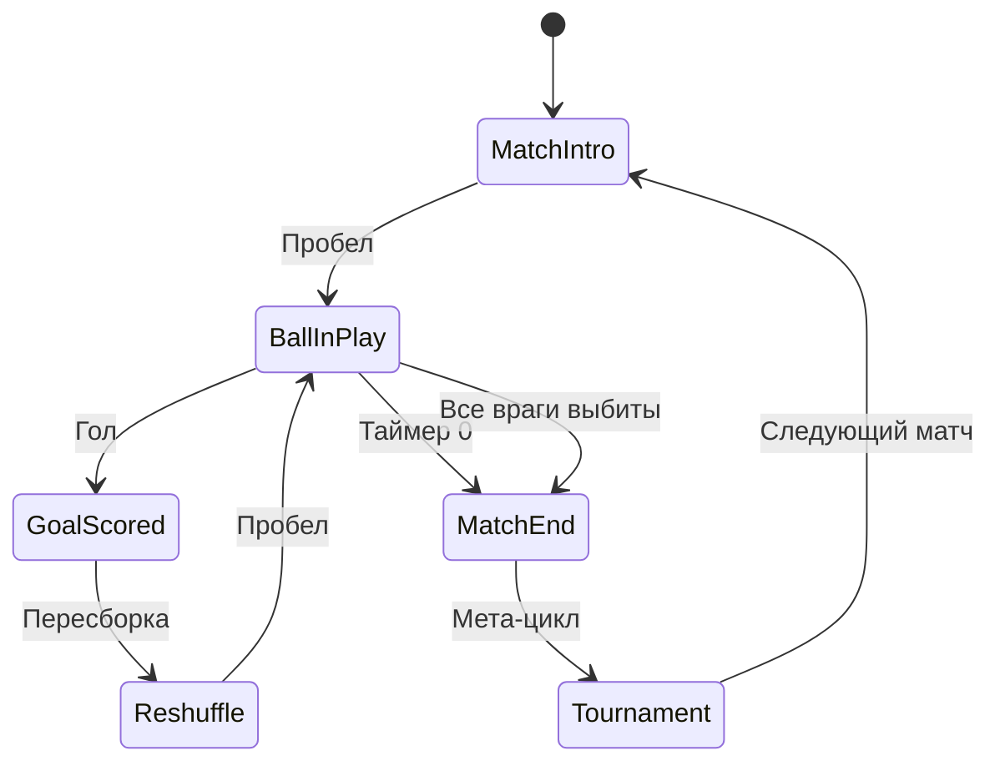
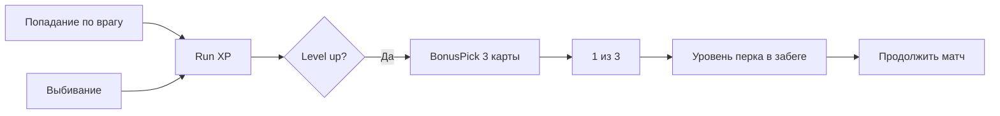

---
tags:
  - gdd
  - systems
  - moc
aliases:
  - Карта систем
  - Составляющие
---

# Составляющие GDD — карта систем

Разложение GDD v6.0 на **игровые системы** и **подсистемы**. Используется как мост между дизайном и будущей архитектурой кода.

См. также: [[Индекс GDD v6]]

---

## 1. Сессия и поток игры

Управляет тем, *в какой фазе* находится игрок и что происходит между фазами.

| Система | Описание | Источник в GDD |
|---------|----------|----------------|
| **[[02 Игровой цикл#Core Loop\|Core Loop (матч)]]** | Старт → процесс → гол → пересборка → конец матча | §2 |
| **[[02 Игровой цикл#Мета-цикл\|Мета-цикл (турнир)]]** | Сетка, статистика, следующий противник | §2 |
| **Пересборка после гола** | Сброс позиций, лечение живых, выбывание уничтоженных | §2 |
| **Таймер матча** | 90 сек + добавочное время, определение победителя | §2, §6.1 |
| **Досрочный конец** | Все враги выбиты → победа игрока до 0:00 | §2, §7 |

---

## 2. Игрок (вратарь-ракетка)

| Подсистема | Описание | Источник |
|------------|----------|----------|
| **Движение с инерцией** | Торможение → остановка → разгон при смене направления | §3 |
| **Ввод мяча** | Пробел в начале матча / после гола | §3 |
| **Прыжок / сейв (Dive)** | Рывок в сторону движения по Пробелу во время игры | §3 |
| **Штраф за прыжок** | Падение, анимация подъёма, обездвиженность | §3 |
| **Процедурная анимация** | Наклоны, squash & stretch (DOTween) | §6.2 |

Связанные системы: [[04 Механики мяча и комбо]], [[06 HUD и визуальный фидбек]]

---

## 3. Мяч

| Подсистема | Описание | Источник |
|------------|----------|----------|
| **Движение мяча** | Кинематика: CircleCast, reflect, буст, затухание | §4 + [[../Архитектура/Движение мяча\|Движение мяча]] |
| **Сессия / комбо** | Множитель, сброс у вратаря | §4 |

Связанные системы: [[04 Механики мяча и комбо#Мультипликатор очков|Комбо-множитель]]

---

## 4. Комбо и очки

| Подсистема | Описание | Источник |
|------------|----------|----------|
| **Мультипликатор сессии** | Растёт за попадания и голы в одной сессии мяча | §4 |
| **Сброс множителя** | При новом касании вратаря | §4 |
| **Сбор XP** | С поверженных врагов | §2 |
| **Визуал очков** | Scale + пружина при обновлении | §6.1 |
| **Визуал комбо** | «Зажигание» X2, X3 и выше | §6.1 |

---

## 5. Защитники и поле

Полное описание: [[07 Противник — вратарь и футболисты]]. Архитектура: [[../Архитектура/Враги и защитники|Враги и защитники]].

| Подсистема | Описание | Источник |
|------------|----------|----------|
| **Вратарь соперника** | Тот же prefab, режим `Goalkeeper`, парабола | §7 |
| **Замена вратаря** | Полевой → `SetRole(Goalkeeper)`, без нового объекта | §7 |
| **Сетка футболистов** | `DefenderSlotLayout` 5×7, спавн `DefenderSpawner` | §7, [[../Архитектура/Генерация врагов\|генерация]] |
| **Генерация состава** | Фигуры, архетипы, pacing по матчу | §8 |
| **ИИ движения** | Стоит / патруль / random / chase мяча | §7 |
| **Типы отбивания** | Reflect, в ворота игрока, пас соседу | §7 |
| **Повреждение / уничтожение** | Выбивание за очки и XP; пас не бьёт HP соседа | §2, §7 |
| **Досрочная победа** | Все враги мертвы → победа игрока; анимация; бонус TBD | §2, §7 |
| **Выход на поле** | Анимация выбегания в начале матча | §6.2 |
| **Возврат после гола** | Перебег на слоты + хил 25%; мяч на кик-офф | §2, §6.2 |
| **Восстановление HP** | +25% max HP у живых после гола | §2 |

> Трибуны и арбитр — по-прежнему TBD. См. [[01 Обзор и философия]].

---

## 6. UI и навигация

| Подсистема | Сцена / контекст | Источник |
|------------|------------------|----------|
| **Главное меню** | Отдельная сцена | §5.1 |
| **Зал славы** | Рекорды, карьерные очки | §5.1 |
| **Настройки** | Язык, громкость, управление | §5.1, §5.2 |
| **Турнирная сетка** | Запуск по «Играть» | §5.1 |
| **Пауза (overlay)** | Escape, `Time.timeScale = 0` | §5.2 |
| **Scene Transition** | Шторки + мяч + async load | §5.3 |

См. [[05 Меню UI и переходы]]

---

## 7. HUD (в матче)

| Элемент | Поведение | Источник |
|---------|-----------|----------|
| **Таймер** | Крупный обратный отсчёт 90 с | §6.1 |
| **Стек баффов/дебаффов** | Вертикальная группа круговых таймеров | §6.1 |
| **Счёт** | Анимированное начисление очков | §6.1 |
| **Счётчик комбо** | Визуальное усиление при росте X | §6.1 |

См. [[06 HUD и визуальный фидбек]]

---

## 8. Рогалик, прогрессия, эффекты

**GDD:** [[09 Карточки перков и XP]]. **Архитектура:** [[../Архитектура/Прогрессия и эффекты|Прогрессия и эффекты]].

| Система | MVP | Кратко |
|---------|-----|--------|
| Шкала XP забега (hit / kill) | ✅ | `RunStateService` |
| **BonusPick** — 1 из 3 карт, пауза матча | ✅ | `PitchStateMachine` + overlay |
| Перки с **уровнями** (1–5), Card Frame в SO | ✅ | `PerkDefinition` + каталог |
| Баффы, дебаффы **в матче** (timed) | ✅ | `StatusEffectService` — трибуна, арбитр |
| HUD: шкала XP + стек timed-эффектов | ✅ | события с шины |
| Уровень, карьерный XP, unlock перков | ❌ post-MVP | `PlayerProgressionService` |
| Выбор команд, мета вне забега | ❌ post-MVP | — |

Ещё без деталей:

- **Трибуны** — timed-дебаффы (`StatusEffectService`), не карточки перков
- **Арбитр** — непредсказуемое поведение
- **Конкретные эффекты перков** — добавляем по одному в коде по `Id`

---

## Сводная таблица → будущие модули кода

| Модуль (черновик) | Системы GDD | Приоритет |
|-------------------|-------------|-----------|
| `MatchFlow` | Core loop, пересборка, таймер | P0 |
| `Goalkeeper` | Движение, dive, ввод мяча | P0 |
| `Ball` | Кинематика, сессия, ускорение | P0 |
| `ComboScore` | Множитель, XP, очки | P0 |
| `Defenders` | Сетка, спавн, HP, ИИ, GK | P0 — 🟡 |
| `UI.Menus` | Главное меню, пауза, настройки | P1 |
| `UI.HUD` | Таймер, комбо, баффы | P1 |
| `SceneTransition` | Шторки + async load | P1 |
| `RunState` | Забег: перки, XP, турнир | P0 (MVP) |
| `StatusEffects` | Баффы, дебаффы, модификаторы матча | P1 |
| `Tournament` | Сетка ~10 матчей, comeback (цель) | P1 — 🟡 MVP 3 матча |
| `PlayerProgression` | Мета, карьера, save | post-MVP |
| `HallOfFame` | Сохранение рекордов | P2 |
| `Crowd` | Трибуны | P3 |
| `Referee` | Арбитр | P3 |

> Таблица — черновик для [[../Архитектура/Индекс архитектуры|раздела «Архитектура»]]. Будет уточняться по мере проектирования.
