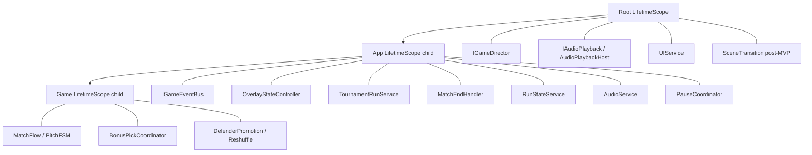

---
tags:
  - architecture
  - di
  - vcontainer
aliases:
  - VContainer
  - DI
---

# DI и LifetimeScope

← [[Обзор архитектуры]] | [[Сцены и Startup]]

**VContainer** + вложенные `LifetimeScope`. Регистрация сервисов — через **extension-методы** `Register*` на `IContainerBuilder`, не через классы `*Installer` с `Install()`.

## Иерархия scope



---

## Регистрация через extensions

Группируем `builder.Register(...)` в статические extension-методы. Каждый метод **возвращает `IContainerBuilder`** — можно чейнить и смешивать с inline-регистрациями.

### Папка

```
Futboloid.Main/
└── DI/
    ├── RootScopeExtensions.cs
    ├── AppScopeExtensions.cs
    └── GameScopeExtensions.cs
```

### Именование

| Метод | Возвращает | Когда |
|-------|------------|-------|
| `RegisterRootScope(...)` | `IContainerBuilder` | Root LifetimeScope |
| `RegisterAppScope()` | `IContainerBuilder` | App child scope |
| `RegisterGameScope()` | `IContainerBuilder` | Game child scope |

В конце каждого extension: `return builder;`

Опционально позже: `RegisterContent`, `RegisterExecutors` — отдельные extensions, если блок разрастётся.

### Пример: Root

```csharp
// RootScopeExtensions.cs — актуально
builder.RegisterComponentInHierarchy<AudioPlaybackHost>().As<IAudioPlayback>();
builder.Register<UIService>(Lifetime.Singleton);
```

### App scope

```csharp
public static class AppScopeExtensions
{
    public static IContainerBuilder RegisterAppScope(this IContainerBuilder builder)
    {
        builder.RegisterInstance(GameplaySettings.Load());
        builder.Register<PauseCoordinator>(Lifetime.Singleton);
        builder.Register<IGameEventBus, GameEventBus>(Lifetime.Singleton);
        builder.Register<TournamentRunService>(Lifetime.Singleton)
            .As<ITournamentRunService>()
            .As<ITournamentBracketReadModel>();
        builder.Register<OverlayStateController>(Lifetime.Singleton);
        builder.Register<MatchEndHandler>(Lifetime.Singleton);
        builder.RegisterInstance(AudioCatalog.Load());
        builder.Register<AudioService>(Lifetime.Singleton);
        builder.Register<RunStateService>(Lifetime.Singleton)
            .As<IRunProgressionService>();
        // …
        return builder;
    }
}
```

### Game scope

```csharp
public static class GameScopeExtensions
{
    public static IContainerBuilder RegisterGameScope(this IContainerBuilder builder, Scene gameScene)
    {
        builder.Register<MatchFlow>(Lifetime.Singleton);
        builder.Register<PitchStateMachine>(Lifetime.Singleton);
        builder.Register<BonusPickCoordinator>(Lifetime.Singleton);
        builder.RegisterComponentInScene<BallView>(gameScene);
        // … RegisterBuildCallback → InjectGameObject на всех root GO сцены
        return builder;
    }
}
```

---

## Использование в состояниях

### Root — `AppRootState.Enter`

```csharp
RootLifetimeScope = LifetimeScope.Create(builder => builder
    .RegisterRootScope(gameDirector));
```

### App — `AppGameState.Enter`

```csharp
LifetimeScope = parentLifetimeScope.CreateChild(builder => builder
    .RegisterAppScope());
```

### Game — `GameState.Enter`

```csharp
LifetimeScope = parentLifetimeScope.CreateChild(builder =>
    builder.RegisterGameScope(gameScene));
// OnGameScopeBuilt: InjectGameObject на root-объектах сцены
```

View с `[Inject]` получают `IGameEventBus` и сервисы из parent/child scope автоматически.

---

## Связь App ↔ Game (без bridge)

> [!important] Не используем `GameSession` / scope-bridge
> Раньше App-сервисы тянулись к Game через ручной `Bind(bus, pitch)`. **Сейчас нет:** шина в App, связь через **события** и constructor injection из parent scope.

| Задача | Как |
|--------|-----|
| Навигация → UI / views | `OverlayStateController` → `NavigationChangedEvent` |
| Сброс поля перед матчем | `PitchResetRequestedEvent` → `PitchStateMachine` слушает и `Reset()` |
| Конец матча → турнир | `MatchEndedEvent` → `MatchEndHandler` → `Navigation.Tournament` |
| View на сцене | `RegisterComponentInScene` + `InjectGameObject` |

**Правило:** App **не держит ссылку** на `PitchStateMachine` и не вызывает его напрямую. Game-сервисы **не инжектятся** в App-конструкторы — только общие из parent (`IGameEventBus`) или реакция на шину.

Child scope нужен пока `MatchFlow` / `PitchStateMachine` живут отдельным lifetime от… *(см. обсуждение: сейчас Game child dispose вместе с App — кандидат на слияние в App).*

---

## Зачем extensions, а не Installer.Install

| | `FooInstaller.Install(builder)` | `builder.RegisterFooScope()` |
|---|--------------------------------|------------------------------|
| Возврат | `void` | `IContainerBuilder` — fluent chain |
| Читается в `Enter` | отдельный глагол, чужой стиль | единый язык VContainer (`Register`) |
| Discoverability | ищешь класс Installer | автодополнение на `builder.Register*` |
| Суть | то же самое | то же самое |

**Installer** в нашем проекте **не используем** — только extensions.

---

## Service Locator (ограниченно)

Тонкий static-доступ **только** для MonoBehaviour на границе с Unity:

| Локатор | Scope | Пример |
|---------|-------|--------|
| `RootServiceLocator` | App+ | `UIService`, `IGameDirector` |
| `G` | Game (если понадобится) | `MatchFlow` — **не** шина; шина только через DI |

Новая логика — constructor injection; локатор не трогаем. **`IGameEventBus` в App scope**, не в `G`.

---

## View на сцене

MonoBehaviour на `Game.unity` — `[Inject] void Construct(...)` или поля с `[Inject]`. VContainer вызывает `InjectGameObject` при сборке Game scope. `BallView` держит `BallMotion` (pure C#). См. [[Шина событий]], [[Связь сцены с кодом]].

- `GameState.Enter`: `RegisterGameScope(gameScene)` → `InjectGameObject` на корнях сцены
- Сброс поля: `PitchResetRequestedEvent` на шине

---

## Опционально позже

Если появится data-driven слой (десятки `GameAction` / SO-контент):

```csharp
public static IContainerBuilder RegisterExecutors(this IContainerBuilder builder)
{
    // рефлексия…
    return builder;
}

public static IContainerBuilder RegisterContent(this IContainerBuilder builder, ContentDatabase db)
{
    // SO…
    return builder;
}

// внутри RegisterRootScope:
builder
    .RegisterContent(contentDatabase)
    .Register<ISaveStorage, PlayerPrefsSaveStorage>(Lifetime.Singleton);
```

Вызываются из `RegisterAppScope` / `RegisterRootScope` — не отдельная «система инсталлеров».

---

## Жизненный цикл

| Событие | Scope |
|---------|-------|
| `AppRootState.Enter` | `LifetimeScope.Create` + `RegisterRootScope` |
| `AppGameState.Enter` | child + `RegisterAppScope`, load Game scene |
| `GameState.Enter` | child + `RegisterGameScope`, Initialize views |
| `AppGameState.Exit` | Dispose, unload scene |
| Restart турнира | `AppGameState.Exit` → `Enter` |
| Restart матча | `PitchResetRequestedEvent` / `PitchStateMachine.Reset()` |

