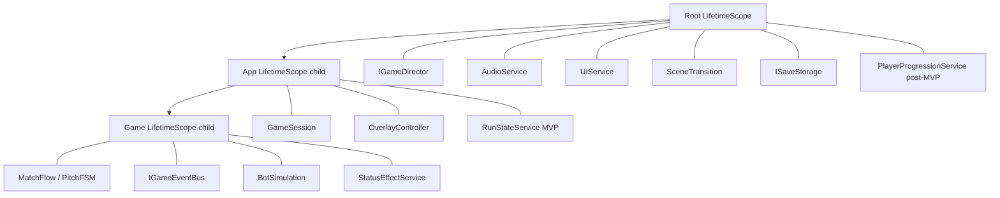

---
tags:
  - architecture
  - di
  - vcontainer
aliases:
  - VContainer
  - DI
---

# DI и LifetimeScope

← [[Обзор архитектуры]] | [[Сцены и Startup]]

**VContainer** + вложенные `LifetimeScope`. Регистрация сервисов — через **extension-методы** `Register*` на `IContainerBuilder`, не через классы `*Installer` с `Install()`.

## Иерархия scope



---

## Регистрация через extensions

Группируем `builder.Register(...)` в статические extension-методы. Каждый метод **возвращает `IContainerBuilder`** — можно чейнить и смешивать с inline-регистрациями.

### Папка

```
Futboloid.Main/
└── DI/
    ├── RootScopeExtensions.cs
    ├── AppScopeExtensions.cs
    └── GameScopeExtensions.cs
```

### Именование

| Метод | Возвращает | Когда |
|-------|------------|-------|
| `RegisterRootScope(...)` | `IContainerBuilder` | Root LifetimeScope |
| `RegisterAppScope()` | `IContainerBuilder` | App child scope |
| `RegisterGameScope()` | `IContainerBuilder` | Game child scope |

В конце каждого extension: `return builder;`

Опционально позже: `RegisterContent`, `RegisterExecutors` — отдельные extensions, если блок разрастётся.

### Пример: Root

```csharp
// RootScopeExtensions.cs
public static class RootScopeExtensions
{
    public static IContainerBuilder RegisterRootScope(
        this IContainerBuilder builder,
        IGameDirector gameDirector)
    {
        builder.RegisterInstance(gameDirector).As<IGameDirector>();
        builder.Register<AudioService>(Lifetime.Singleton);
        builder.Register<UIService>(Lifetime.Singleton).AsImplementedInterfaces();
        builder.Register<SceneTransitionService>(Lifetime.Singleton);
        builder.Register<ISaveStorage, PlayerPrefsSaveStorage>(Lifetime.Singleton);
        // PlayerProgressionService — post-MVP, не регистрируем в первой версии

        return builder;
    }
}
```

### Пример: App

```csharp
public static class AppScopeExtensions
{
    public static IContainerBuilder RegisterAppScope(this IContainerBuilder builder)
    {
        builder.RegisterBuildCallback(RootServiceLocator.Initialize);
        builder.Register<GameSession>(Lifetime.Singleton);
        builder.Register<OverlayStateController>(Lifetime.Singleton);
        builder.Register<RunStateService>(Lifetime.Singleton);

        return builder;
    }
}
```

### Пример: Game

```csharp
public static class GameScopeExtensions
{
    public static IContainerBuilder RegisterGameScope(this IContainerBuilder builder)
    {
        builder.RegisterBuildCallback(G.Initialize);

        builder.Register<IGameEventBus, GameEventBus>(Lifetime.Singleton);
        builder.Register<MatchFlow>(Lifetime.Singleton);
        builder.Register<PitchStateMachine>(Lifetime.Singleton);
        builder.Register<BotSimulationController>(Lifetime.Singleton);
        builder.Register<ComboScoreService>(Lifetime.Singleton);
        builder.Register<IStatusEffectService, StatusEffectService>(Lifetime.Singleton);
        // BallMotion внутри BallView — не в DI

        return builder;
    }
}
```

---

## Использование в состояниях

### Root — `AppRootState.Enter`

```csharp
RootLifetimeScope = LifetimeScope.Create(builder => builder
    .RegisterRootScope(gameDirector));
```

### App — `AppGameState.Enter`

```csharp
LifetimeScope = parentLifetimeScope.CreateChild(builder => builder
    .RegisterAppScope());
```

### Game — `GameState.Enter`

```csharp
LifetimeScope = parentLifetimeScope.CreateChild(builder => builder
    .RegisterGameScope()
    .RegisterBuildCallback(OnGameScopeBuilt)); // при необходимости — ещё inline
```

Цепочка: extension возвращает тот же `builder`, дальше можно вызывать любые `Register*` / `RegisterBuildCallback`.

---

## Зачем extensions, а не Installer.Install

| | `FooInstaller.Install(builder)` | `builder.RegisterFooScope()` |
|---|--------------------------------|------------------------------|
| Возврат | `void` | `IContainerBuilder` — fluent chain |
| Читается в `Enter` | отдельный глагол, чужой стиль | единый язык VContainer (`Register`) |
| Discoverability | ищешь класс Installer | автодополнение на `builder.Register*` |
| Суть | то же самое | то же самое |

**Installer** в нашем проекте **не используем** — только extensions.

---

## Service Locator (ограниченно)

Тонкий static-доступ **только** для MonoBehaviour на границе с Unity:

| Локатор | Scope | Пример |
|---------|-------|--------|
| `RootServiceLocator` | App+ | `UIService`, `IGameDirector` |
| `G` | Game | `MatchFlow`, `IGameEventBus`, `IStatusEffectService` |

Новая логика — constructor injection; локатор не трогаем.

---

## View на сцене

MonoBehaviour получает `IGameEventBus` в `Initialize`. `BallView` держит `BallMotion` (pure C#). См. [[Шина событий]], [[Связь сцены с кодом]].

- `GameState.Enter`: `RegisterGameScope()` → `Initialize` на view
- Сброс матча: `MatchResetEvent` на шине

---

## Опционально позже

Если появится data-driven слой (десятки `GameAction` / SO-контент):

```csharp
public static IContainerBuilder RegisterExecutors(this IContainerBuilder builder)
{
    // рефлексия…
    return builder;
}

public static IContainerBuilder RegisterContent(this IContainerBuilder builder, ContentDatabase db)
{
    // SO…
    return builder;
}

// внутри RegisterRootScope:
builder
    .RegisterContent(contentDatabase)
    .Register<ISaveStorage, PlayerPrefsSaveStorage>(Lifetime.Singleton);
```

Вызываются из `RegisterAppScope` / `RegisterRootScope` — не отдельная «система инсталлеров».

---

## Жизненный цикл

| Событие | Scope |
|---------|-------|
| `AppRootState.Enter` | `LifetimeScope.Create` + `RegisterRootScope` |
| `AppGameState.Enter` | child + `RegisterAppScope`, load Game scene |
| `GameState.Enter` | child + `RegisterGameScope`, Initialize views |
| `AppGameState.Exit` | Dispose, unload scene |
| Restart турнира | `AppGameState.Exit` → `Enter` |
| Restart матча | reset внутри Game scope / событие на шине |
