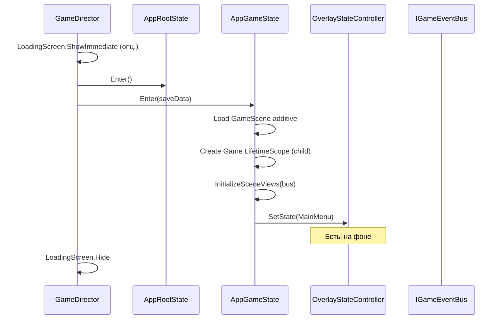

---
tags:
  - architecture
  - gamedirector
---

# GameDirector

← [[Обзор архитектуры]] | [[Машины состояний]]

Центральный оркестратор приложения: startup, переходы между app-состояниями, рестарт, save.

## Интерфейс

```csharp
public interface IGameDirector
{
    void InitializeGame();
    void RestartTournament();
    void RestartMatch();
    void ReturnToMainMenu();
    void SaveGame();
    void LoadLastSave();
}
```

Регистрируется в Root DI как singleton; экземпляр создаётся до построения scope и передаётся через `RegisterInstance`.

## InitializeGame (cold start)



## RestartMatch

Без выгрузки сцены — через шину и Navigation:

1. `OverlayStateController` публикует `PitchResetRequestedEvent`
2. `PitchStateMachine` слушает → `Reset()`; `MatchFlow.Reset()` — счёт, таймер
3. `Navigation → OnField`, `Pitch → KickoffWait`

## RestartTournament

Полный цикл сессии: `AppGameState.Exit()` → `Enter()`.

1. Scene transition (опционально)
2. `AppGameState.Exit()`
3. `AppGameState.Enter(null)`
4. `Overlay → Tournament` или `MainMenu`

## ReturnToMainMenu

1. `Pitch →` остановка / idle
2. `Navigation → MainMenu`
3. `BotSimulation` on
4. Показать лидерборд

## Сохранения

### Web / Standalone

```csharp
public interface ISaveStorage
{
    bool HasSave();
    GameSaveData Load();
    void Save(GameSaveData data);
    void SaveLeaderboardEntry(LeaderboardEntry entry);
    IReadOnlyList<LeaderboardEntry> GetLeaderboard();
}
```

| Платформа | Реализация |
|-----------|------------|
| WebGL | `PlayerPrefs` → localStorage |
| Standalone | `PlayerPrefs` или файл JSON |

> Cookies для геймплейных save **не используем** — неудобно, лимит 4KB, не Unity-way.

### Что сохраняем (позже)

- Прогресс турнира
- Карьерные очки
- Таблица лидеров (локальная; онлайн — отдельный backend TBD)

### Первый запуск

`HasSave() == false`:

- Не блокируем вход меню
- После «Играть» — чистый матч с подсказкой
- Флаг `HasPlayedBefore` можно записать при первом голе / конце матча

## Связь с Pause

`IGameDirector.ReturnToMainMenu()` вызывается из Pause overlay.  
`RestartTournament()` — из Pause или Game Over overlay.
