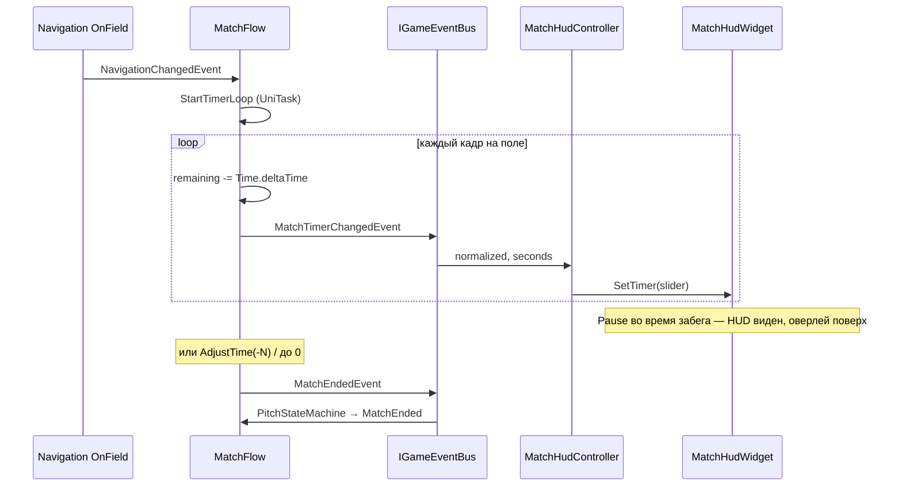
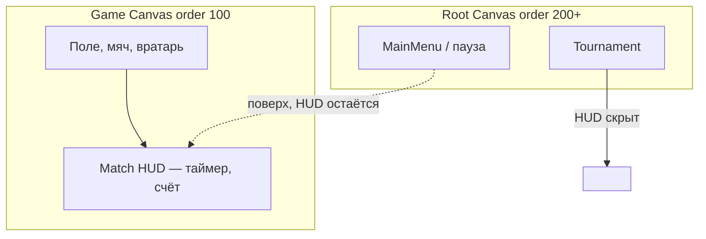
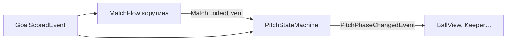
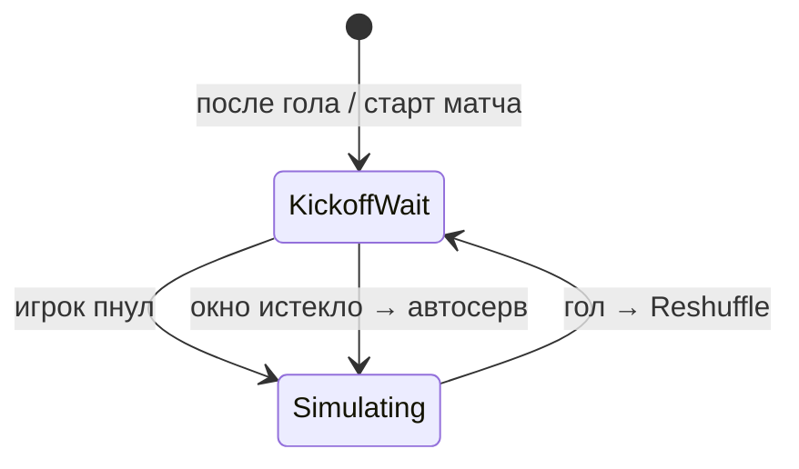

---
tags:
  - architecture
  - match
  - timer
  - hud
aliases:
  - MatchFlow
  - Таймер матча
---

# MatchFlow и таймер матча

← [[Индекс архитектуры]] | [[Машины состояний]] | [[Шина событий]]

**Scope:** Game (`MatchFlow` в Game LifetimeScope).

Отвечает за **счёт голов** и **обратный отсчёт 90 с**. `PitchStateMachine` не тикает таймер — только слушает **`MatchEndedEvent`** и переходит в `MatchEnded`.

Связано: [[UI и оверлеи#Match HUD]], [[../GDD/02 Игровой цикл#Окончание матча|GDD: окончание матча]], [[Прогрессия и эффекты#7. HUD — события + анимация кольца|HUD на событиях (аналогия с баффами)]].

> [!note] Статус
> **Реализовано (MVP):** корутина таймера, события шины, `MatchHudController` на Game. Комбо, доп. время по правилам футбола — позже.

---

## Разделение ответственности

| Класс | Что делает | Чего не делает |
|-------|------------|----------------|
| **`MatchFlow`** | Счёт, таймер, `MatchEndedEvent`, сдвиг времени | Не двигает мяч, не знает про UI |
| **`PitchStateMachine`** | Фазы поля (`KickoffWait`, `Simulating`…) | Не считает секунды |
| **`MatchHudController`** (Game) | Шина → виджет; видимость поля | Скрывает только при `Tournament` |
| **`MatchHudWidget`** | Слайдер, тексты | Не знает про Navigation напрямую |

**XP забега, перки, timed-баффы** — не здесь. См. [[Прогрессия и эффекты]].

---

## Принцип таймера (как у баффов в §7)

**Источник правды** — `MatchFlow` (одна фоновая **UniTask-корутина**).  
**HUD** не опрашивает сервис в `Update` и **нет** внешнего `ITickable` / `Tick(dt)` снаружи.

| Что | Кто решает |
|-----|------------|
| Сколько секунд осталось | `MatchFlow` (корутина + `AdjustTime`) |
| Как выглядит полоска | `MatchHudLayout` → `Slider` по **`MatchTimerChangedEvent`** |
| Матч реально кончен | `MatchFlow` → **`MatchEndedEvent`** → `PitchStateMachine` |



### Почему корутина, а не внешний тик

- Один владелец времени — проще пауза, сброс, доп. время.
- Параллельно с геймплеем: корутина крутится, остальной код **только слушает события**.
- Сдвиг времени (`+15` доп. время) — одно событие, без правок HUD.

---

## Жизненный цикл корутины

| Событие | Поведение |
|---------|-----------|
| `Navigation → OnField` | `StartTimerLoop()` (если матч не кончен) |
| Пауза (`Pause` во время **забега**, см. [[UI и оверлеи#Главное меню ≠ пауза]]) | `StopTimerLoop()` — секунды **сохраняются** |
| Continue → `OnField` | снова `StartTimerLoop()` с тем же `RemainingSeconds` |
| `PitchResetRequestedEvent` (новый Play) | стоп корутины, счёт и таймер → 90 с |
| `RemainingSeconds ≤ 0` | `MatchEndedEvent`, стоп корутины |
| `PitchPhase → MatchEnded` | стоп корутины, флаг конца матча |

Корутина использует `Time.deltaTime` → при `timeScale = 0` отсчёт замирает даже если цикл формально жив (на паузе цикл **останавливаем** через `CancellationToken`).

---

## Настройки (`GameplaySettings`)

ScriptableObject: **Assets → Create → Futboloid → Gameplay Settings**.

Положить в `Assets/_Projects/Resources/Data/Settings/GameplaySettings.asset` (путь Resources: `Data/Settings/GameplaySettings`).

| Поле | По умолчанию | Кто читает |
|------|--------------|------------|
| `matchDurationSeconds` | 90 | `MatchFlow` |
| `matchesToWin` | 3 | `TournamentRunService` |

Регистрация в **App scope**; Game scope наследует через VContainer.

---

## События (шина)

```csharp
public readonly struct MatchTimerChangedEvent
{
    public float RemainingSeconds { get; }
    public float Normalized { get; }   // Remaining / TotalDuration (растёт при доп. времени)
}

public readonly struct MatchScoreChangedEvent
{
    public int PlayerScore { get; }
    public int OpponentScore { get; }
}

public readonly struct MatchEndedEvent
{
    public int PlayerScore { get; }
    public int OpponentScore { get; }
}

/// <summary>+N доп. время, −N штраф. Публикует любой геймплейный код.</summary>
public readonly struct MatchTimeAdjustedEvent
{
    public float DeltaSeconds { get; }
    public string Reason { get; }
}
```

`MatchFlow` публикует:

- **`MatchTimerChangedEvent`** — из корутины после каждого шага (для плавного слайдера) и после `AdjustTime` / `Reset`
- **`MatchScoreChangedEvent`** — при голе (`GoalScoredEvent` → `RecordGoal`)
- **`MatchEndedEvent`** — при `RemainingSeconds ≤ 0` (в т.ч. после отрицательного `AdjustTime`)
- слушает **`MatchTimeAdjustedEvent`** → `AdjustTime(delta, reason)`

### Доп. время

```csharp
_bus.Publish(new MatchTimeAdjustedEvent(15f, "stoppage"));
```

При **положительном** `DeltaSeconds` увеличивается `_totalDurationSeconds` — слайдер остаётся в диапазоне 0…1 (полоска может «подрасти» визуально).

Отрицательный сдвиг — штраф / ускорение конца матча.

---

## HUD: слайдер на сцене Game

Match HUD **не на Root** — он живёт на **`Game.unity`** вместе с полем. Магазин и турнир на Root **не тащат** HUD матча.

### Видимость vs оверлеи



| Navigation | HUD |
|------------|-----|
| `OnField`, `Pause` (во время забега) | **Включён** — пауза рисуется поверх |
| `MainMenu` | **Выключен** — фоновые боты без матча, см. [[UI и оверлеи#Главное меню ≠ пауза]] |
| `Tournament` | **Выключен** |

```
Game.unity
└── UI / MatchHud          ← Canvas (Screen Space Overlay, order 100)
    ├── MatchHudController  IGameSceneInitializable
    ├── MatchHudWidget
    └── TimerSlider, тексты…
```

Инициализация — как у `GoalkeeperView`: `GameState` → `Initialize(bus)` → HUD **сразу виден**.

| Компонент | Где | Роль |
|-----------|-----|------|
| `MatchHudController` | Game scene | шина → слайдер/счёт; `Close` только при `Tournament` |
| `MatchHudWidget` + `MatchHudLayout` | Game scene | слайдер 0…1, тексты |

**Не** в `UIService` на Root. Подписка на `NavigationChangedEvent` — **только** чтобы скрыть при уходе с поля, не при меню/паузе.

**Inspector (слайдер):** Min = 0, Max = 1, Value = 1, Interactable = off.

Виджет **не** слушает `MatchEnded` — конец матча обрабатывает `PitchStateMachine`.

---

## Связь с Pitch FSM



- Гол: `PitchStateMachine` → `Reshuffle` → `KickoffWait` (матч-таймер **не** сбрасывается).
- Новый матч: `OverlayStateController` → `PitchResetRequestedEvent` → `PitchStateMachine.Reset()` + `MatchFlow.Reset()` + `KickoffWait`.

---

## KickoffWait: окно ввода (идея, не реализовано)

> [!idea] Не пауза матч-таймера
> **Не** останавливаем 90-секундный таймер в `KickoffWait`. Вместо этого — **отдельный короткий таймер ввода** (kickoff window), не связанный с `MatchFlow`.

| Таймер | Когда | Что делает |
|--------|-------|------------|
| **Матч** (`MatchFlow`) | `Simulating` | Обратный отсчёт 90 с, счёт голов |
| **Окно ввода** (kickoff) | `KickoffWait` | Короткая задержка перед автосервом |

### Поведение окна ввода

1. Фаза `KickoffWait`: мяч на `BallKickoffAnchor`, матч-таймер **не тикает** (или ещё не запущен — только после первого `Simulating`).
2. Стартует **отдельный** отсчёт (например 3–5 с) — «окно», пока игрок может **сам** пнуть (Пробел / тап).
3. Если игрок пнул раньше — окно отменяется, переход в `Simulating`, матч-таймер идёт.
4. Если окно **истекло** — **автоматический** удар по мячу (серв без игрока), затем `Simulating`.



### Зачем так

- Не нужно «замораживать» матч-таймер на каждом кик-оффе — проще модель: таймер = только активная игра.
- Игрок не застревает, если забыл Пробел — автосерв после задержки.
- Окно ввода — зона `PitchStateMachine` + `BallView` / anchor; в шину можно позже добавить `KickoffWindowChangedEvent` (не в MVP).

**Сейчас в коде:** только ручной серв по Пробелу, без окна и без автосерва. Матч-таймер крутится всё время на `OnField` — это временно, до реализации идеи выше.

---

## Чего нет в MVP (задел)

| Фича | Как добавить позже |
|------|---------------------|
| Доп. время при голе в концовке | подписчик публикует `MatchTimeAdjustedEvent` |
| Окно ввода в `KickoffWait` + автосерв | отдельный таймер в Pitch FSM, см. § выше |
| Анимация счёта (bounce) | `MatchHudLayout` на `MatchScoreChangedEvent` + DOTween |
| `ComboScoreService` | отдельные события, тот же `MatchHudController` |

---

## Код

| Файл | Сборка |
|------|--------|
| `Futboloid.Gameplay/Match/MatchFlow.cs` | Game |
| `Futboloid.Core/Bus/Events/Match*.cs` | Core |
| `Futboloid.Main/UI/MatchHudController.cs` | Game scene |
| `Futboloid.UI/Views/MatchHud/*` | Game scene UI |

См. также [[Шина событий]], [[DI и LifetimeScope#Game scope]].
