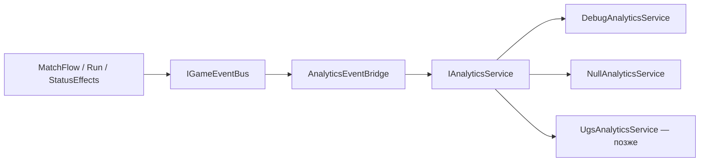

---
tags:
  - architecture
  - analytics
aliases:
  - Analytics
  - Аналитика
status: active
---

# Аналитика

← [[Индекс архитектуры]] | [[Обзор архитектуры]]

Связано: [[Шина событий]], [[DI и LifetimeScope]], [[GameDirector#Сохранения]], [[../GDD/02 Игровой цикл|GDD: игровой цикл]].

---

## Цели (согласовано)

| Фокус | Что узнаём |
|-------|------------|
| **Удержание** | Дошли ли до матча 2…9; на каком раунде вылет / чемпион |
| **Баланс** | Счёт, wipe vs timer, комбо, какие перки берут, какие бафы ловят |

Не собираем: время до первой подачи (игра сразу ждёт Space — метрика ~100%).

**SDK:** цель — **UGS Analytics** (рядом с уже подключёнными Leaderboards). Сейчас в коде — фасад + `Debug` / `Null`, без боевого SDK.

---

## Принципы

1. **Один фасад** — `IAnalyticsService`, не `AnalyticsService.Instance` / UGS API по всему коду
2. **Не путать с игровой шиной** — `IGameEventBus` для геймплея; аналитика — `AnalyticsEventBridge`
3. **События из домена** — «матч кончился», «перк выбран», не клики по UI
4. **Без PII**
5. **Dev:** Editor / Development Build → `DebugAnalyticsService` (лог); иначе → `NullAnalyticsService` до подключения UGS
6. Имена событий **стабильны**; менять только вместе с этой страницей

---

## Архитектура



| Слой | Роль |
|------|------|
| **App scope** | `IAnalyticsService` + `AnalyticsEventBridge` |
| **Bridge** | подписка на шину → `Track` |
| **Провайдер** | Debug / Null / (позже) UGS |

Регистрация: `RegisterAnalytics()` в `AppScopeExtensions`.

---

## Интерфейс

```csharp
public interface IAnalyticsService
{
    void Track(AnalyticsEvent evt);
    void SetUserProperty(string key, string value);
    void Flush();
}
```

Папки:

```
Futboloid.Core/Analytics/
  IAnalyticsService.cs
  AnalyticsEvent.cs
  AnalyticsEventNames.cs
  NullAnalyticsService.cs
  DebugAnalyticsService.cs
  AnalyticsEventBridge.cs
```

UGS-реализация (когда подключим пакет): `Futboloid.Main/Analytics/UgsAnalyticsService.cs`.

---

## Каталог v1

Имена — `snake_case`. Параметры — примитивы.

### Сессия

| Событие | Когда | Параметры |
|---------|-------|-----------|
| `session_start` | создание Bridge (старт App) | `platform`, `build_version` |
| `session_end` | `Dispose` Bridge | `duration_sec` |

### Турнир (9 матчей)

| Событие | Когда | Параметры |
|---------|-------|-----------|
| `tournament_start` | `ResetRun` | `matches_to_win`, `run_seed` |
| `tournament_end` | вылет или 9-я победа | `result` (`completed` \| `eliminated`), `matches_played`, `max_round` |

### Матч

| Событие | Когда | Параметры |
|---------|-------|-----------|
| `match_end` | `MatchEndedEvent` | `round`, `player_score`, `enemy_score`, `win`, `end_reason` (`timer` \| `wipe`), `duration_sec`, `max_combo`, `bonus_picks` |

### Перки

| Событие | Когда | Параметры |
|---------|-------|-----------|
| `perk_offered` | `BonusPickOfferedEvent` | `offer_0`, `offer_1`, `offer_2`, `round` |
| `perk_picked` | `PerkPickedEvent` | `perk_id`, `level_after`, `round` |

Отчёт баланса: **picked / offered** по `perk_id` (не только picked).

### Бафы / дебафы (трибуны)

| Событие | Когда | Параметры |
|---------|-------|-----------|
| `status_effect_applied` | `StatusEffectAppliedEvent` | `effect_id`, `is_debuff`, `round` |

---

## Вне v1 (пока не слать)

- first serve / время до подачи
- каждый гол / каждый hit
- позиции мяча
- dive (опционально позже счётчиком в `match_end`)
- GDPR banner / очередь Web — при подключении UGS, если понадобится

---

## Этапы

| Этап | Содержание | Статус |
|------|------------|--------|
| 0 | `IAnalyticsService` + Null/Debug + DI | ✅ |
| 1 | Bridge: session, tournament, match_end, perk_*, status_effect_* | ✅ |
| 2 | `UgsAnalyticsService` + пакет UGS Analytics | 🔲 |
| 3 | User properties, Flush, privacy | 🔲 |

---

## Чего не делать

- Вызовы SDK из `BallView` / entity / виджетов
- Дублировать всю шину 1:1
- Слать данные каждый кадр
- Блокировать UI ожиданием сети
- Хардкодить ключи SDK по проекту

---

## Связанные заметки

- [[Шина событий]]
- [[DI и LifetimeScope]]
- [[../GDD/08 Сложность, pacing и турнир]]
- [[../GDD/09 Карточки перков и XP]]
