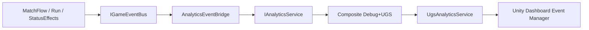

---
tags:
  - architecture
  - analytics
aliases:
  - Analytics
  - Аналитика
status: active
---

# Аналитика

← [[Индекс архитектуры]] | [[Обзор архитектуры]]

Связано: [[Шина событий]], [[DI и LifetimeScope]], [[GameDirector#Сохранения]], [[../GDD/02 Игровой цикл|GDD: игровой цикл]].

---

## Цели (согласовано)

| Фокус | Что узнаём |
|-------|------------|
| **Удержание** | Дошли ли до матча 2…9; на каком раунде вылет / чемпион |
| **Баланс** | Счёт, wipe vs timer, комбо, какие перки берут, какие бафы ловят |

Не собираем: время до первой подачи (игра сразу ждёт Space — метрика ~100%).

**SDK:** **UGS Analytics** (`com.unity.services.analytics`) + тот же Unity Project / anonymous auth, что Leaderboards.

---

## Принципы

1. **Один фасад** — `IAnalyticsService`, не `AnalyticsService.Instance` по всему коду
2. **Не путать с игровой шиной** — `IGameEventBus` для геймплея; аналитика — `AnalyticsEventBridge`
3. **События из домена** — «матч кончился», «перк выбран», не клики по UI
4. **Без PII**
5. **Dev:** Editor / Development Build → `Debug` **+** UGS (Composite); Release → только UGS
6. Имена событий **стабильны** и **должны совпадать** со схемами в Dashboard
7. Consent: Unity 6.2+ через `EndUserConsent` (`AnalyticsIntent = Granted` при старте; GDPR-баннер — позже)

---

## Архитектура



| Слой | Роль |
|------|------|
| **App scope** | `IAnalyticsService` + `AnalyticsEventBridge` |
| **Bridge** | шина → `Track` |
| **UgsAnalyticsService** | `CustomEvent` + consent + Flush |

Регистрация: `RegisterAnalytics()` в `AppScopeExtensions`.

Код:

```
Futboloid.Core/Analytics/     — фасад, bridge, Debug, Composite
Futboloid.Main/Analytics/     — UgsAnalyticsService
```

---

## Каталог v1

Имена — `snake_case`. Параметры — примитивы (`string` / `int` / `bool` / `float`).

### Сессия

| Событие | Параметры |
|---------|-----------|
| `session_start` | `platform` (string), `build_version` (string) |
| `session_end` | `duration_sec` (int) |

### Турнир

| Событие | Параметры |
|---------|-----------|
| `tournament_start` | `matches_to_win` (int), `run_seed` (int), `start_match` (int) |
| `tournament_end` | `result` (string: `completed` \| `eliminated`), `matches_played` (int), `max_round` (int) |

### Матч

| Событие | Параметры |
|---------|-----------|
| `match_end` | `round` (int), `player_score` (int), `enemy_score` (int), `win` (bool), `end_reason` (string: `timer` \| `wipe`), `duration_sec` (int), `max_combo` (int), `bonus_picks` (int) |

### Перки / бафы

| Событие | Параметры |
|---------|-----------|
| `perk_offered` | `offer_0`, `offer_1`, `offer_2` (string), `round` (int) |
| `perk_picked` | `perk_id` (string), `level_after` (int), `round` (int) |
| `status_effect_applied` | `effect_id` (string), `is_debuff` (bool), `round` (int) |

---

## Настройка Dashboard (делаешь ты)

Без схем в Event Manager UGS **молча отбрасывает** custom events.

### 1. Включить Analytics

1. [Unity Dashboard](https://cloud.unity.com) → тот же **Project**, что для Leaderboards  
2. **Products → Analytics** → включить / открыть  
3. В Editor: Project Settings → Services — проект привязан (как уже для лидербордов)

### 2. Создать custom events

**Analytics → Event Manager → Create Event** — по одной на каждое имя из каталога v1 выше.

Для каждого параметра указать **тот же тип**, что в таблице (`STRING` / `INTEGER` / `BOOLEAN` / `FLOAT`).  
Имена **регистрозависимы** — копируй 1:1 (`match_end`, `end_reason`, …).

После создания — **Approve / make live** (в UI Dashboard может называться Activate), иначе события не принимаются.

### 3. Проверка

1. Открой проект в Unity → дождись resolve пакета `com.unity.services.analytics`  
2. Play Mode + интернет  
3. Console: `[Analytics] …` (Debug) и `[Analytics:UGS] Consent granted…`  
4. Dashboard → **Analytics → Event Browser** (данные с задержкой; можно `Flush` при выходе из App scope)

Сцена / префабы аналитики **не нужны** — всё через DI.

---

## Этапы

| Этап | Содержание | Статус |
|------|------------|--------|
| 0 | Фасад + Null/Debug + DI | ✅ |
| 1 | Bridge: каталог v1 | ✅ |
| 2 | `UgsAnalyticsService` + пакет + consent | ✅ код; 🔲 схемы в Dashboard |
| 3 | GDPR-баннер, user properties | 🔲 |

---

## Чего не делать

- SDK из view / entity  
- Дублировать всю шину 1:1  
- События без схемы в Dashboard  
- Менять имена без правки этой страницы и Dashboard  

---

## Связанные заметки

- [[Шина событий]]
- [[DI и LifetimeScope]]
- [[../GDD/08 Сложность, pacing и турнир]]
- [[../GDD/09 Карточки перков и XP]]
