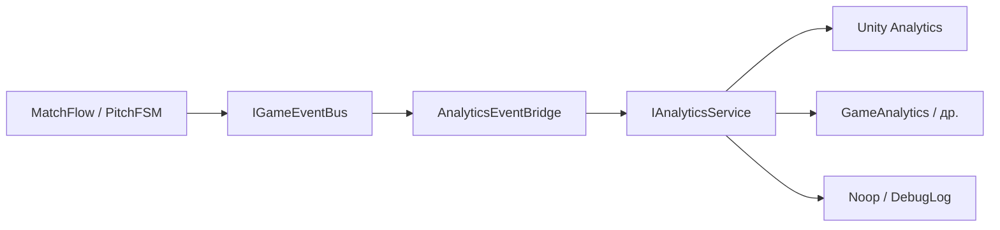

---
tags:
  - architecture
  - analytics
  - wip
  - future
aliases:
  - Analytics
  - Аналитика
status: draft
---

# Аналитика (на будущее)

← [[Индекс архитектуры]] | [[Обзор архитектуры]]

> [!warning] Черновик
> Аналитика **не в приоритете** на старте разработки. Документ фиксирует **куда встроить**, **что слать** и **чего избегать**, чтобы не переделывать архитектуру позже.

Связано: [[Шина событий]], [[DI и LifetimeScope]], [[GameDirector#Сохранения]], [[../GDD/02 Игровой цикл|GDD: игровой цикл]].

---

## Зачем

| Вопрос | Пример |
|--------|--------|
| Баланс | Средняя длина матча, сколько голов за 90 с |
| Воронка | Дошли до турнира → дошли до 2-го матча |
| Фичи | Используют ли dive, какой max combo |
| Web / релиз | Платформа, браузер, падения сессии |
| Монетизация (если будет) | — заранее не закладываем |

Аналитика **не** должна тормозить геймплей и **не** должна утекать в entity/view.

---

## Принципы

1. **Один фасад** — `IAnalyticsService`, не `GameAnalytics.SDK` по всему коду
2. **Не путать с игровой шиной** — `IGameEventBus` для UI/геймплея; аналитика — отдельный слушатель или тонкий мост
3. **События из домена** — слать «гол забит», а не «нажали кнопку на HUD»
4. **Без PII** — никаких имён, email, свободного текста чата
5. **Очередь + flush** — особенно WebGL: батчить, переживать обрыв сети
6. **Dev off** — в редакторе / debug-билде можно глушить или логировать в консоль

---

## Место в архитектуре



| Слой | Роль |
|------|------|
| **Root scope** | `IAnalyticsService` singleton на всё приложение |
| **AnalyticsEventBridge** | подписка на выбранные события шины → вызов `Track(...)` |
| **Провайдер** | реализация под платформу (WebGL / Standalone) |

Инициализация — в `AppRootState.Enter` (рядом с audio), **до** первого матча:

```csharp
// RootScopeExtensions — позже
builder
    .RegisterRootScope(gameDirector)
    .RegisterAnalytics(); // IAnalyticsService + bridge
```

---

## Интерфейс (черновик)

```csharp
public interface IAnalyticsService
{
    void Track(AnalyticsEvent evt);
    void SetUserProperty(string key, string value);
    void Flush();
}

public readonly struct AnalyticsEvent
{
    public string Name { get; }
    public IReadOnlyDictionary<string, object> Parameters { get; }
}
```

Реализации на выбор (одна активная в билде):

| Класс | Когда |
|-------|-------|
| `NullAnalyticsService` | По умолчанию в dev |
| `DebugAnalyticsService` | Лог в консоль |
| `UnityAnalyticsService` | Встроенная Unity |
| `GameAnalyticsService` | Если подключим SDK |
| `QueuedAnalyticsService` | Обёртка: очередь + flush для Web |

Регистрация через [[DI и LifetimeScope#Регистрация через extensions|extension]] `RegisterAnalytics()`.

---

## Игровая шина ≠ аналитика

| | `IGameEventBus` | `IAnalyticsService` |
|---|-----------------|---------------------|
| Скорость | каждый кадр ок | редко, батчи |
| Подписчики | view, HUD, audio | bridge, иногда achievements |
| Контракт | struct в процессе матча | стабильные имена для дашборда |

**Мост** переводит доменные события в analytics-события:

```csharp
// AnalyticsEventBridge — подписан на шину
void OnGoalScored(GoalScoredEvent e) =>
    analytics.Track(new AnalyticsEvent("goal_scored", new Dictionary<string, object>
    {
        ["is_player"] = e.IsPlayerGoal,
        ["combo"] = e.ComboMultiplier,
        ["match_time_left"] = e.TimeLeftSec,
    }));
```

Entity **не** вызывает `analytics.Track` — только публикует в шину (или сервис матча публикует).

---

## Каталог событий (черновик)

Имена — `snake_case`, стабильные. Параметры — примитивы (`int`, `float`, `bool`, `string` enum).

### Сессия / приложение

| Событие | Когда | Параметры |
|---------|-------|-----------|
| `session_start` | `AppGameState.Enter` | `platform`, `build_version` |
| `session_end` | выход / `AppGameState.Exit` | `duration_sec` |
| `navigation_changed` | смена overlay | `screen` (main_menu, match, tournament, pause) |

### Матч

| Событие | Когда | Параметры |
|---------|-------|-----------|
| `match_start` | `Pitch → Simulating` первый раз | `tournament_round` |
| `match_end` | `MatchEnded` | `player_score`, `enemy_score`, `duration_sec` |
| `goal_scored` | гол | `is_player`, `combo`, `time_left` |
| `defender_destroyed` | защитник выбит | `slot_id`, `session_ball_id` |
| `combo_peak` | новый max combo в сессии мяча | `multiplier` |
| `dive_used` | dive вратаря | `success` (если есть сейв) |
| `ball_served` | ввод мяча | `phase` (kickoff, after_goal) |

### Мета / турнир

| Событие | Когда | Параметры |
|---------|-------|-----------|
| `tournament_start` | вход в сетку | — |
| `tournament_match_scheduled` | следующий соперник | `round` |
| `tournament_end` | победа / поражение в турнире | `result`, `matches_played` |

### UI / воронка

| Событие | Когда | Параметры |
|---------|-------|-----------|
| `main_menu_play` | «Играть» | `has_save` |
| `leaderboard_opened` | панель лидеров | — |
| `match_pause` | Escape | — |
| `match_restart` | рестарт из паузы | — |

### Ошибки (опционально)

| Событие | Когда |
|---------|-------|
| `unhandled_exception` | глобальный handler (см. startup) |

> Расширять список **только** через этот документ — иначе дашборды разъедутся.

---

## User properties (редко, на сессию)

| Ключ | Пример |
|------|--------|
| `first_play` | `true` / `false` |
| `matches_total` | счётчик из save |
| `preferred_lang` | из настроек |

Не слать каждый кадр. Обновлять при старте сессии или смене настроек.

---

## WebGL и сохранения

| Тема | Подход |
|------|--------|
| Идентификатор игрока | анонимный UUID в `PlayerPrefs` / localStorage |
| Согласие (GDPR) | если EU — баннер + флаг до `Initialize` аналитики |
| Офлайн | очередь в памяти, `Flush` при `OnApplicationPause` / конце матча |
| Cookies | **не** используем для аналитики; см. [[GameDirector#Сохранения]] |

---

## Папки в проекте (когда дойдём)

```
Futboloid.Core/
└── Analytics/
    ├── IAnalyticsService.cs
    ├── AnalyticsEvent.cs
    ├── NullAnalyticsService.cs
    └── AnalyticsEventBridge.cs   # подписка на IGameEventBus

Futboloid.Main/
└── Analytics/                    # реализации под SDK
    ├── UnityAnalyticsService.cs
    └── RegisterAnalyticsExtensions.cs
```

---

## Этапы внедрения

| Этап | Содержание | Приоритет |
|------|------------|-----------|
| 0 | `NullAnalyticsService` + интерфейс в DI | после startup |
| 1 | `DebugAnalyticsService` + bridge на 3–5 событий (match_end, goal) | после Pitch FSM |
| 2 | Выбор SDK, WebGL queue | перед публичным Web |
| 3 | Полный каталог + user properties | по необходимости |

- [ ] Интерфейс и noop в Root scope
- [ ] Bridge от шины
- [ ] Каталог событий v1 согласован с геймдизайном
- [ ] SDK и privacy для Web

---

## Чего не делать

- `GameAnalytics` / `Analytics.CustomEvent` из `BallView` или entity
- Дублировать каждое событие шины в аналитику 1:1 (шум)
- Слать позиции мяча каждый кадр
- Блокировать UI ожиданием ответа SDK
- Хардкодить ключи SDK в десятках файлов

---

## Связанные заметки

- [[Шина событий]]
- [[DI и LifetimeScope]]
- [[Машины состояний]]
- [[../GDD/Составляющие (карта систем)|Карта систем GDD]]
