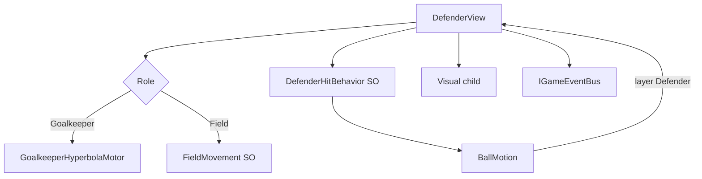

---
tags:
  - architecture
  - enemies
  - defenders
aliases:
  - Враги
  - Defenders
---

# Враги и защитники

← [[Индекс архитектуры]] | GDD: [[../GDD/07 Противник — вратарь и футболисты|§7 Противник]]

Техническая модель **футболиста соперника**: **один prefab, один коллайдер**, переключаемый **режим** (`Field` / `Goalkeeper`). Согласовано с [[Принципы проектирования]] — **MonoBehaviour + SO + шина**, без Entity.

> [!important] Не два класса
> Нет `OpponentGoalkeeperView` отдельно от `DefenderView`. Всё — **`DefenderView`**. Вратарь = тот же компонент с `Role = Goalkeeper`.

---

## Один prefab

```text
Defender (prefab)
├── DefenderView          ← логика, HP, режим, контакт с мячом
├── BoxCollider2D         ← один на всё время жизни
├── Visual                ← спрайт/скин; view переключает по Role
└── (опц.) Animator
```

| Что | Как |
|-----|-----|
| Коллайдер | **Один** `BoxCollider2D`, layer `Defender`, не меняется при смене роли |
| Визуал | Дочерний `Visual` — ссылки на спрайты вратаря/полевого в `DefenderView` или отдельном `DefenderVisual` |
| Режим | `DefenderRole`: `Field` \| `Goalkeeper` |
| Движение | `DefenderMotor` внутри view: ветка по `Role` |
| Удар | `DefenderHitBehavior` (SO) — общий для обеих ролей |



---

## `DefenderView` — ядро

```csharp
public enum DefenderRole { Field, Goalkeeper }

public sealed class DefenderView : MonoBehaviour, IDefenderBallContact
{
    [SerializeField] DefenderRole role;
    [SerializeField] DefenderMovementBehavior fieldMovement;  // только для Field
    [SerializeField] DefenderHitBehavior hitBehavior;
    [SerializeField] DefenderVisual visual;                   // смена спрайта по role
    [SerializeField] BoxCollider2D bodyCollider;              // один

    int slotId;
    int hp;
    Vector2 homePosition;   // слот на поле; пусто если только GK с рождения

    public void SetRole(DefenderRole newRole)
    {
        role = newRole;
        visual?.ApplyRole(newRole);
        // motor переключается в Tick
    }
}
```

- Старт матча: один экземпляр с `role = Goalkeeper` у `GoalAnchor`, остальные на слотах с `role = Field`.
- HP, hit, bus — **одинаково** для обеих ролей.
- `OnBallHit` — без ветвления по типу класса, только по `hitBehavior` и флагам (пас и т.д.).

---

## Движение (`DefenderMotor`)

Один motor (pure C# или private в view), две ветки:

### `Goalkeeper` — гипербола

```csharp
// t ∈ [-1, 1] → x по ширине ворот, y = goalLineY + a * (1 - t²)
Vector2 PositionOnHyperbola(float t, float goalLineY, float minX, float maxX, float hyperbolaA);
```

- Параметры зоны ворот — с `GoalAnchor` или SO `GoalkeeperZoneSettings`.
- `t` — `PingPong` по времени.
- Коллайдер едет с `transform`.

### `Field` — `DefenderMovementBehavior` (SO)

| Enum | Поведение |
|------|-----------|
| `Idle` | `homePosition` |
| `PatrolGenerated` | `PatrolPathGenerator` → N точек вокруг слота |
| `WanderInRadius` | случайные цели в радиусе |
| `ChaseBallInRadius` | к мячу, если в радиусе |

Тик только при `PitchStateMachine.IsSimulating` и `role == Field`.

### Переход Field → Goalkeeper (замена)

1. `DefenderPromotionService` (лёгкий сервис или static на registry) слушает смерть текущего GK.
2. Кандидат: живой `DefenderView` с `role == Field`.
3. Состояние `PromotingToGoalkeeper`: lerp/DOTween к `GoalAnchor`.
4. `SetRole(Goalkeeper)` — motor переключается на гиперболу, `homeSlot` освобождён.

Отдельный prefab **не** спавним.

---

## Отбивание: `DefenderHitBehavior` (SO)

Без изменений по смыслу — см. предыдущую версию документа:

| `DefenderHitType` | Мяч |
|-------------------|-----|
| `Reflect` | reflect по нормали |
| `ToPlayerGoal` | `Directed` вниз |
| `PassToNeighbor` | `Directed` к соседу, HP получателя не трогаем |

Заряд паса — в `DefenderView`, сброс по `BallReturnedToKeeperEvent`.

В режиме `Goalkeeper` тип `PassToNeighbor` на практике не назначаем (или fallback в SO).

---

## Сетка и соседи

```text
Opponents (parent)
├── GoalAnchor                 ← зона ворот, не отдельный юнит
└── Defenders
    ├── Defender_GK            ← тот же prefab, role=Goalkeeper
    ├── Defender_0_0           ← prefab, role=Field, slotId=...
    └── Defender_0_1
```

`DefenderGridRegistry` — при старте собирает **все** `DefenderView` матча (для `AliveCount` и вайпа). Соседи для паса — только `role == Field`; вратарь в пас не входит.

---

## События шины

| Событие | Когда |
|---------|--------|
| `DefenderHitEvent` | Касание мяча |
| `DefenderDamagedEvent` | HP изменилось |
| `DefenderDestroyedEvent` | HP = 0 |
| `DefenderRoleChangedEvent` | `SetRole` (Field↔Goalkeeper) |
| `DefenderPromotionStartedEvent` | Полевой бежит к воротам |
| `DefenderPromotionCompletedEvent` | Полевой стал вратарём |
| `AllDefendersEliminatedEvent` | (опц.) последний враг умер — альтернатива подсчёту в registry |

Слушатели: `ComboScoreService`, `RunStateService`, **`MatchFlow`** (вайп → `EndMatch`), VFX, аналитика.

### Досрочный конец матча

`DefenderGridRegistry` (или `MatchFlow` по подписке на `DefenderDestroyedEvent`):

```csharp
if (registry.AliveCount == 0)
    matchFlow.EndMatch(MatchEndReason.AllDefendersEliminated);
```

`MatchEndReason` в `MatchEndedEvent` — **задел** (пока в коде только счёт; поле добавим с очками):

```csharp
public enum MatchEndReason { TimeExpired, AllDefendersEliminated }

public readonly struct MatchEndedEvent
{
    public int PlayerScore { get; }
    public int OpponentScore { get; }
    public MatchEndReason Reason { get; }
    // public int WipeBonusPoints { get; }  // TBD при ComboScoreService
}
```

При `AllDefendersEliminated` — **победа игрока**; бонус к очкам/XP **TBD**. См. [[../GDD/07 Противник — вратарь и футболисты#Досрочная победа (вайп команды)|GDD §7]].

> Старые имена `OpponentGoalkeeper*` **не используем** — всё через `Defender*` + `DefenderRoleChangedEvent`.

---

## Интеграция с `BallMotion`

```csharp
if (layer == DefenderId)
{
    var handler = hit.collider.GetComponentInParent<IDefenderBallContact>();
    handler?.OnBallHit(ref this, hit);
    return;
}
```

Реализует только **`DefenderView`**.

---

## Структура папок

```text
Futboloid.Gameplay/
├── Defenders/
│   ├── DefenderView.cs              ← единственный view врага
│   ├── DefenderVisual.cs            ← спрайты Field / Goalkeeper
│   ├── DefenderMotor.cs             ← гипербола + field movement
│   ├── DefenderRole.cs              ← enum
│   ├── DefenderMovementBehavior.cs  # SO
│   ├── DefenderHitBehavior.cs       # SO
│   ├── PatrolPathGenerator.cs
│   ├── DefenderGridRegistry.cs
│   ├── DefenderPromotionService.cs
│   └── IDefenderBallContact.cs
```

---

## Сборка сцены (чеклист)

- [ ] Prefab `Defender`: `DefenderView`, один `BoxCollider2D`, layer `Defender`, child `Visual`
- [ ] `Opponents/GoalAnchor` — empty, параметры зоны ворот
- [ ] Один экземпляр prefab у ворот: **Role = Goalkeeper** (в инспекторе или bootstrap)
- [ ] Остальные экземпляры на слотах: **Role = Field**, свои movement/hit SO
- [ ] `DefenderGridRegistry` на `Opponents` или Game root

**Не** делать отдельный объект `OpponentGoalkeeper` с другим скриптом.

---

## Порядок реализации

1. Prefab + `DefenderView` (Field, Idle, Reflect, HP)
2. `BallMotion` → `IDefenderBallContact`
3. События + `DefenderGridRegistry`
4. `Directed` в `BallMotion`, `ToPlayerGoal`
5. Пас + заряд
6. `DefenderRole.Goalkeeper` + гипербола в том же `DefenderMotor`
7. `DefenderVisual` + `SetRole`
8. `DefenderPromotionService`
9. Field movement behaviors
10. Reshuffle после гола

---

## Связанные заметки

- [[Движение мяча]]
- [[Шина событий]]
- [[Связь сцены с кодом]]
- [[Принципы проектирования]]
- [[../GDD/07 Противник — вратарь и футболисты]]
