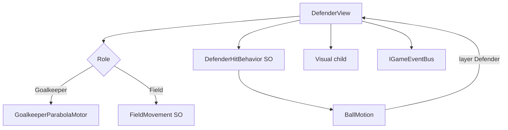

---
tags:
  - architecture
  - enemies
  - defenders
aliases:
  - Враги
  - Defenders
---

# Враги и защитники

← [[Индекс архитектуры]] | GDD: [[../GDD/07 Противник — вратарь и футболисты|§7 Противник]]

Техническая модель **футболиста соперника**: **один prefab, один коллайдер**, переключаемый **режим** (`Field` / `Goalkeeper`). Согласовано с [[Принципы проектирования]] — **MonoBehaviour + SO + шина**, без Entity.

> [!important] Не два класса
> Нет `OpponentGoalkeeperView` отдельно от `DefenderView`. Всё — **`DefenderView`**. Вратарь = тот же компонент с `Role = Goalkeeper`.

---

## Один prefab

```text
Defender (prefab)
├── DefenderView          ← логика, HP, режим, контакт с мячом
├── BoxCollider2D         ← один на всё время жизни
├── Visual                ← спрайт/скин; view переключает по Role
└── (опц.) Animator
```

| Что | Как |
|-----|-----|
| Коллайдер | **Один** `BoxCollider2D`, layer `Defender`, не меняется при смене роли |
| Визуал | Дочерний `Visual` — ссылки на спрайты вратаря/полевого в `DefenderView` или отдельном `DefenderVisual` |
| Режим | `DefenderRole`: `Field` \| `Goalkeeper` |
| Движение | `DefenderMotor` внутри view: ветка по `Role` |
| Удар | `DefenderHitBehavior` (SO) — общий для обеих ролей |



---

## `DefenderView` — ядро

```csharp
public enum DefenderRole { Field, Goalkeeper }

public sealed class DefenderView : MonoBehaviour, IDefenderBallContact
{
    [SerializeField] DefenderRole role;
    [SerializeField] DefenderMovementBehavior fieldMovement;  // только для Field
    [SerializeField] DefenderHitBehavior hitBehavior;
    [SerializeField] DefenderVisual visual;                   // смена спрайта по role
    [SerializeField] BoxCollider2D bodyCollider;              // один

    int slotId;
    int hp;
    Vector2 homePosition;   // слот на поле; пусто если только GK с рождения

    public void SetRole(DefenderRole newRole)
    {
        role = newRole;
        visual?.ApplyRole(newRole);
        // motor переключается в Tick
    }
}
```

- Старт матча: один экземпляр с `role = Goalkeeper` у `GoalAnchor`, остальные на слотах с `role = Field`.
- HP, hit, bus — **одинаково** для обеих ролей.
- `OnBallHit` — без ветвления по типу класса, только по `hitBehavior` и флагам (пас и т.д.).

---

## Движение (`DefenderMotor`)

Один motor (pure C# или private в view), две ветки:

### `Goalkeeper` — парабола

```csharp
// t ∈ [-1, 1] → x по ширине ворот, y = goalLineY - a * (1 - t²)  (дуга к полю)
Vector2 PositionOnParabola(float t, float goalLineY, float minX, float maxX, float parabolaHeight);
```

- Параметры зоны ворот — с `GoalAnchor` или SO `GoalkeeperZoneSettings`.
- `t = clamp((ballX − centerX) / halfWidth, −1, 1)` — цель слежения по X мяча.
- `trackSpeed` — `MoveTowards` текущего `t` к цели; позиция на параболе через `PositionOnParabola(t)`.
- Ссылка на `BallView` на GK prefab (или `FindAnyObjectByType` при старте).
- Коллайдер едет с `transform`.

### `Field` — `DefenderMovementBehavior` (SO)

| Enum | Поведение |
|------|-----------|
| `Idle` | `homePosition` |
| `PatrolGenerated` | `PatrolPathGenerator` → N точек вокруг слота |
| `WanderInRadius` | случайные цели в радиусе |
| `ChaseBallInRadius` | к мячу, если в радиусе |

Тик только при `PitchStateMachine.IsSimulating` и `role == Field`.

### Переход Field → Goalkeeper (замена)

1. `DefenderPromotionService` слушает смерть GK (`DefenderDestroyedEvent` + `role == Goalkeeper`).
2. Кандидат: живой `Field`, ближайший к `GoalAnchor`.
3. Флаг **`runningToGoal`** (роль пока **`Field`**): motor = бег к воротам. Коллайдер, пас-цели, урон — **как у полевого**.
4. Ворота **пустые** — гол в проём возможен.
5. Убили бегущего → следующий кандидат.
6. Прибытие → `SetRole(Goalkeeper)`, `runningToGoal = false`, motor = парабола.

Отдельный prefab **не** спавним. Сетка соседей / коллайдер **не** перестраиваем на полпути.

### Separation (anti-stack)

После движения field-motor — лёгкое **отталкивание** от других `DefenderView` в `separationRadius` (steer от центров). Параметр на SO или глобально на матч.

---

## Отбивание: `DefenderHitBehavior` (SO)

```csharp
public enum DefenderHitType
{
    Reflect,
    ToPlayerGoal,      // Directed; см. ToPlayerGoalAimMode
    PassToNearest,     // Directed к ближайшему живому DefenderView
}

public enum ToPlayerGoalAimMode
{
    OpenGoal,          // в проём / центр GoalPlayer
    AtPlayerKeeper,    // в вратаря игрока
    Weighted,          // шансы на SO: openWeight, atKeeperWeight
}
```

| Тип | Мяч | HP |
|-----|-----|-----|
| `Reflect` | reflect | −1 отбивающему |
| `ToPlayerGoal` | `Directed` по режиму / весам | −1 |
| `PassToNearest` | `Directed` к ближайшему, если `canPass`; иначе **Reflect** | −1 отбивающему; прилёт **как пас** — **0** урона цели |

**Комбо** растёт на всех `DefenderHitEvent`, включая пас.

**Заряд паса** в `DefenderView`:

```csharp
// BallReturnedToKeeperEvent → canPass = true (у PassToNearest)
// После успешного паса → canPass = false
// OnBallHit: if HitType == PassToNearest && !canPass → Reflect как дефолт
```

В режиме `Goalkeeper` тип `PassToNearest` обычно не назначаем.

### Анти-дубль урона (per frame)

**Не** геймплейный кулдаун. Защита от бага, когда мяч на кадр остаётся внутри `BoxCollider2D` и `CircleCast` даёт несколько hit подряд.

**Реализация (MVP):** в `BallMotion.ResolveHit` или `DefenderView` — `HashSet<int> _damagedSlotsThisFrame`, очищается в конце `Tick`. Один `slotId` → максимум **один** `ApplyDamage` за кадр.

См. [[Движение мяча#Углы и анти-баги]].

---

## Сетка и соседи

```text
Defenders (parent)
├── DefenderGridRegistry
├── GoalAnchor
├── DefenderSlots            ← DefenderSlotLayout, 5×7 точек
├── Spawned                  ← runtime instances
└── DefenderSpawner
```

`DefenderGridRegistry` — все **заспавненные** `DefenderView` матча (`AliveCount`, вайп, **ближайший для паса**). Сетка **5×7 = 35** слотов — см. [[Генерация врагов]].

### Reshuffle (после гола)

> **Статус кода:** `PitchStateMachine` сейчас делает `Reshuffle` мгновенно — **заглушка**. Целевое поведение:

| Шаг | Кто |
|-----|-----|
| `GoalScored` → `Reshuffle` | `PitchStateMachine` |
| Мяч: анимация на `BallKickoffAnchor` | `BallView` (не `Simulating`) |
| Живые: +25% max HP, DOTween на `homePosition` / ворота | `DefenderView` |
| Убитые: не трогаем | — |
| GK жив: остаётся GK у ворот | `SetRole` без воскрешения стартового |
| Все анимации done | `CompleteReshuffle()` → `KickoffWait` |

**Таймер матча на `Reshuffle`:** **идёт** (`MatchFlow` не останавливается). Только Escape-меню (`Navigation.Pause`) ставит матч на паузу.

### Досрочная победа

`AliveCount == 0` → `MatchFlow.EndMatchFromWipe()` → `MatchEndedEvent(PlayerWon: true)` → `PitchStateMachine.MatchEnded`. Счёт голов **не** влияет на исход вайпа.

---

## События шины

| Событие | Когда |
|---------|--------|
| `DefenderHitEvent` | Касание мяча |
| `DefenderDamagedEvent` | HP изменилось |
| `DefenderDestroyedEvent` | HP = 0 |
| `DefenderRoleChangedEvent` | `SetRole` (Field↔Goalkeeper) |
| `DefenderPromotionStartedEvent` | Полевой бежит к воротам |
| `DefenderPromotionCompletedEvent` | Полевой стал вратарём |
| `AllDefendersEliminatedEvent` | (опц.) последний враг умер — альтернатива подсчёту в registry |

Слушатели: `ComboScoreService`, `RunStateService`, **`MatchFlow`** (вайп → `EndMatch`), VFX, аналитика.

### Досрочный конец матча

`DefenderGridRegistry.OnDefenderDestroyed`:

```csharp
if (AliveCount == 0)
    matchFlow.EndMatchFromWipe();  // → PlayerWon = true
```

`MatchEndedEvent` (код):

```csharp
public readonly struct MatchEndedEvent
{
    public int PlayerScore { get; }
    public int OpponentScore { get; }
    public bool PlayerWon { get; }   // вайп → true; по таймеру → score >
}
```

`MatchEndHandler` → `RecordMatchResult(..., playerWon)`. При вайпе — **победа игрока** при любом счёте. Бонус к очкам/XP — **TBD**.

> Старые имена `OpponentGoalkeeper*` **не используем** — всё через `Defender*` + `DefenderRoleChangedEvent`.

---

## Интеграция с `BallMotion`

```csharp
if (layer == DefenderId)
{
    var handler = hit.collider.GetComponentInParent<IDefenderBallContact>();
    handler?.OnBallHit(ref this, hit);
    return;
}
```

Реализует только **`DefenderView`**.

---

## Генерация состава на матч

> [!note] Статус
> **Частично в коде.** Слоты, `DefenderSpawner`, фикс. полевые на 15/17/19. Полный генератор — см. [[Генерация врагов]].

| Компонент | Роль |
|-----------|------|
| `DefenderSlotLayout` | 5×7 точек на сцене, gizmo |
| `DefenderSpawner` | Спавн по `PitchReset`, один prefab |
| `DefenderFormationPatterns` | Временно: фикс. слоты + GK |
| `DefenderGenerationSettings` | **План:** фигуры, архетипы, pacing SO |
| `DefenderMatchGenerator` | **План:** pure C# выбор состава |

**Сейчас:** не расставляем `Defender` вручную на `Game.unity`. **Цель:** data-driven состав по `matchNumber`, перкам, seed.

Полная спецификация: [[Генерация врагов]].

---

## Структура папок

```text
Futboloid.Gameplay/
├── Defenders/
│   ├── DefenderView.cs              ← единственный view врага
│   ├── DefenderVisual.cs            ← спрайты Field / Goalkeeper
│   ├── DefenderMotor.cs             ← парабола GK + field + separation
│   ├── DefenderSeparation.cs        ← steer от соседей
│   ├── DefenderRole.cs              ← enum
│   ├── DefenderMovementBehavior.cs  # SO
│   ├── DefenderHitBehavior.cs       # SO
│   ├── PatrolPathGenerator.cs
│   ├── DefenderGridRegistry.cs
│   ├── DefenderPromotionService.cs
│   └── IDefenderBallContact.cs
```

---

## Сборка сцены (чеклист)

- [ ] Prefab `Defender`: `DefenderView`, один `BoxCollider2D`, layer `Defender`
- [ ] `Defenders/GoalAnchor` — компонент **`GoalAnchor`**
- [ ] `Defenders/DefenderSlots` — **`DefenderSlotLayout`**, сетка 5×7 (editor: Generate grid)
- [ ] `Defenders/Spawned` — пустой Transform, ссылка в **`DefenderSpawner`**
- [ ] **`DefenderSpawner`**: prefab, Slot Layout, Goal Anchor, Spawn Root
- [ ] `DefenderGridRegistry` на `Defenders`
- [ ] **Нет** ручных `Defender_*` на сцене (только runtime под `Spawned`)

> [!note] MVP vs вики-черновик
> В старых черновиках — отдельные SO `DefenderMovementBehavior` / `DefenderHitBehavior`. **В коде:** поля и enum'ы на `DefenderView`; SO для каталога архетипов — в [[Генерация врагов]].

---

## Порядок реализации

1. Prefab + `DefenderView` (Field, Idle, Reflect, HP)
2. `BallMotion` → `IDefenderBallContact`
3. События + `DefenderGridRegistry`
4. `Directed` в `BallMotion`, `ToPlayerGoal`
5. Пас + заряд
6. `DefenderRole.Goalkeeper` + парабола в том же `DefenderMotor`
7. `DefenderVisual` + `SetRole`
8. `DefenderPromotionService`
9. Field movement behaviors
10. Reshuffle: анимация, хил 25%, мяч на якорь
11. Separation radius
12. Состав матча data-driven — 🟡 в работе ([[Генерация врагов]])

---

## Связанные заметки

- [[Движение мяча]]
- [[Шина событий]]
- [[Связь сцены с кодом]]
- [[Принципы проектирования]]
- [[Генерация врагов]]
- [[../GDD/07 Противник — вратарь и футболисты]]
