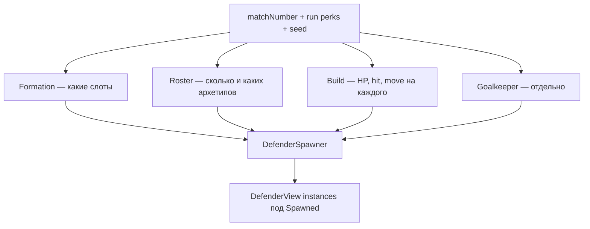

---
tags:
  - architecture
  - defenders
  - generation
  - pacing
aliases:
  - Генерация врагов
  - DefenderSpawner
  - DefenderGeneration
---

# Генерация врагов

← [[Индекс архитектуры]] | **Баланс:** [[Баланс генерации врагов]] | GDD: [[../GDD/08 Сложность, pacing и турнир|§8 Сложность]] | [[Враги и защитники]]

Как на **каждый матч** появляется команда соперника: слоты на поле, фигуры, статы, рост сложности, связь с перками забега.

> [!note] Статус кода (07.2026)
> | Реализовано | В плане |
> |-------------|---------|
> | `DefenderSlotLayout` — сетка 5×7 | Модификаторы Elite/Swift/… |
> | `DefenderMatchGenerator` — фигуры, архетипы, tier, diversity | `Patrol`, `Trickster` архетипы |
> | `DefenderGenerationSettings` SO + asset | Перк `enemy_hp` → spawner |
> | `DefenderSpawner` — спавн по `PitchResetRequestedEvent` | Визуал архетипов |
> | Туториал: фикс. архетипы, рандом. расстановка | Динамическая сложность |
> | `ChaseBall` — chase по всему полю | `runId` в seed |

**Числа баланса** — в [[Баланс генерации врагов]], не дублировать здесь.

---

## Принцип: три слоя + голкипер



| Слой | Вопрос | Источник данных |
|------|--------|-----------------|
| **Formation** | Где стоят? | Шаблоны фигур + `DefenderFormationComposer` (якорь + остаток) |
| **Roster** | Сколько и кого? | Tier матча + веса архетипов + cap дубликатов |
| **Build** | Конкретные числа | Архетип + `fieldDefaults` + pacing + перки |
| **Goalkeeper** | Вратарь | Всегда; не из слота сетки; больше HP |

**Один prefab** `Defender` на всех. Различия — HP, hit, movement, скорости (через `ApplySpawnSetup`).

---

## Сетка слотов (`DefenderSlotLayout`)

- Сетка на сцене: **5 столбцов × 7 рядов = 35 слотов**
- **Slot id = индекс** в массиве `Slot Points` (0…34)
- Нумерация: **слева направо, сверху вниз** (верхний ряд у ворот соперника)

---

## Рандом

```text
seed = generationSeedSalt * 397 ^ matchNumber * 1009 ^ runSeed * 9176
```

Детерминированно на матч. `runId` — задел на будущее.

**Что рандомим:** якоря фигур, комбинацию фигур, архетип на слот (с diversity).

**Композиция:** `DefenderFormationComposer.Compose()` — набирает N ячеек из фигур со смещениями; остаток — `Dot1` разбросом. См. [[Баланс генерации врагов#Фигуры (formations)]].

**Что фиксируем:** матч 1 — **число** врагов (3); GK всегда.

**RunSeed:** новый при `ResetRun()` — другой забег = другие расстановки и ±1 по матчам.

**Diversity:** не больше 2 одинаковых архетипов на матч (`MaxSameArchetypePerMatch`).

---

## Архетипы

7 архетипов: `Shield`, `Drifter`, `Hunter`, `Sniper`, `Striker`, `Tank`, `Presser`.

На архетипе только то, что **отличает роль**: HP, hit, movement, wander, speed, launch, openGoal%, points.

Общие параметры движения — в `fieldDefaults` на SO. См. [[Баланс генерации врагов#Архетипы (ростер)]].

---

## Пайплайн (код)

```text
PitchResetRequestedEvent
  → DefenderSpawner.SpawnForCurrentMatch()
      → matchNumber = ITournamentBracketReadModel.CurrentMatchNumber
      → if matchNumber == 1 → TutorialBuild
      → else DefenderMatchGenerator.Generate(settings, context)
      → ClearSpawned()
      → SpawnGoalkeeper(buildGk)
      → foreach slot in formation → SpawnField(build)
```

`DefenderMatchGenerator` — **pure C#**, без `MonoBehaviour`.

---

## Матч 1 — исключение

Фиксированные архетипы, случайная расстановка (композитор tier 0). См. [[Баланс генерации врагов#Матч 1 (туториал)]].

---

## Связь с остальными системами

| Система | Связь |
|---------|--------|
| `DefenderGridRegistry` | `AliveCount` → вайп |
| `DefenderMatchSettings` | Promotion / reshuffle |
| `GoalAnchor` | Позиция GK |
| `MatchFlow` | `EndMatchFromWipe()` |
| `TournamentRunService` | `CurrentMatchNumber` |
| `RunStateService` | Перки → `EnemyHpMultiplier` (TODO) |

---

## Связанные заметки

- [[Баланс генерации врагов]] — **числа и правила**
- [[Враги и защитники]]
- [[Сборка поля Game]]
- [[../GDD/08 Сложность, pacing и турнир]]
- [[Журнал расхождений вики и кода]]
