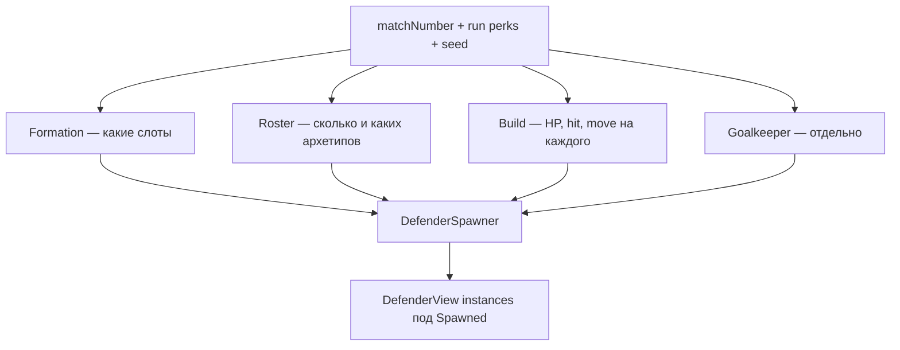

---
tags:
  - architecture
  - defenders
  - generation
  - pacing
aliases:
  - Генерация врагов
  - DefenderSpawner
  - DefenderGeneration
---

# Генерация врагов

← [[Индекс архитектуры]] | GDD: [[../GDD/08 Сложность, pacing и турнир|§8 Сложность]] | [[Враги и защитники]]

Как на **каждый матч** появляется команда соперника: слоты на поле, фигуры, статы, рост сложности, связь с перками забега.

> [!note] Статус кода (2026)
> | Реализовано | В плане |
> |-------------|---------|
> | `DefenderSlotLayout` — сетка 5×7, gizmo, editor «Generate grid» | Фигуры, архетипы, модификаторы |
> | `DefenderSpawner` — спавн по `PitchResetRequestedEvent` | `DefenderMatchGenerator` (чистая логика) |
> | GK всегда + полевые на слотах **15, 17, 19** (фикс) | Кривая pacing + перки |
> | `ApplySpawnSetup` на `DefenderView` | `DefenderGenerationSettings` SO |
> | Вайп → `PlayerWon = true` в `MatchEndedEvent` | Визуал архетипов |

---

## Принцип: три слоя + голкипер



| Слой | Вопрос | Источник данных |
|------|--------|-----------------|
| **Formation** | Где стоят? | Фигуры на сетке 5×7 (`DefenderSlotLayout`) |
| **Roster** | Сколько и кого? | Tier матча + веса архетипов |
| **Build** | Конкретные числа | Архетип + модификатор + pacing + перки |
| **Goalkeeper** | Вратарь | Всегда; не из слота сетки; больше HP |

**Один prefab** `Defender` на всех. В MVP различия только **HP и поведение** (enum на view). Визуал (цвет/иконка) — позже.

---

## Сетка слотов (`DefenderSlotLayout`)

- Сетка на сцене: **5 столбцов × 7 рядов = 35 слотов**
- **Slot id = индекс** в массиве `Slot Points` (0…34)
- Нумерация при генерации сетки в редакторе: **слева направо, сверху вниз** (верхний ряд ближе к воротам соперника)
- Позиция слота = `Transform` точки; код **не** хранит дублирующий `Vector2[]`

Иерархия на `Game.unity`:

```text
Defenders
├── DefenderGridRegistry
├── GoalAnchor
├── DefenderSlots          ← DefenderSlotLayout + Slot_0…Slot_34
├── Spawned                ← Spawn Root для DefenderSpawner
└── DefenderSpawner
```

См. [[Сборка поля Game#Иерархия]].

---

## Фигуры (Formation)

Фигура — **набор slot id** (или смещений от якоря). Примеры для 5×7:

| Имя | Слоты (пример) | Tier |
|-----|----------------|------|
| `Triangle3` | 12, 16, 18 | 0 |
| `Line3` | 11, 12, 13 | 0–1 |
| `V5` | 10, 14, 17, 21, 23 | 1–2 |
| `Wall5` | 10, 11, 12, 13, 14 | 2+ |
| `Diamond` | 12, 16, 18, 22 | 2+ |
| `Scattered3` | 8, 19, 26 | 1+ (хаос) |

**Правила:**
- не использовать нижние ряды в kickoff-зоне игрока (настраивается `minRow` в tier)
- голкипер **не** занимает слот сетки
- после гола **убитые не воскрешаются** — пустые слоты остаются пустыми ([[../GDD/02 Игровой цикл#Пересборка (после гола)|§2]])

**Рандом фигуры:** взвешенный выбор из пула, разрешённого для tier; опционально сдвиг якоря по X на ±1 колонку.

---

## Рандом

**Детерминированный seed** на матч (дебаг и повторяемость):

```text
seed = Hash(runId, matchNumber, globalSalt)
```

- `runId` — идентификатор забега (позже из `RunStateService`; пока достаточно `matchNumber`)
- один `System.Random(seed)` на весь пайплайн генерации матча

**Что рандомим:** фигуру, якорь, архетип на слот, модификатор (с шансом).

**Что фиксируем:**
- **Матч 1** — всегда один и тот же «туториал» (см. [[../GDD/08 Сложность, pacing и турнир#Матч 1 (туториал)|§8]])
- минимум один «простой» враг в ранних матчах
- голкипер **всегда**

---

## Архетипы (Roster / Build)

Архетип — пресет поведения на **одном** prefab. Поля совпадают с `DefenderView` (MVP без отдельных SO на каждого):

| id | Hit | Move | HP (база) | Роль в игре |
|----|-----|------|-----------|-------------|
| `Shield` | Reflect | Idle | среднее | стена |
| `Drifter` | Reflect | Wander | низкое | шум |
| `Hunter` | Reflect | ChaseBall | среднее | давит на мяч |
| `Patrol` | Reflect | PatrolGenerated | среднее | предсказуемый |
| `Sniper` | ToPlayerGoal | Idle | низкое | опасный удар |
| `Trickster` | ToPlayerGoal | Wander | среднее | высокий openGoal% |
| `Tank` | Reflect | Idle | высокое | долго убивать |
| `Presser` | ToPlayerGoal | ChaseBall | среднее | поздние матчи |

Хранение: массив в `DefenderGenerationSettings` (ScriptableObject), не раздуваем `GameplaySettings`.

---

## Модификаторы (опционально на врага)

Накладываются **поверх** архетипа с tier ≥ 2:

| id | Эффект |
|----|--------|
| `Elite` | ×1.5 max HP |
| `Swift` | +скорость, +wanderRadius |
| `Heavy` | +HP, −скорость |
| `Glass` | −HP, +launchSpeed reflect |

В gizmo/HUD позже: `Hunter+Elite`. В MVP — только цифра HP.

---

## Голкипер

| Параметр | Правило |
|----------|---------|
| Спавн | Всегда 1 на матч |
| Позиция | `GoalAnchor.PositionOnParabola(0)` — **не** слот сетки |
| `slotId` | **100** (`DefenderFormationPatterns.GoalkeeperSlotId`) |
| HP | **выше полевых**; старт **10**, рост по матчу |
| Поведение | `DefenderRole.Goalkeeper`, парабола |

Формула (черновик для SO):

```text
gkMaxHp = gkBaseHp + (matchNumber - 1) * gkHpPerMatch
```

Пример: base **10**, +**2** за матч → матч 1: 10 HP, матч 5: 18 HP.

---

## Кривая pacing (нелинейная сложность)

Сложность **не** растёт линейно только от `matchNumber`. Итоговый множитель:

```text
difficulty = pacingCurve(matchNumber) * perkModifiers(run) * dynamicAdj(TBD)
```

### `pacingCurve` — AnimationCurve в настройках

- Ось X: номер матча (1…12)
- Ось Y: множитель сложности (0…1+)
- Плато в начале (матч 1–2), ускорение в середине, спайк перед «финалом», опционально спад перед босс-матчем

Влияет на:
- число полевых врагов
- веса опасных архетипов
- шанс модификатора
- множитель HP полевых (не GK отдельно или GK слабее кривой)

### Перки забега (`RunStateService`, post-MVP логика)

Перки **не** меняют слоты напрямую — дают **модификаторы** к генерации или к статам врагов на матч:

| Перк (пример) | Эффект на генерацию |
|---------------|---------------------|
| «Лёгкая нога соперника» | `EnemyMaxHp` ×0.9 на матч |
| «Разведка» | −1 опасный архетип в ростер |
| «Штурм» | +1 полевой, но −HP у всех |
| «Элитный тур» | +шанс Elite, +награда |

Интеграция: `StatusEffectService.GetMultiplier(StatId.EnemyMaxHp)` **или** отдельный `IDefenderGenerationContext` из `RunStateService` при `SpawnForCurrentMatch`. См. [[Прогрессия и эффекты#A. Запрос модификаторов (статы)]].

### Динамическая сложность (позже)

Отдельный коэффициент при серии поражений / низком HP забега / мало оставшихся «жизней» в турнире — **не в MVP**, только задел в формуле `dynamicAdj`.

---

## Tier матча (сводка)

| Tier | Матчи (черновик) | Полевых | Фигуры | Модификаторы |
|------|------------------|---------|--------|--------------|
| 0 | 1 | 2–3 фикс | Triangle / Line | нет |
| 1 | 2–3 | 3–4 | Line, V | редко |
| 2 | 4–6 | 4–5 | Wall, Diamond | 1 на матч |
| 3 | 7–10+ | 5–7 | все | 1–2 |

Точные числа — в `DefenderGenerationSettings`, не в коде.

---

## Данные: что в каком ассете

### `GameplaySettings` (уже есть)

Глобальное, не раздувать:

- `matchDurationSeconds`, `matchesToWin` (сейчас 3; цель турнира ~10 — см. §8)
- ссылка на `DefenderGenerationSettings`
- `generationSeedSalt` (int)
- опционально: `AnimationCurve matchPacingCurve`

### `DefenderGenerationSettings` (новый SO)

- `gridColumns = 5`, `gridRows = 7`
- `gkBaseHp`, `gkHpPerMatch`, `gkTrackSpeedBase`
- `fieldBaseHp`, `hpPerTier` / кривая
- `FormationShape[]` — id, slotOffsets[], minTier, weight
- `DefenderArchetype[]` — id, hit, move, hp, radii, speeds, weightsByTier
- `DefenderModifier[]` — id, stat deltas, weight, minTier
- `MatchTierRule[]` — matchFrom, matchTo, tier, fieldCountMin/Max, modifierChance
- **`TutorialMatch`** — override для матча 1 (фикс. фигура + фикс. архетипы)

---

## Пайплайн (целевой код)

```text
PitchResetRequestedEvent
  → DefenderSpawner.SpawnForCurrentMatch()
      → matchNumber = ITournamentBracketReadModel.CurrentMatchNumber
      → if matchNumber == 1 → TutorialBuild
      → else DefenderMatchGenerator.Generate(settings, matchNumber, runPerks, seed)
      → ClearSpawned()
      → SpawnGoalkeeper(buildGk)
      → foreach slot in formation → SpawnField(build)
```

`DefenderMatchGenerator` — **pure C#** (тестируемый), без `MonoBehaviour`.

---

## Матч 1 — исключение

Матч 1 **всегда** одинаковый (обучение):

- 2–3 полевых, простая фигура (например `Triangle3` в центре)
- только `Shield` / `Drifter`, Reflect, низкое HP
- GK с **10 HP**, медленный track
- **без** модификаторов и без рандома фигуры

Игрок должен понять: отскок, урон, вайп-победа. См. [[../GDD/08 Сложность, pacing и турнир]].

---

## Связь с остальными системами

| Система | Связь |
|---------|--------|
| `DefenderGridRegistry` | Регистрация заспавненных; `AliveCount` → вайп |
| `DefenderMatchSettings` | Promotion / reshuffle: скорость, длительность, arrive |
| `GoalAnchor` | DI с Game-сцены; позиция GK, парабола |
| `MatchFlow` | `EndMatchFromWipe()` → `PlayerWon = true` |
| `DefenderPromotionService` | GK из пула полевых — работает с заспавненными |
| `DefenderReshuffleService` | Возврат на `homePosition` слота |
| `TournamentRunService` | `CurrentMatchNumber`, запись результата по `PlayerWon` |
| `RunStateService` | Перки → модификаторы генерации (позже) |

---

## Порядок реализации

1. [x] Слоты + `DefenderSpawner` + фикс. слоты 15/17/19
2. [ ] `DefenderBuild` struct + полный `ApplySpawnSetup`
3. [ ] `DefenderGenerationSettings` SO + tutorial override
4. [ ] `DefenderMatchGenerator` + 3–4 фигуры
5. [ ] `pacingCurve` + tier table
6. [ ] Модификаторы
7. [ ] Хук перков из `RunStateService`
8. [ ] Визуал архетипов

---

## Связанные заметки

- [[Враги и защитники]]
- [[Сборка поля Game]]
- [[Прогрессия и эффекты]]
- [[MatchFlow и таймер]]
- [[../GDD/08 Сложность, pacing и турнир]]
- [[Журнал расхождений вики и кода]]
