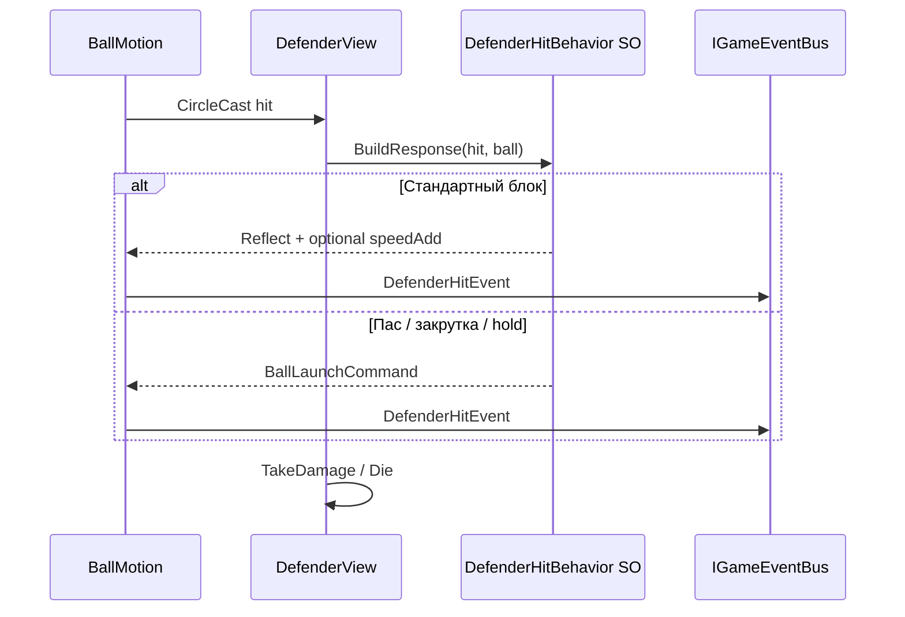
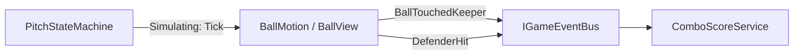
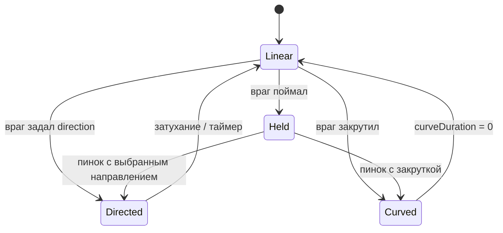

---
tags:
  - architecture
  - ball
  - movement
aliases:
  - Кинематика мяча
  - Ball movement
---

# Движение мяча (кинематика)

← [[Индекс архитектуры]] | [[../GDD/04 Механики мяча и комбо|GDD §4]]

> [!important] Решение
> **Unity Physics 2D для мяча не используем.** Движение — **кинематическое**, своя модель: скорость, отражение, ускорение от касаний, затухание до базовой скорости. Для арканоида полноценный физдвижок — **оверкилл**.

Текущий `Ball.cs` с `Rigidbody2D` — **прототип**, подлежит замене.

> [!summary] Кратко: отскоки
> - Движение: `position += direction * speed * dt` в `BallMotion.Tick`
> - Коллизии: **CircleCast** на дистанцию полёта за кадр (MVP) — не dynamic RB
> - Стены / борт: `Reflect(direction, normal)` по нормали коллайдера
> - Вратарь: тот же reflect + `speed += keeperBoost` + `BallReturnedToKeeperEvent` → сброс комбо
> - Защитник: reflect **или** `BallLaunchCommand` из `DefenderHitBehavior` + `DefenderHitEvent`
> - Ворота: триггер, **без** reflect → `GoalScoredEvent`
> - Спец-враги: `Directed` / `Curved` / `Held` — не reflect, см. § режимы полёта

---

## Почему не Physics2D

| Physics2D | Наша кинематика |
|-----------|-----------------|
| Непредсказуемые углы, залипания | Угол отражения **под контролем** |
| Сложно «чуть ускорить за касание» | `speed += boost`, clamp max |
| Зависимость от fixed timestep + solver | Один `Tick(dt)` — проще баланс |
| Лишнее для прямолинейного арканоида | Только то, что в GDD |

Коллайдеры на стенах/защитниках можно оставить как **триггеры или хитбоксы** для детекта касания — без `Rigidbody2D` на мяче (или `Rigidbody2D` kinematic **только** как носитель триггера, двигаем `transform` сами). Подробнее: [[Мяч и коллайдеры]].

---

## Модель состояния

```csharp
// Чистые данные — в BallView или BallMotion (без Entity-ритуала)
Vector2 position;
Vector2 direction;      // normalized
float speed;            // текущая величина
float baseSpeed;        // куда затухает
float maxSpeed;
```

Каждый шаг симуляции — только в фазе `Simulating` (`PitchStateMachine`):

```text
BallMotion.Tick(dt):
  1. если Held → позиция у держателя, return
  2. если Curved → повернуть direction
  3. sweep = direction * speed * dt
  4. hit = CircleCast(position, radius, direction, |sweep|)
  5. если hit → ResolveCollision(hit), иначе position += sweep
  6. speed = MoveTowards(speed, baseSpeed, deceleration * dt)
  7. ClampMinAngle(direction)   // не лететь почти параллельно полу
```

`BallView` после `Tick`: `transform.position = motion.Position`, вращение спрайта опционально.

---

## Коллизии — как детектить (MVP)

**Решение для MVP:** `Physics2D.CircleCast` (или `CircleCastAll` + ближайший hit) из текущей позиции по `direction` на длину `speed * dt + skin`.

| Вариант | Вердикт |
|---------|---------|
| **CircleCast за кадр** | ✅ MVP — нет туннелинга на нормальных скоростях, один код для всех поверхностей |
| Trigger + kinematic RB | допустимо, но порядок `OnTriggerEnter` и туннелинг на высокой speed — хуже |
| Ручной AABB сетки | позже, если упростим коллайдеры защитников |

### Настройка сцены

| Объект | Collider | Layer / tag | Роль |
|--------|----------|-------------|------|
| Борта, задняя стена | `BoxCollider2D` / `EdgeCollider2D`, **не trigger** | `Wall` | reflect |
| Вратарь (тело) | `CapsuleCollider2D` / `BoxCollider2D` | `Keeper` | reflect + boost |
| Защитник | `BoxCollider2D` на слоте | `Defender` | hit + behavior |
| Ворота противника | `BoxCollider2D` **isTrigger** | `GoalEnemy` | гол игрока |
| Зона смерти / аут | trigger | `OutOfBounds` | конец / штраф по GDD |

`BallView`: **без** dynamic `Rigidbody2D`. Радиус мяча — в `BallSettings.radius` (тот же для cast и визуала).

```csharp
// LayerMask в BallSettings: Wall | Keeper | Defender (не Goal — гол отдельно)
var hit = Physics2D.CircleCast(pos, radius, direction, distance, contactMask);
```

Голы и аут — **OverlapCircle** на новой позиции или отдельные trigger-колбэки на `BallView`, если проще; главное — не смешивать с reflect-стенами в одном cast без приоритетов.

### ResolveCollision — общий пайплайн

```csharp
void ResolveCollision(RaycastHit2D hit)
{
    var surface = hit.collider.GetComponent<ISurfaceHitHandler>()
               ?? hit.collider.GetComponentInParent<ISurfaceHitHandler>();

    // 1. Вынуть мяч из пересечения (depenetration)
    position = hit.point + hit.normal * (radius + skin);

    // 2. Поверхность решает: reflect, command, или гол
    surface?.OnBallHit(ref this, hit);

    // 3. Если никто не переопределил — дефолтный reflect
    if (!commandApplied)
        direction = Reflect(direction, hit.normal);

    ClampMinAngle(ref direction);
}
```

Один **физический** контакт за кадр обычно достаточно; если `CircleCastAll` даёт несколько — берём **ближайший** по `distance`. Угол в углу поля: нормаль от Unity корректна для `EdgeCollider2D`.

---

## Отскоки по поверхностям

### Стены и борт

Классическое зеркальное отражение:

```csharp
public static Vector2 Reflect(Vector2 dir, Vector2 normal)
    => (dir - 2f * Vector2.Dot(dir, normal) * normal).normalized;
```

- Нормаль — из `RaycastHit2D.normal` (перпендикуляр к грани)
- **Буста нет** (или микроскопический из `BallSettings.wallSpeedRetention`, по умолчанию `1f`)
- Опционально: `direction = Rotate(direction, Random.Range(-wallJitterDeg, wallJitterDeg))` из баланса

Для **строго горизонтального арканоида** можно упростить: если `|normal.x| > |normal.y|` → `direction.x *= -1`, иначе `direction.y *= -1`. Универсальный `Reflect` предпочтительнее — работает на скошенных бортах.

### Вратарь

| Шаг | Действие |
|-----|----------|
| 1 | `direction = Reflect(direction, hit.normal)` |
| 2 | `speed = Min(speed + keeperBoost, maxSpeed)` |
| 3 | `bus.Publish(BallReturnedToKeeperEvent)` → `ComboScoreService` сбрасывает множитель |
| 4 | Опционально VFX / звук на `GoalkeeperView` |

Хитбокс вратаря — **отдельный** collider на теле (не весь спрайт размыто). При **dive** коллайдер двигается вместе с view — reflect от актуальной позиции.

**Подача (Пробел):** не reflect от касания — `BallMotion.Serve(Vector2 dir)`:

```csharp
void Serve(Vector2 dir)
{
    position = keeper.ServeAnchor;
    direction = dir.normalized;   // чаще вверх ± небольшой разброс
    speed = serveSpeed;
    mode = Linear;
    bus.Publish(BallServedEvent);
    // сессия комбо начнётся после первого отскока от вратаря — по GDD уточнить:
    // вариант A: Serve = уже «у вратаря», сессия с первого DefenderHit
    // вариант B: первый контакт с Keeper после Serve = старт сессии
}
```

Зафиксировать при реализации; в GDD сессия — «от отскока от вратаря».

### Защитники (игроки на поле)

Цепочка при попадании:



**Нормаль для reflect** — `hit.normal` от cast (от центра мяча к поверхности бокса). Альтернатива «от центра защитника»:

```csharp
normal = (ball.position - defender.center).normalized;
```

Выбрать **один** способ в MVP (`hit.normal` проще и стабильнее с `BoxCollider2D`).

| Тип защитника | Поведение мяча |
|---------------|----------------|
| Обычный | `Reflect` + опц. `speed += defenderBoost` |
| Пасующий | `BallLaunchCommand { Directed, Direction = aim }` — **без** reflect |
| Закручивающий | `Curved` с `curveRate`, `duration` |
| Ловец | `Held` → через N сек `Release(command)` |

`DefenderHitEvent` публикует **view или BallMotion** после применения команды — `ComboScoreService` увеличивает множитель, `RunStateService` — XP забега.

**Не бить дважды за кадр:** после resolve пометить `defenderInstanceId` в `HashSet` на кадр или cooldown 1 кадр на слот — иначе мяч «внутри» бокса даст серию хитов.

### Ворота

- Collider **trigger**, слой не в `contactMask` для CircleCast **или** отдельная проверка после движения
- **Нет reflect** — мяч поглощается: `speed = 0`, скрыть / привязать к точке, `GoalScoredEvent`
- Дальше `PitchStateMachine` → `Reshuffle` → снова `KickoffWait`

### Out of bounds / GameOver

Как в текущем прототипе — trigger `OutOfBounds` / `GameOver` → событие матча, не reflect.

---

## Углы и анти-баги

| Проблема | Решение |
|----------|---------|
| Мяч летит почти горизонтально вечно | `ClampMinAngle`: `|direction.y| >= minVerticalComponent` (напр. 0.15) |
| Туннелинг сквозь стену | CircleCast на полную дистанцию шага; cap `maxSpeed * dt` |
| Залипание в углу | depenetration + один hit за кадр; min angle |
| Двойной hit защитник | cooldown на слот / ignore list на кадр |
| Пауза | `Tick` не вызывается — мяч заморожен |
| Reshuffle | `BallMotion.ResetAtKeeper()` — позиция у вратаря, speed 0 |

```csharp
void ClampMinAngle(ref Vector2 dir)
{
    if (Mathf.Abs(dir.y) < minVerticalComponent)
    {
        dir.y = Mathf.Sign(dir.y == 0 ? 1 : dir.y) * minVerticalComponent;
        dir.Normalize();
    }
}
```

---

## События (шина)

| Событие | Когда |
|---------|-------|
| `BallServedEvent` | Пробел, мяч в игру |
| `BallTouchedKeeperEvent` / `BallReturnedToKeeperEvent` | reflect от вратаря |
| `DefenderHitEvent` | попадание по защитнику |
| `GoalScoredEvent` | триггер ворот |
| `BallHeldEvent` / `BallReleasedEvent` | режим Held |

`ComboScoreService` слушает `DefenderHit`, `GoalScored`, `BallReturnedToKeeper` — **не** логика внутри `BallMotion`.

---

## BallSettings (ScriptableObject)

| Поле | Назначение |
|------|------------|
| `radius` | CircleCast, визуальный размер |
| `baseSpeed`, `maxSpeed`, `serveSpeed` | скорости |
| `keeperBoost` | прибавка при отскоке от вратаря |
| `deceleration` | затухание к `baseSpeed` |
| `minVerticalComponent` | анти-горизонталь |
| `wallJitterDeg` | 0 = без рандома |
| `contactMask` | LayerMask стен / keeper / defender |
| `skin` | depenetration epsilon |

---

## Отскоки (сводка)

| Поверхность | Поведение |
|-------------|-----------|
| **Вратарь** | reflect + `keeperBoost` + сброс комбо |
| **Стена / борт** | reflect, без буста |
| **Защитник** | reflect **или** `BallLaunchCommand` + `DefenderHit` |
| **Ворота** | гол, без reflect |

Формула reflect — см. § стены выше.

---

## Ускорение (суть из GDD)

Не симуляция силы, а **аркадный буст**:

```csharp
void OnKeeperContact()
{
    speed = Mathf.Min(speed + keeperAcceleration, maxSpeed);
    // direction уже пересчитан reflect'ом
}
```

Затухание — обратное: в полёте скорость **плавно** к `baseSpeed`, не мгновенно.

Параметры в ScriptableObject / `BallSettings`: `baseSpeed`, `maxSpeed`, `keeperBoost`, `deceleration`, `serveSpeed`.

---

## Кто чем управляет



| Компонент | Роль |
|-----------|------|
| `BallView` | `transform`, визуал, вызов `Tick`, детект коллизий |
| `ComboScoreService` | сессия мяча, множитель — **не** внутри отражений |
| `PitchStateMachine` | мяч **не двигается** в `KickoffWait` / `Reshuffle` / паузе |

---

## Детект касаний — legacy-варианты

Основной путь — **CircleCast** (§ выше). Запасные варианты:

1. **CircleCast** — ✅ выбран для MVP  
2. **Trigger + kinematic RB** — только если не хватает cast  
3. **Ручной AABB** сетки — оптимизация позже  

---

## Вратарь и защитники

Их движение тоже **не обязано** быть Physics2D:

- вратарь — кинематика + инерция (GDD §3), как у мяча по духу  
- защитники — статичные слоты + сдвиг по ИИ позже  

Единый стиль: **мы задаём позицию/скорость**, Unity Physics только для raycast/overlap при необходимости.

---

## Режимы полёта (спец-враги)

Разные враги меняют мяч **по-разному** — это не повод подключать Physics2D. Наоборот: при **кастомных** ударах кинематика + **режим полёта** (`BallFlightMode`) даёт полный контроль.



### Контракт: кто что задаёт

Враг при ударе **не** дергает `BallView` напрямую — отдаёт **команду** (через шину или `IBallController`):

```csharp
public readonly struct BallLaunchCommand
{
    public BallFlightMode Mode;
    public Vector2 Direction;      // для Directed / старт Curved / пинок
    public float Speed;
    public float CurveRate;        // град/сек или lateral accel — для Curved
    public float CurveDuration;    // сколько длится дуга
}
```

`BallMotion` применяет команду и дальше сам тикает в `Tick(dt)`.

---

### Режим 1: `Linear` (базовый)

- `position += direction * speed * dt`
- столкновения → **reflect** (вратарь, стена, простой защитник)
- затухание `speed` → `baseSpeed`

---

### Режим 2: `Directed` (задать направление, не reflect)

Враг **игнорирует** угол прилёта и выставляет:

```csharp
direction = command.Direction.normalized;
speed = command.Speed;
mode = Linear; // или оставить Directed до таймера
```

Reflect не вызываем — враг «перебивает» физику аркады. Для обычных блоков — reflect, для «пасующего» защитника — `Directed`.

---

### Режим 3: `Curved` («закрутка», полёт по дуге)

Летим в общем направлении `direction`, но **поворачиваем** его во времени:

```csharp
// вариант A — вращение направления (простой, предсказуемый)
direction = Rotate(direction, curveRateDegPerSec * dt);

// вариант B — боковое ускорение (более «физичная» дуга)
var lateral = new Vector2(-direction.y, direction.x);
direction = (direction + lateral * curveAccel * dt).normalized;
```

Параметры с врага: `curveRate` / `curveAccel`, `curveDuration`. По истечении → `Linear`, кривизна 0.

> Physics2D с силами для «магнуса» — непредсказуемо. Вращать `direction` вручную — **ровно** то, что нужно для геймплея.

Визуал: опционально лёгкий trail / spin sprite, не влияет на логику.

---

### Режим 4: `Held` (задержка + пинок)

1. Мяч **не тикает**: не двигается, не коллизит (или только с держателем)
2. `position` = точка у врага (слот / `holdAnchor`)
3. Таймер или анимация → враг вызывает `BallLaunchCommand` с нужным `Direction` / `Curved`

```csharp
void TickHeld(float dt)
{
  position = holder.AnchorPosition;
  // коллизии с полем — off
}

void Release(BallLaunchCommand cmd) => ApplyCommand(cmd);
```

Событие на шине: `BallHeld`, `BallReleased` — для VFX и паузы комбо по желанию.

---

### Сводка: враг → режим

| Поведение врага | Режим | Что задаётся |
|-----------------|-------|--------------|
| Обычный блок | `Linear` | reflect + опц. буст |
| Задаёт угол удара | `Directed` | `direction`, `speed` |
| Закрутка | `Curved` | `direction`, `speed`, `curveRate`, `duration` |
| Поймал → пнул | `Held` → `Directed` / `Curved` | пинок при `Release` |

---

### Почему не Physics2D даже с этим

| Фича | Кинематика + режимы | Physics2D |
|------|---------------------|-----------|
| Точный пинок куда хочешь | ✅ `Direction` в команде | ❌ разброс |
| Дуга фиксированной кривизны | ✅ rotate direction | ❌ силы, масса |
| Hold на враге | ✅ `Held`, позиция = anchor | ❌ joint, глюки |
| Баланс | числа в SO | копать inspector |

**Вывод:** один `BallMotion` с `enum BallFlightMode` и `Tick` по режиму — масштабируется на всех врагов без смены движка.

---

### Где жить в коде

```
BallMotion.cs          — режим, Tick, ApplyCommand, collide
BallView.cs            — transform, визуал, вызов Tick
DefenderHitBehavior    — SO или компонент на prefab: Reflect | Directed | Curved | HoldAndKick
```

Враг при контакте читает свой `DefenderHitBehavior` и формирует `BallLaunchCommand` / или «стандартный reflect» для дефолта.

---

## Миграция с `Ball.cs`

| Сейчас | Цель |
|--------|------|
| `Rigidbody2D.linearVelocity` | `direction * speed` |
| `OnCollisionEnter2D` + physics material | ручной reflect + boost |
| `GameManager.Instance` gate | `PitchStateMachine` / bus |

---

## Связанные заметки

- [[Мяч и коллайдеры]]
- [[../GDD/04 Механики мяча и комбо]]
- [[Шина событий]]
- [[Машины состояний]]
- [[Принципы проектирования]]
