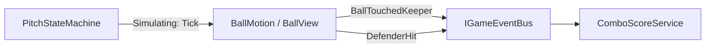
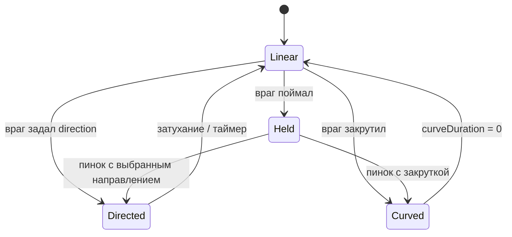

---
tags:
  - architecture
  - ball
  - movement
aliases:
  - Кинематика мяча
  - Ball movement
---

# Движение мяча (кинематика)

← [[Индекс архитектуры]] | [[../GDD/04 Механики мяча и комбо|GDD §4]]

> [!important] Решение
> **Unity Physics 2D для мяча не используем.** Движение — **кинематическое**, своя модель: скорость, отражение, ускорение от касаний, затухание до базовой скорости. Для арканоида полноценный физдвижок — **оверкилл**.

Текущий `Ball.cs` с `Rigidbody2D` — **прототип**, подлежит замене.

---

## Почему не Physics2D

| Physics2D | Наша кинематика |
|-----------|-----------------|
| Непредсказуемые углы, залипания | Угол отражения **под контролем** |
| Сложно «чуть ускорить за касание» | `speed += boost`, clamp max |
| Зависимость от fixed timestep + solver | Один `Tick(dt)` — проще баланс |
| Лишнее для прямолинейного арканоида | Только то, что в GDD |

Коллайдеры на стенах/защитниках можно оставить как **триггеры или хитбоксы** для детекта касания — без `Rigidbody2D` на мяче (или `Rigidbody2D` kinematic **только** как носитель триггера, двигаем `transform` сами).

---

## Модель состояния

```csharp
// Чистые данные — в BallView или BallMotion (без Entity-ритуала)
Vector2 position;
Vector2 direction;      // normalized
float speed;            // текущая величина
float baseSpeed;        // куда затухает
float maxSpeed;
```

Каждый шаг симуляции (из `MatchFlow` / `PitchStateMachine` в фазе `Simulating`, или `FixedUpdate` когда матч активен):

```text
1. position += direction * speed * dt
2. speed = MoveTowards(speed, baseSpeed, deceleration * dt)   // затухание GDD
3. проверка пересечений / триггеров → отражение + бусты
```

---

## Отскоки

| Поверхность | Поведение |
|-------------|-----------|
| **Вратарь** | Автоотбив (GDD); `direction` = reflect; `speed += keeperBoost`; событие `BallTouchedKeeper` → сброс комбо |
| **Стена / борт** | `direction = Reflect(direction, normal)` |
| **Защитник** | reflect + событие `DefenderHit` + XP/комбо |
| **Ворота** | событие `GoalScored`, не reflect (или поглощение мяча до reshuffle) |

Отражение — классическая формула:

```csharp
direction = (direction - 2f * Vector2.Dot(direction, normal) * normal).normalized;
```

Угол можно слегка **рандомизировать** (±2°) для живости — опционально, в данных баланса.

---

## Ускорение (суть из GDD)

Не симуляция силы, а **аркадный буст**:

```csharp
void OnKeeperContact()
{
    speed = Mathf.Min(speed + keeperAcceleration, maxSpeed);
    // direction уже пересчитан reflect'ом
}
```

Затухание — обратное: в полёте скорость **плавно** к `baseSpeed`, не мгновенно.

Параметры в ScriptableObject / `BallSettings`: `baseSpeed`, `maxSpeed`, `keeperBoost`, `deceleration`, `serveSpeed`.

---

## Кто чем управляет



| Компонент | Роль |
|-----------|------|
| `BallView` | `transform`, визуал, вызов `Tick`, детект коллизий |
| `ComboScoreService` | сессия мяча, множитель — **не** внутри отражений |
| `PitchStateMachine` | мяч **не двигается** в `KickoffWait` / `Reshuffle` / паузе |

---

## Детект касаний (без dynamic RB)

Варианты на выбор (зафиксировать при реализации):

1. **CircleCast** по направлению движения на `speed * dt` — один луч за кадр  
2. **Trigger Collider2D** на мяче + kinematic RB — `OnTriggerEnter2D`  
3. **Ручной AABB** против сетки защитников (если сетка регулярная)

Для арканоида чаще всего хватает **2** (просто) или **1** (предсказуемо).

---

## Вратарь и защитники

Их движение тоже **не обязано** быть Physics2D:

- вратарь — кинематика + инерция (GDD §3), как у мяча по духу  
- защитники — статичные слоты + сдвиг по ИИ позже  

Единый стиль: **мы задаём позицию/скорость**, Unity Physics только для raycast/overlap при необходимости.

---

## Режимы полёта (спец-враги)

Разные враги меняют мяч **по-разному** — это не повод подключать Physics2D. Наоборот: при **кастомных** ударах кинематика + **режим полёта** (`BallFlightMode`) даёт полный контроль.



### Контракт: кто что задаёт

Враг при ударе **не** дергает `BallView` напрямую — отдаёт **команду** (через шину или `IBallController`):

```csharp
public readonly struct BallLaunchCommand
{
    public BallFlightMode Mode;
    public Vector2 Direction;      // для Directed / старт Curved / пинок
    public float Speed;
    public float CurveRate;        // град/сек или lateral accel — для Curved
    public float CurveDuration;    // сколько длится дуга
}
```

`BallMotion` применяет команду и дальше сам тикает в `Tick(dt)`.

---

### Режим 1: `Linear` (базовый)

- `position += direction * speed * dt`
- столкновения → **reflect** (вратарь, стена, простой защитник)
- затухание `speed` → `baseSpeed`

---

### Режим 2: `Directed` (задать направление, не reflect)

Враг **игнорирует** угол прилёта и выставляет:

```csharp
direction = command.Direction.normalized;
speed = command.Speed;
mode = Linear; // или оставить Directed до таймера
```

Reflect не вызываем — враг «перебивает» физику аркады. Для обычных блоков — reflect, для «пасующего» защитника — `Directed`.

---

### Режим 3: `Curved` («закрутка», полёт по дуге)

Летим в общем направлении `direction`, но **поворачиваем** его во времени:

```csharp
// вариант A — вращение направления (простой, предсказуемый)
direction = Rotate(direction, curveRateDegPerSec * dt);

// вариант B — боковое ускорение (более «физичная» дуга)
var lateral = new Vector2(-direction.y, direction.x);
direction = (direction + lateral * curveAccel * dt).normalized;
```

Параметры с врага: `curveRate` / `curveAccel`, `curveDuration`. По истечении → `Linear`, кривизна 0.

> Physics2D с силами для «магнуса» — непредсказуемо. Вращать `direction` вручную — **ровно** то, что нужно для геймплея.

Визуал: опционально лёгкий trail / spin sprite, не влияет на логику.

---

### Режим 4: `Held` (задержка + пинок)

1. Мяч **не тикает**: не двигается, не коллизит (или только с держателем)
2. `position` = точка у врага (слот / `holdAnchor`)
3. Таймер или анимация → враг вызывает `BallLaunchCommand` с нужным `Direction` / `Curved`

```csharp
void TickHeld(float dt)
{
  position = holder.AnchorPosition;
  // коллизии с полем — off
}

void Release(BallLaunchCommand cmd) => ApplyCommand(cmd);
```

Событие на шине: `BallHeld`, `BallReleased` — для VFX и паузы комбо по желанию.

---

### Сводка: враг → режим

| Поведение врага | Режим | Что задаётся |
|-----------------|-------|--------------|
| Обычный блок | `Linear` | reflect + опц. буст |
| Задаёт угол удара | `Directed` | `direction`, `speed` |
| Закрутка | `Curved` | `direction`, `speed`, `curveRate`, `duration` |
| Поймал → пнул | `Held` → `Directed` / `Curved` | пинок при `Release` |

---

### Почему не Physics2D даже с этим

| Фича | Кинематика + режимы | Physics2D |
|------|---------------------|-----------|
| Точный пинок куда хочешь | ✅ `Direction` в команде | ❌ разброс |
| Дуга фиксированной кривизны | ✅ rotate direction | ❌ силы, масса |
| Hold на враге | ✅ `Held`, позиция = anchor | ❌ joint, глюки |
| Баланс | числа в SO | копать inspector |

**Вывод:** один `BallMotion` с `enum BallFlightMode` и `Tick` по режиму — масштабируется на всех врагов без смены движка.

---

### Где жить в коде

```
BallMotion.cs          — режим, Tick, ApplyCommand, collide
BallView.cs            — transform, визуал, вызов Tick
DefenderHitBehavior    — SO или компонент на prefab: Reflect | Directed | Curved | HoldAndKick
```

Враг при контакте читает свой `DefenderHitBehavior` и формирует `BallLaunchCommand` / или «стандартный reflect» для дефолта.

---

## Миграция с `Ball.cs`

| Сейчас | Цель |
|--------|------|
| `Rigidbody2D.linearVelocity` | `direction * speed` |
| `OnCollisionEnter2D` + physics material | ручной reflect + boost |
| `GameManager.Instance` gate | `PitchStateMachine` / bus |

---

## Связанные заметки

- [[../GDD/04 Механики мяча и комбо]]
- [[Шина событий]]
- [[Машины состояний]]
- [[Принципы проектирования]]
