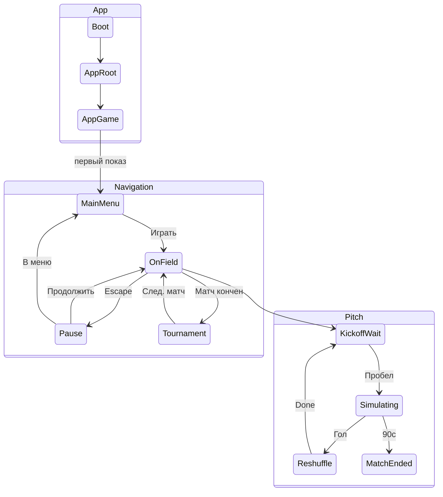

---
tags:
  - architecture
  - index
aliases:
  - Архитектура
---

# Архитектура — индекс

← [[../Home|Главная]]

## Обзор

- [[Принципы проектирования]] — **с чего начать**
- [[Шина событий]] — связь логики и view
- [[Обзор архитектуры]] — схема целиком
- [[Сцены и Bootstrap]] — RootScene, GameScene, build settings
- [[DI и LifetimeScope]] — VContainer, scopes, bus
- [[Связь сцены с кодом]] — MonoBehaviour на сцене
- [[Машины состояний]] — App / Navigation / Pitch FSM
- [[UI и оверлеи]] — меню поверх игры, боты на фоне
- [[GameDirector]] — оркестратор, save, restart
- [[Миграция с текущего кода]] — план от текущих скриптов
- [[Структура папок проекта]] — раскладка `Assets/_Projects/`
- [[Аналитика]] — события, SDK, Web (на будущее)
- [[Движение мяча]] — кинематика, без Physics2D
- [[Мяч и коллайдеры]] — коллайдеры при kinematic, CircleCast vs RB
- [[Прогрессия и эффекты]] — уровень, перки, баффы/дебаффы

## GDD

- [[../GDD/Индекс GDD v6|GDD v6.0]]
- [[../GDD/Составляющие (карта систем)|Карта систем]]

> [!important] Расхождение с GDD
> Главное меню в GDD — отдельная сцена. **Архитектура:** меню = оверлей. См. [[Обзор архитектуры#Ключевые решения]].

## Модули (статус)

| Модуль | Документ | Код |
|--------|----------|-----|
| Bootstrap / App FSM | [[GameDirector]], [[Сцены и Bootstrap]] | 🔲 |
| Navigation overlays | [[UI и оверлеи]], [[Машины состояний]] | 🔲 |
| Pitch FSM | [[Машины состояний]] | 🔲 частично `GameManager` |
| Goalkeeper | [[../GDD/03 Физика и управление вратарём\|GDD §3]] | 🔲 `PlayerController` |
| Ball + Combo | [[Движение мяча]], [[../GDD/04 Механики мяча и комбо\|GDD §4]] | 🔲 `Ball.cs` → kinematic |
| Scene Transition | [[UI и оверлеи]] | 🔲 |
| Tournament | [[Машины состояний#Уровень 2]] | 🔲 |
| Leaderboard | [[GameDirector#Сохранения]] | 🔲 |
| Analytics | [[Аналитика]] | 🔲 |
| Bot background | [[UI и оверлеи#BotSimulationController]] | 🔲 |

## Диаграмма состояний (краткая)

