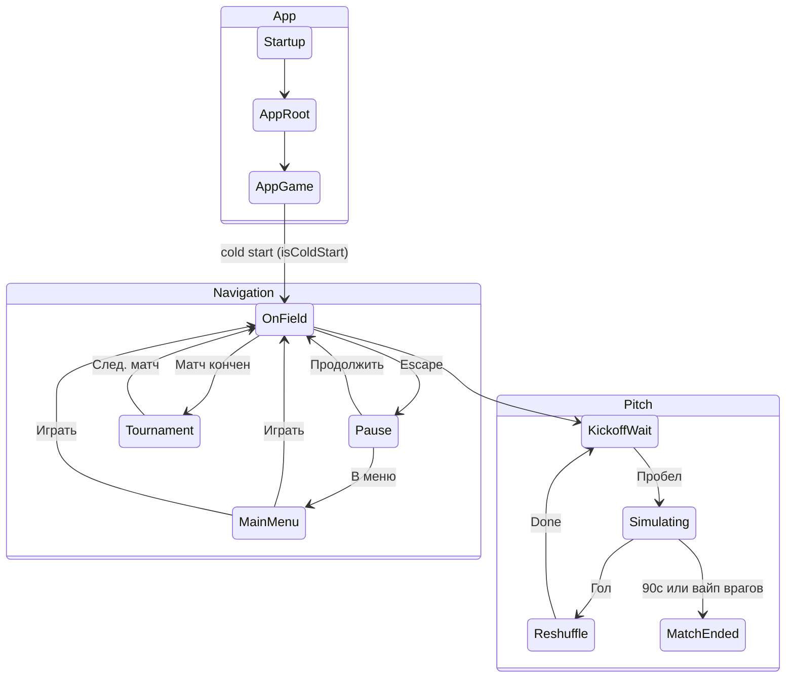

---
tags:
  - architecture
  - index
aliases:
  - Архитектура
---

# Архитектура — индекс

← [[../Home|Главная]]

## Обзор

- [[Принципы проектирования]] — **с чего начать**
- [[Шина событий]] — связь логики и view
- [[Обзор архитектуры]] — схема целиком
- [[Сцены и Startup]] — RootScene, GameScene, build settings
- [[DI и LifetimeScope]] — VContainer, scopes, bus
- [[Связь сцены с кодом]] — MonoBehaviour на сцене
- [[Машины состояний]] — App / Navigation / Pitch FSM
- [[UI и оверлеи]] — меню поверх игры, пауза, HUD
- [[PauseCoordinator]] — единый `timeScale`
- [[GameDirector]] — оркестратор, save, restart
- [[Миграция с текущего кода]] — план от текущих скриптов
- [[Структура папок проекта]] — раскладка `Assets/_Projects/`
- [[Аналитика]] — события, SDK, Web (на будущее)
- [[Движение мяча]] — кинематика, без Physics2D
- [[Мяч и коллайдеры]] — коллайдеры при kinematic, CircleCast vs RB
- [[Сборка поля Game]] — **иерархия Game.unity, ворота, якоря, слои**
- [[Прогрессия и эффекты]] — уровень, перки, баффы/дебаффы
- [[MatchFlow и таймер]] — счёт, 90 с, корутина, HUD-слайдер
- [[Враги и защитники]] — футболист соперника (один prefab, режим Field/Goalkeeper), ИИ, пас
- [[Генерация врагов]] — **слоты 5×7, спавн, фигуры, pacing, архетипы**
- [[Баланс генерации врагов]] — **числа баланса, архетипы, фигуры (источник правды)**
- [[Журнал расхождений вики и кода]] — сверка документации с кодом

## GDD

- [[../GDD/Индекс GDD v6|GDD v6.0]]
- [[../GDD/Составляющие (карта систем)|Карта систем]]

> [!important] Расхождение с GDD
> Главное меню в GDD — отдельная сцена. **Архитектура:** меню = оверлей. См. [[Обзор архитектуры#Ключевые решения]].

## Модули (статус)

| Модуль | Документ | Код |
|--------|----------|-----|
| Startup / App FSM | [[GameDirector]], [[Сцены и Startup]] | ✅ `Startup`, `GameDirector`, `AppRootState`, `AppGameState` |
| Navigation overlays | [[UI и оверлеи]], [[Машины состояний]] | 🟡 `OverlayStateController`, `MainMenuWidget`, `PauseMenuView` |
| Pause / timeScale | [[PauseCoordinator]] | ✅ `PauseCoordinator` |
| Pitch FSM | [[Машины состояний]] | ✅ `PitchStateMachine` |
| MatchFlow / таймер | [[MatchFlow и таймер]] | ✅ `MatchFlow`, `MatchHudWidget` |
| Run progression | [[Прогрессия и эффекты]] | 🟡 `RunStateService`, `BonusPickCoordinator` |
| Audio | [[../Аудио менеджер/аудио менеджер Wiki\|Аудио]] | ✅ `AudioService`, `AudioPlaybackHost`, `AudioCatalog` |
| Goalkeeper | [[../GDD/03 Физика и управление вратарём\|GDD §3]], [[Сборка поля Game]] | ✅ `GoalkeeperView`, `GoalkeeperMotor`, flip |
| Ball + Combo | [[Движение мяча]], [[../GDD/04 Механики мяча и комбо\|GDD §4]] | 🟡 `BallView` / `BallMotion` (комбо — 🔲) |
| Defenders | [[Враги и защитники]], [[Генерация врагов]] | ✅ `DefenderView`, spawner, `DefenderHealth`, `GoalAnchor` DI |
| Scene Transition | [[UI и оверлеи]] | 🔲 |
| Tournament | [[Машины состояний#Уровень 2]] | 🟡 `TournamentRunService`, `TournamentWidget` |
| Leaderboard | [[GameDirector#Сохранения]] | 🔲 |
| Analytics | [[Аналитика]] | 🔲 |
| Bot background (меню) | [[UI и оверлеи#BotSimulationController]] | 🔲 post-MVP |
| Status effects | [[Прогрессия и эффекты]] | 🔲 |

## Диаграмма состояний (краткая)

