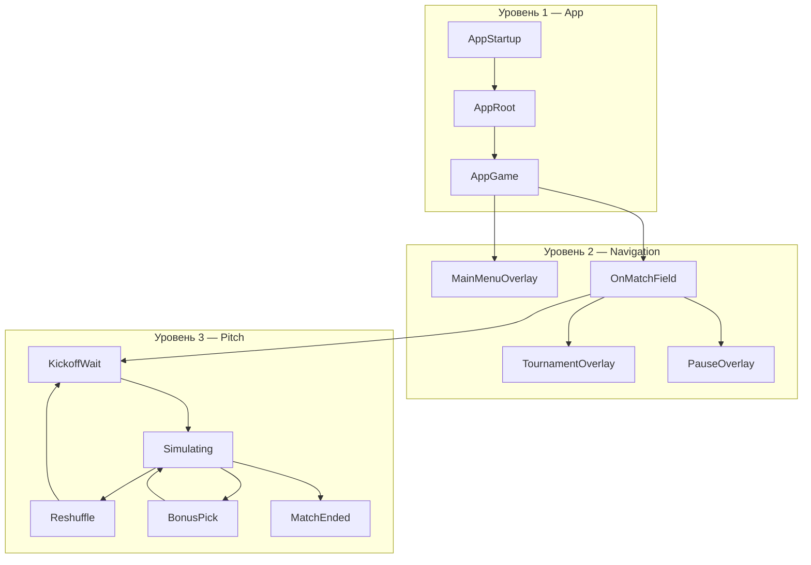
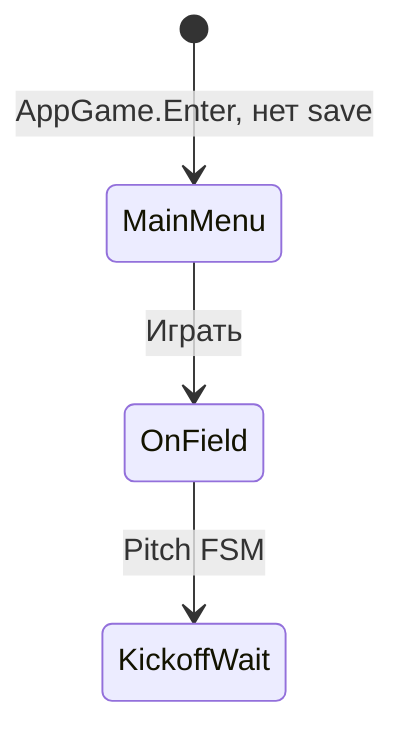
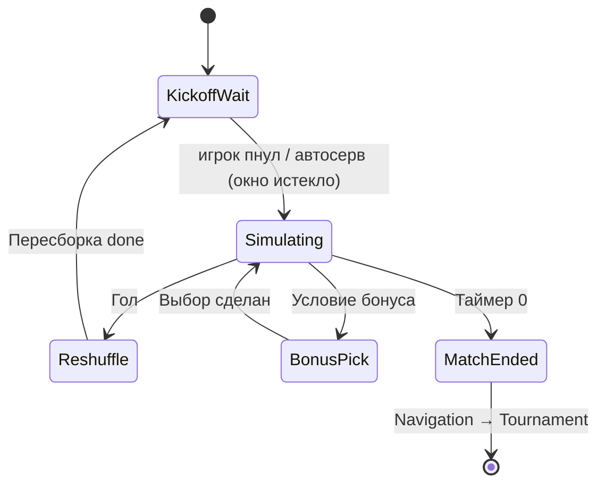

---
tags:
  - architecture
  - fsm
  - state-machine
aliases:
  - FSM
  - Состояния
---

# Машины состояний

← [[Обзор архитектуры]] | [[Индекс архитектуры]]

Три уровня, не смешиваем:

1. **App FSM** — startup, загрузка, жизнь приложения
2. **Navigation FSM** — где «мы» с точки зрения игрока: меню, поле, турнир, пауза
3. **Pitch FSM** — что происходит **на поле**: кик-офф, симуляция, гол, бонус



---

## Уровень 1: App FSM (`GameDirector`)

Ручные классы `Enter` / `Exit`, не Unity Animator.

| Состояние | Класс | Ответственность |
|-----------|-------|-----------------|
| **Startup** | `Startup` + `GameStartupHandler` | Старт, guard от двойного init |
| **AppRoot** | `AppRootState` | RootScene, root DI, audio, save |
| **AppGame** | `AppGameState` | GameScene additive, app child DI, overlays |

Переходы:

```
Startup → AppRoot.Enter()
AppRoot → AppGame.Enter(saveData?)
AppGame.Exit() → unload Game, dispose scopes
```

См. [[GameDirector]], [[Принципы проектирования]].

---

## Уровень 2: Navigation FSM (`OverlayStateController`)

Управляет **видимостью оверлеев** и **кто владеет вводом**. Игровая сцена при этом **остаётся загруженной**.

| Состояние | UI | Симуляция поля | Ввод игрока | Match HUD (Game) |
|-----------|-----|----------------|-------------|------------------|
| `MainMenu` | Главное меню + **лидерборд** (Root) | **Фоновые боты** — мяч без матча, `timeScale = 1` | Только UI меню | **Нет** — нет активного забега |
| `OnField` | Нет Root-оверлея | Полная / по Pitch FSM, **забег** | Да | **Да** |
| `Tournament` | Турнирная сетка (Game) | Поле на паузе или затемнено | Только UI сетки | **Нет** |
| `Pause` | Escape-меню (**только при активном забеге**) | `timeScale = 0` | Только UI паузы | **Да** — замороженный матч под оверлеем |

> [!important] Main Menu ≠ Pause
> Главное меню **не замораживает** поле и **не показывает** Match HUD. Пауза доступна **только во время забега** (после «Играть», пока run не завершён или игрок не вышел в меню). См. [[UI и оверлеи#Главное меню ≠ пауза]].

> [!important] Match HUD ≠ Root overlay
> HUD — **часть сцены Game** (таймер, счёт), только при **забеге**. Главное меню — Root поверх поля **без** HUD. Скрываем HUD при `MainMenu` и `Tournament`. См. [[UI и оверлеи#Match HUD]], [[MatchFlow и таймер#HUD: слайдер на сцене Game]].

### Первый запуск



1. `AppGame.Enter()` загружает поле, запускает `BotSimulation` (фон, без матча)
2. Показывается `MainMenu` overlay (с панелью лидеров) — **без** Match HUD
3. «Играть» → скрыть меню → `Navigation = OnField` → старт **забега** → Match HUD on → `Pitch = KickoffWait`
4. Подсказка: A/D, Пробел (окно ввода — см. [[MatchFlow и таймер#KickoffWait: окно ввода (идея, не реализовано)]])

### Повторный заход (есть save)

- Можно снова показать `MainMenu` с лидербордом
- Или восстановить турнир из save → сразу `Tournament` или `OnField`

> Детали save — в [[GameDirector#Сохранения]]; на первом этапе достаточно флага `HasPlayedBefore`.

### Переходы Navigation

| Из | В | Действие |
|----|---|----------|
| `MainMenu` | `OnField` | Скрыть меню, старт забега, Match HUD on, Pitch → KickoffWait |
| `OnField` | `Pause` | Escape (**только если есть активный забег**), timeScale 0 |
| `Pause` | `OnField` | Продолжить |
| `Pause` | `MainMenu` | Сброс забега, Match HUD off, фоновые боты |
| `OnField` | `Tournament` | HUD off, сетка on |
| `Tournament` | `OnField` | Следующий матч, `PitchResetRequestedEvent` |
| `OnField` / `Tournament` | `MainMenu` | Конец забега / выход — HUD off, меню + боты на фоне |

---

## Уровень 3: Pitch FSM (`PitchStateMachine`)

Только когда `Navigation == OnField`. Соответствует [[../GDD/02 Игровой цикл|GDD: игровой цикл]].

| Состояние | Описание | GDD |
|-----------|----------|-----|
| `KickoffWait` | Окно ввода: игрок может пнуть; по истечении задержки — **автосерв** (идея). Мяч на `BallKickoffAnchor`; матч-таймер не тикает | §2 старт, §3, [[MatchFlow и таймер#KickoffWait: окно ввода (идея, не реализовано)]] |
| `Simulating` | Мяч в игре, таймер идёт, комбо активно | §2 процесс |
| `Reshuffle` | После гола: сброс позиций, лечение, анимации | §2 пересборка |
| `BonusPick` | Выбор рогалик-бонуса (если есть XP) | рогалик, TBD |
| `MatchEnded` | 90 сек истекло, итог | §2 конец матча |



### Связь с текущим `GameManager`

Сейчас в коде:

```csharp
enum GameState { None, Countdown, Playing, GameOver }
```

Маппинг при миграции:

| Старый | Новый |
|--------|-------|
| `Countdown` | убрать; заменить **окном ввода** в `KickoffWait` (отдельный короткий таймер + автосерв) |
| `Playing` | `Simulating` |
| `GameOver` | `MatchEnded` |
| — | `Reshuffle`, `BonusPick`, `KickoffWait` — новые |

Логику таймера и счёта забирает `MatchFlow` ([[MatchFlow и таймер]]); FSM только оркестрирует **разрешения** (можно ли бить, двигается ли мяч).

---

## Кто кого вызывает

```
GameDirector
  └─ AppRootState / AppGameState
       └─ OverlayStateController  (Navigation)
            └─ UIService.Show/Hide overlays
       └─ PitchStateMachine       (Pitch)
            └─ MatchFlow, Ball, Goalkeeper, Defenders
            └─ BotSimulationController (когда Navigation == MainMenu)
```

**Правило:** Pitch FSM не знает про турнир. Navigation не знает про комбо-множитель. App FSM не знает про Пробел.

---

## Реализация (рекомендация)

Простые C# классы + `UniTask Enter()` / `Exit()` — **без** сторонней FSM-библиотеки на первом этапе.

Опционально позже: source generator или `StateMachine<T>` если состояний станет > 15.

### Интерфейс состояния поля

```csharp
public interface IPitchState
{
    UniTask Enter(PitchContext ctx);
    UniTask Exit();
    void OnUpdate(float dt); // или события
}
```

`PitchStateMachine` держит текущее состояние и маршрутизирует события (`GoalScored`, `BallReturnedToKeeper`, `MatchEnded`).
