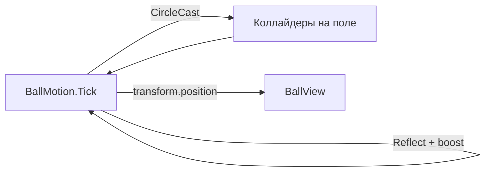

---
tags:
  - architecture
  - ball
  - colliders
aliases:
  - Коллайдеры мяча
  - Kinematic colliders
---

# Мяч и коллайдеры

← [[Движение мяча]] | [[Сборка поля Game]] | [[Индекс архитектуры]]

**Кинематик** здесь значит: мяч **не симулируется** физическим движком (нет сил, импульсов, `linearVelocity`). Позицию и отскок задаёт **`BallMotion.Tick`**. Это **не** значит «без коллайдеров на сцене».

---

## Главная идея

Коллайдеры на **стенах, вратаре, защитниках, воротах** — как обычно. Они описывают **геометрию** для запросов (`CircleCast`, `Overlap`) или триггеров.

Мяч **не толкает** их и не получает отскок от Unity Physics — отражение считаем в коде.



---

## Два рабочих варианта на мяче

### Вариант A — без Rigidbody (MVP)

На мяче **нет** `Rigidbody2D`. Есть позиция и `radius` в `BallSettings` / `BallMotion`.

```csharp
Physics2D.CircleCast(position, radius, direction, speed * dt, contactMask);
```

- Cast смотрит коллайдеры в мире — **RB на мяче не нужен**
- `OnCollisionEnter2D` на мяче **не придёт** — вся логика в `Tick`
- Отскок, depenetration, буст — вручную

**Выбран для MVP.** См. [[Движение мяча#Коллизии — как детектить (MVP)]].

### Вариант B — Kinematic Rigidbody2D

Если нужны **`OnTriggerEnter2D`** (ворота, аут, зоны):

| Компонент | Настройка |
|-----------|-----------|
| `Rigidbody2D` | **Kinematic** |
| `Collider2D` на мяче | часто **Is Trigger** |
| Движение | `transform` или `rb.MovePosition` из того же `Tick` |

Kinematic **не падает и не отскакивает сам** — ты всё равно задаёшь `direction` и `speed`. При движении триггеры **срабатывают**.

Для **стен** kinematic + `OnCollisionEnter2D` возможен, но углы и бусты хуже контролировать, чем у CircleCast. Практика:

- **стены / вратарь / защитники** → CircleCast + ручной reflect  
- **ворота / out of bounds** → trigger (+ опционально kinematic RB на мяче)

---

## Раскладка на сцене

| Объект | Collider | Rigidbody | Trigger |
|--------|----------|-----------|---------|
| Борт, задняя стена | `BoxCollider2D` / `EdgeCollider2D` | не нужен (static) | нет |
| Вратарь | `Capsule` / `Box` | kinematic, если двигается скриптом | нет |
| Защитник (слот) | `BoxCollider2D` | обычно static | нет |
| Ворота соперника | `ScoringZone`: trigger, Layer `GoalEnemy` | не нужен | **да** |
| Гол в свои ворота | `GoalPlayer`: trigger, Layer `GoalPlayer` | не нужен | **да** |
| Рама ворот | `Frame`: `EdgeCollider2D`, Layer `Wall` | не нужен | нет |
| Мяч | **нет** collider (вариант A) | **нет** | — |

**Слои для cast:** `Wall`, `Keeper`, `Defender` — `PhysicsLayers.BallContactMask`.  
**Голы:** `GoalEnemy`, `GoalPlayer` — `OverlapCircle`, не в cast.

Полная сборка сцены: [[Сборка поля Game]].

---

## Что происходит за кадр

```text
1. Было: position, direction, speed
2. delta = direction * speed * dt
3. hit = CircleCast(position, radius, direction, |delta|)
4. если hit:
     position = hit.point + hit.normal * (radius + skin)   // вынуть из стены
     reflect / BallLaunchCommand / событие
   иначе:
     position += delta
5. speed → затухание к baseSpeed
6. BallView: transform.position = position
```

Коллайдеры на поле **не двигает** физика мяча — только **читаем** их через cast/overlap.

---

## Типичная ошибка

**Dynamic** `Rigidbody2D` на мяче **и** ручное движение `transform` в одном кадре:

- конфликт velocity vs transform  
- пролёты сквозь стены  
- непредсказуемые углы  

Либо **полная** physics, либо **kinematic + свой Tick**. У нас — второе (без dynamic).

Текущий прототип `Assets/Scripts/Ball.cs` — dynamic RB + `OnCollisionEnter2D` → **заменить** при миграции.

---

## Сводка

| Вопрос | Ответ |
|--------|--------|
| Нужен ли collider на стенах? | Да |
| Нужен ли dynamic RB на мяче? | **Нет** |
| Как ловим отскок? | `CircleCast` + `Reflect` в коде |
| Как ловим гол? | Trigger на воротах (+ overlap или `OnTriggerEnter2D`) |
| Коллайдеры «работают» без RB на мяче? | Да — для **Cast/Overlap**; для **триггер-колбэков** на мяче лучше kinematic RB |

---

## Связанные заметки

- [[Движение мяча]]
- [[Сборка поля Game]]
- [[Связь сцены с кодом]]
- [[Миграция с текущего кода]]
