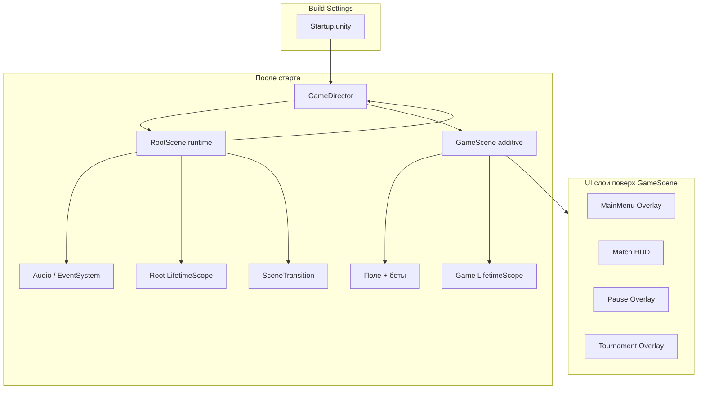
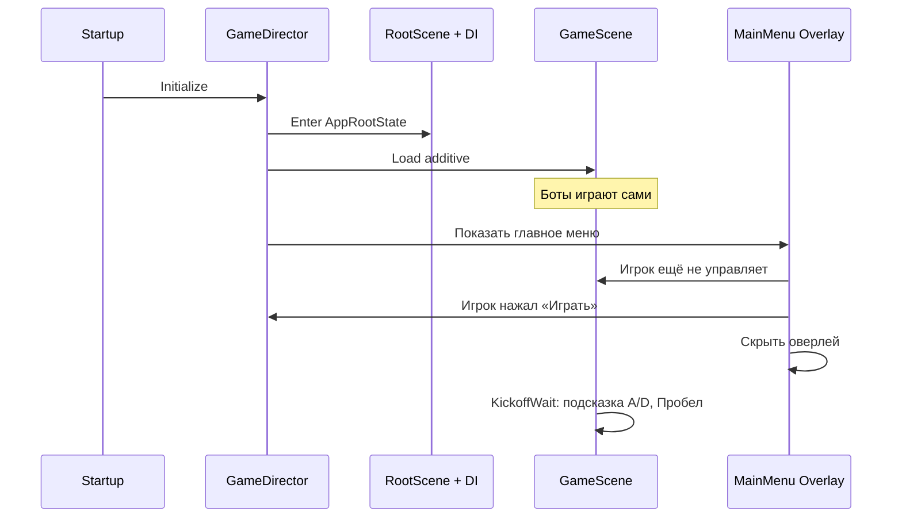

---
tags:
  - architecture
  - overview
aliases:
  - Архитектура обзор
---

# Обзор архитектуры

← [[Индекс архитектуры]] | [[../Home|Главная]]

Архитектура **ФУТБОЛОИД**: startup, VContainer, FSM, оверлеи, **MonoBehaviour + сервисы + шина**, кинематический мяч. См. [[Принципы проектирования]].

## Ключевые решения

| Решение | Почему |
|---------|--------|
| Одна точка входа `Startup` | Единое место инициализации приложения |
| `RootScene` (runtime) | Глобальные объекты живут вне игровой сцены и не выгружаются |
| Игровая сцена **аддитивно** | Поле всегда под рукой; меню — слой поверх |
| **Главное меню = оверлей** | На фоне крутятся боты; нет лишней загрузки сцены |
| **Сервисы + MonoBehaviour + шина** | Матч в DI; поле во view; `BallMotion` — pure C# |
| **VContainer** + child scopes | Чистый lifecycle: Root → App → Game; шина в App |
| **Две FSM** | «Где мы в приложении» и «что на поле» |
| Scene Transition (шторки) | Из [[../GDD/05 Меню UI и переходы#5.3. Анимация перехода между сценами (Scene Transition)\|GDD §5.3]] — только для тяжёлых переходов (турнир и т.п.) |

> [!important] Отличие от GDD v6.0
> В GDD главное меню описано как **отдельная сцена**. По итогам обсуждения принято: **меню — оверлей поверх игровой сцены**. GDD будет уточнён отдельно.

## Схема целиком

## Поток первого запуска

**Первый заход:** сохранений нет → сразу загружается игра на фоне, сверху главное меню с **панелью лидеров**. После «Играть» — подсказка начать движение / ввести мяч.

## Документы раздела

| Заметка | Содержание |
|---------|------------|
| [[Сцены и Startup]] | RootScene, build settings, что где лежит |
| [[DI и LifetimeScope]] | VContainer, регистрация сервисов |
| [[Машины состояний]] | App FSM + Pitch FSM + оверлеи |
| [[UI и оверлеи]] | Меню, пауза, HUD, лидерборд |
| [[GameDirector]] | Оркестратор переходов |
| [[Принципы проектирования]] | MonoBehaviour, сервисы, без Entity |
| [[Шина событий]] | IGameEventBus, publish / subscribe |
| [[Связь сцены с кодом]] | Initialize view, registry |
| [[Структура папок проекта]] | Раскладка `Assets/_Projects/` |
| [[Миграция с текущего кода]] | `GameManager`, `MainMenuController` → целевая схема |

## Стек

- **Unity** + URP 2D
- **VContainer** — DI
- **UniTask** — async startup / transitions
- **DOTween** — анимации UI, вратарь, scene transition
- **Input System** — уже в проекте

## Web / сохранения

Для WebGL прогресс и лидерборд — **не cookies**, а:

- `PlayerPrefs` (на WebGL мапится в localStorage браузера)
- или обёртка `ISaveStorage` с реализацией под Web / Standalone

См. [[GameDirector#Сохранения]].
