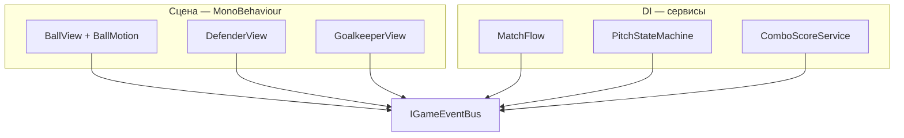

---
tags:
  - architecture
  - principles
aliases:
  - Принципы
  - Senior lens
---

# Принципы проектирования

← [[Индекс архитектуры]] | [[Обзор архитектуры]]

Правила архитектуры ФУТБОЛОИД. Чужие проекты — только **подсмотреть интересное**, не строить «по образу».

> [!quote] Критерий
> Слой оправдан, если без него код **реально** сложнее поддерживать — не «так принято в больших проектах».

---

## Слои (итоговая модель)



| Слой | Что | Пример |
|------|-----|--------|
| **Сервис** (DI) | Матч, фазы, комбо, таймер | `MatchFlow`, `PitchStateMachine` |
| **MonoBehaviour** | Объект на поле: input, коллизии, VFX | `DefenderView`, `GoalkeeperView` |
| **Pure C#** (точечно) | Сложная логика без Unity | `BallMotion` (режимы полёта) |
| **Шина** | Связь с HUD, FSM, аналитикой | `IGameEventBus` |

**Отдельный `XxxEntity` на каждый prefab — не используем.** Логики на объект мало; лишний файл и wiring.

---

## MonoBehaviour — основной дом для объектов поля

```csharp
// DefenderView — типичный защитник
public class DefenderView : MonoBehaviour
{
    [SerializeField] DefenderHitBehavior hitBehavior;
    int hp;
    IGameEventBus bus;

    public void Initialize(IGameEventBus bus) => this.bus = bus;

    void OnBallContact(BallMotion ball)
    {
        hitBehavior.Apply(ball);           // reflect / directed / curved / hold
        hp--;
        bus.Publish(new DefenderDamagedEvent(slotId, hp));
        if (hp <= 0) bus.Publish(new DefenderDestroyedEvent(slotId));
    }
}
```

Допустимо держать **10–30 строк** логики во view. Если раздувается — выносим кусок, но не обязательно называть это Entity.

---

## Когда выносить pure C# (не Entity)

| Класс | Зачем | Не Entity, потому что |
|-------|-------|------------------------|
| **`BallMotion`** | режимы `Linear` / `Directed` / `Curved` / `Held`, `Tick` | это **движок мяча**, не «сущность домена» |
| **`GoalkeeperMotor`** (позже) | инерция, dive — если view разрастётся | то же |
| struct **`BallLaunchCommand`** | данные удара от врага | DTO |

`BallView` владеет `BallMotion`, синхронизирует `transform`:

```csharp
void FixedUpdate()
{
    if (!pitch.IsSimulating) return;
    ballMotion.Tick(Time.fixedDeltaTime);
    transform.position = ballMotion.Position;
}
```

Тесты без сцены — для **`BallMotion`**, не для каждого защитника.

---

## Шина: назад к миру

MonoBehaviour и сервисы **не** дергают HUD напрямую:

```csharp
bus.Publish(new GoalScoredEvent(isPlayer, combo));
```

View подписан на свои события (анимация, shake). См. [[Шина событий]].

**Запрещено:** `GetComponent`, `Find`, ссылка view→view соседа для геймплейной логики.

---

## Сервисы vs MonoBehaviour

| Вопрос | Куда |
|--------|------|
| Таймер 90 с, счёт голов, фаза матча? | `MatchFlow` |
| Сессия мяча, комбо-множитель? | `ComboScoreService` |
| Куда летит мяч, reflect, дуга? | `BallMotion` |
| HP этого защитника, анимация смерти? | `DefenderView` |
| Какой тип удара у этого prefab? | `DefenderHitBehavior` (SO) |
| Уровень, карьерный XP, unlock перков? | `PlayerProgressionService` — **post-MVP**, не делаем |
| Перки и XP **этого забега**? | `RunStateService` — **MVP** |
| Активные бафф/дебафф, множители, разовые? | `StatusEffectService` |

Подробнее: [[Прогрессия и эффекты]].

---

## Состояние

| Данные | Где |
|--------|-----|
| `direction`, `speed`, режим полёта | `BallMotion` |
| HP защитника | `DefenderView` |
| Счёт, таймер | `MatchFlow` |
| Активные эффекты матча | `StatusEffectService` |
| Перки и XP текущего забега | `RunStateService` |
| Карьерный уровень / мета-перки | post-MVP (`PlayerProgressionService`) |
| Позиция на экране | `transform` (из motion или motor) |

Один источник правды на поле — **не** дублировать HP в сервисе и view.

---

## DI

- Сервисы матча — **VContainer**, extensions `Register*Scope`
- MonoBehaviour — `Initialize(bus)` при старте матча
- **Нет** `GameManager.Instance`

---

## Чего не делаем

- [ ] `BallEntity`, `DefenderEntity` на всё поле «для красоты»
- [ ] View ↔ логика с взаимными ссылками
- [ ] `Rigidbody2D` dynamic на мяч ([[Движение мяча]])
- [ ] HUD из `DefenderView` напрямую
- [ ] Копировать чужие паттерны без проверки

---

## Связанные заметки

- [[Движение мяча]]
- [[Шина событий]]
- [[DI и LifetimeScope]]
- [[Связь сцены с кодом]]
