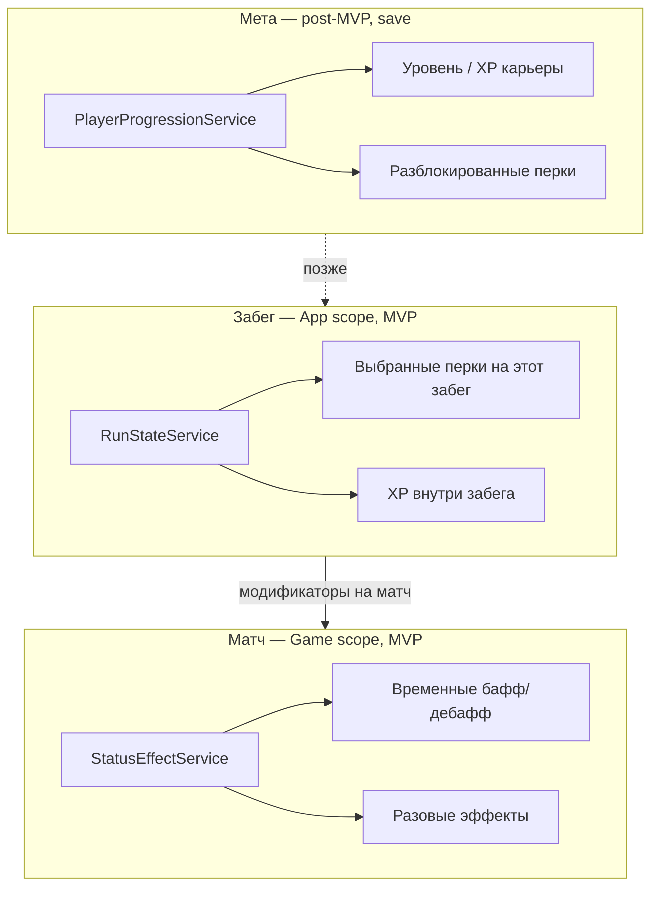
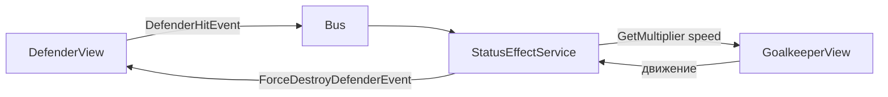
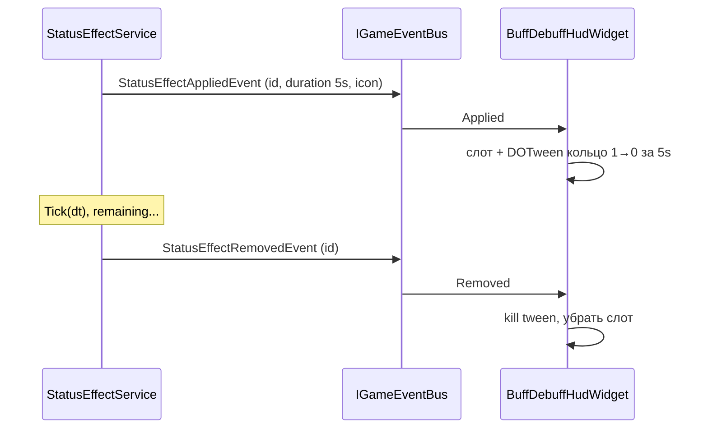

---
tags:
  - architecture
  - progression
  - roguelike
  - buffs
aliases:
  - Прогрессия
  - Баффы и дебаффы
  - Status effects
---

# Прогрессия и эффекты

← [[Индекс архитектуры]] | [[Принципы проектирования]]

Где хранятся **уровень, опыт, перки** и **баффы/дебаффы**, и как эффекты **меняют геймплей** (медленнее бег, сильнее враги, разовое «убить врага»).

Связано: [[../GDD/06 HUD и визуальный фидбек#Умные трекеры баффов/дебаффов|HUD: стек эффектов]], [[Шина событий]], [[GameDirector#Сохранения]].

> [!note] Статус
> Рогалик-часть в GDD v6.0 описана слабо. Здесь — **архитектурный каркас**; числа и список перков — позже в data (SO).

> [!important] MVP
> **В первой версии — только прогрессия забега.** Нет мета-прогрессии вне матча/турнира, нет выбора команд, нет карьерного уровня и unlock-дерева между сессиями.
>
> | В MVP | Не в MVP (позже) |
> |-------|------------------|
> | `RunStateService` — перки и XP **этого забега** | `PlayerProgressionService` — карьера, save между запусками |
> | `StatusEffectService` — баффы/дебаффы в матче | Выбор команды, мета-unlock перков |
> | `BonusPick` / выбор после матча внутри забега | Hall of Fame, долгосрочный профиль |
>
> `PlayerProgressionService` — **не делаем сейчас**. Допустим только **задел**: пустой `IPlayerProgressionService` или закомментированный слот в DI, **без реализации и без данных**. В MVP весь XP и все перки живут в `RunStateService`.

---

## Три разных «слоя» данных

Не смешивать в одном классе:



| Слой | Живёт | MVP | Пример |
|------|-------|-----|--------|
| **Мета-прогрессия** | Root + `ISaveStorage` | ❌ не делаем | уровень 12, unlock перка между сессиями |
| **Забег** | App scope | ✅ **основное** | перки и XP только внутри текущего турнира |
| **Эффекты в матче** | Game scope | ✅ | дебаф «медленный бег 8 с», баф «след. удар убивает» |

**XP с убитых врагов в MVP** — только в **забег** (`RunStateService`) и/или в очки матча (`MatchFlow` / `ComboScoreService`). Карьерного XP нет.

---

## 1. PlayerProgressionService (мета) — **не MVP**

> [!warning] Отложено
> Не реализуем в первой версии. Нет мета-цикла вне забега: ни карьерного уровня, ни unlock-дерева, ни выбора команд.

**Задел (опционально, пустой):**

```csharp
// Только контракт на будущее — без Register в DI, без save
public interface IPlayerProgressionService { }
```

Когда понадобится post-MVP:

- **Scope:** Root + `ISaveStorage` → `PlayerProfileData`
- карьерный уровень, XP между сессиями, разблокированные перки, рекорды
- пассивы мета подмешиваются в начало забега из `RunStateService`

Черновик save (не пишем в MVP):

```csharp
public class PlayerProfileData
{
    public int CareerLevel;
    public int CareerXp;
    public List<string> UnlockedPerkIds;
    // ...
}
```

---

## 2. RunStateService (забег) — **ядро MVP**

**Scope:** App — создаётся при входе в турнир, сбрасывается при «новый турнир».

**В MVP — единственный источник «прогрессии игрока»:**

- **перки, выбранные в этом забеге** (экран выбора после матча / `BonusPick` между раундами)
- **XP и уровень внутри забега** (прокачка только пока идёт турнир; новый забег — с нуля)
- текущий раунд сетки, соперник (когда появится турнир)
- опционально: валюта забега

**Не хранит:** таймер 90 с, счёт гола — это `MatchFlow`. Активные timed-дебаффы — `StatusEffectService`.

При старте матча: `RunStateService` → `StatusEffectService.ApplyPassives(...)` для перков, накопленных в забеге.

Новый забег / «играть снова» → **полный сброс** `RunStateService`. Между сессиями ничего не переносим (кроме общих настроек звука и т.п. через `ISaveStorage`, если нужно).

---

## 3. StatusEffectService (баффы / дебаффы в матче)

**Scope:** Game — новый матч = чистый список эффектов.

Центральная система для всего, что в HUD-кружочках и **меняет правила** на поле.

### Типы эффектов

| Тип | Поведение | Пример | UI |
|-----|-----------|--------|-----|
| **Timed** | `duration`, тикает в `Tick(dt)` | медленный бег 8 с | кольцо таймера |
| **Stat modifier** | множитель/сложение к стату | враги +20% HP | иконка + таймер или пассив |
| **Charge / instant** | N зарядов, срабатывает на событие | убить 1 врага при следующем попадании | иконка + число зарядов |
| **One-shot** | charge = 1, после срабатывания снять | «следующий гол ×2» | до срабатывания |
| **Passive** (с матча) | до конца матча | перк забега «+скорость» | без таймера или серый border |

Определения — **ScriptableObject** `StatusEffectDefinition` (id, иконка, тип, параметры).

### Как эффект меняет геймплей

Два механизма (можно оба):

#### A. Запрос модификаторов (статы)

Сервисы и view **спрашивают** перед действием:

```csharp
float moveMul = statusEffects.GetMultiplier(StatId.GoalkeeperMoveSpeed);
// GoalkeeperView применяет к скорости
float enemyHpMul = statusEffects.GetMultiplier(StatId.EnemyMaxHp);
```

Удобно для: скорость бега, урон врагов, скорость мяча, длительность dive.

#### B. Реакция на события (разовые)

`StatusEffectService` подписан на шину:

```csharp
// псевдокод
void OnDefenderHit(DefenderHitEvent e)
{
    if (TryConsumeEffect(EffectId.InstantKillNextHit, out _))
        bus.Publish(new ForceDestroyDefenderEvent(e.SlotId));
}
```

Удобно для: убить врага, двойные очки за гол, заморозить мяч.



**View не хранит список баффов** — только запрашивает множитель или слушает **результирующие** события.

---

## 4. Контракты (черновик)

```csharp
public enum StatId
{
    GoalkeeperMoveSpeed,
    GoalkeeperDiveRecovery,
    EnemyMaxHp,
    EnemyDamage,
    BallMaxSpeed,
    ComboGain,
    // ...
}

public interface IStatusEffectService
{
    void Apply(StatusEffectDefinition def, int stacks = 1);
    void ApplyPassive(StatusEffectDefinition def); // до конца матча
    void Tick(float dt);
    float GetMultiplier(StatId stat);
    float GetAdditive(StatId stat);
    IReadOnlyList<ActiveEffectSnapshot> GetActiveForHud(); // отладка / resync, не основной путь HUD
}

public readonly struct ActiveEffectSnapshot
{
    public string EffectId;
    public Sprite Icon;
    public float Duration01;       // Remaining/Total, для кольца HUD
    public float RemainingSeconds; // опционально для текста
    public int Charges;
    public bool ShowTimerRing;
}
```

`Tick` вызывает `MatchFlow` / `PitchStateMachine` только в `Simulating` (как и мяч).

---

## 5. Перки vs баффы — термины

| Термин | Где | Когда выдаётся |
|--------|-----|----------------|
| **Перк (мета)** | `PlayerProgressionService` | post-MVP, не в первой версии |
| **Перк (забег)** | `RunStateService` | **MVP:** выбор из 3 карт после матча / уровня |
| **Бафф** | `StatusEffectService` | подобрал на поле, скилл, награда |
| **Дебафф** | `StatusEffectService` | трибуна, арбитр, провал QTE |

В коде всё может быть одним `StatusEffectDefinition` с разным **источником**; различие — **кто вызвал `Apply`** и **сколько живёт**.

---

## 6. BonusPick и Pitch FSM

Состояние [[Машины состояний#Уровень 3: Pitch FSM (PitchStateMachine)|`BonusPick`]]:

1. `PitchStateMachine` → `BonusPick`
2. UI показывает 3 `StatusEffectDefinition` на выбор
3. Игрок выбрал → `statusEffects.Apply(chosen)`
4. → обратно в `Simulating`

Перки забега — отдельный UI (между матчами турнира), пишут в `RunStateService` + `ApplyPassive` на следующий матч.

---

## 7. HUD — события + анимация кольца

**Источник правды по геймплею** — `StatusEffectService` (`Tick`, снятие эффекта).  
**HUD** не опрашивает сервис каждый кадр: слушает **шину** и крутит **локальную анимацию** кольца (DOTween).

### Принцип

| Что | Кто решает |
|-----|------------|
| Эффект реально активен / снят | `StatusEffectService` → событие **`Removed`** |
| Как выглядит кольцо | `BuffDebuffHudWidget` → tween на `duration` из **`Applied`** |
| Когда убрать иконку | только по **`Removed`**, не когда tween дошёл до 0 |

Кольцо может **дойти до нуля раньше** события (или наоборот) — иконка **остаётся**, пока не придёт `StatusEffectRemovedEvent`. Так UI не расходится с логикой при паузе, продлении, досрочном снятии.



### События (шина)

```csharp
public readonly struct StatusEffectAppliedEvent
{
    public int InstanceId;           // уникальный экземпляр на матч
    public string EffectId;
    public Sprite Icon;
    public float DurationSeconds;    // 0 = без кольца (passive на матч)
    public int Charges;
}

public readonly struct StatusEffectRemovedEvent
{
    public int InstanceId;
    public StatusEffectRemoveReason Reason; // Expired, Dispelled, Consumed, MatchEnd
}

public readonly struct StatusEffectRefreshedEvent
{
    public int InstanceId;
    public float DurationSeconds;    // продлили / перестакали — перезапустить tween
}

public readonly struct StatusEffectChargesChangedEvent
{
    public int InstanceId;
    public int Charges;
}
```

`StatusEffectService` публикует:

- **`Applied`** — в `Apply` / `ApplyPassive`
- **`Removed`** — в `Tick` при истечении, при досрочном снятии, при расходе заряда (если эффект кончился)
- **`Refreshed`** — если тот же бафф наложили снова и **обновили** длительность
- **`ChargesChanged`** — разовый эффект, остались заряды

### Логика виджета

```csharp
void OnApplied(StatusEffectAppliedEvent e)
{
    var slot = SpawnSlot(e.InstanceId, e.Icon);
    if (e.DurationSeconds > 0f)
        slot.RingTween = slot.Ring
            .DOFillAmount(0f, e.DurationSeconds)
            .SetEase(Ease.Linear);
    // passive: кольца нет
}

void OnRemoved(StatusEffectRemovedEvent e)
{
    _slots[e.InstanceId].KillTween();
    DespawnSlot(e.InstanceId);   // единственный момент снятия UI
}

void OnRefreshed(StatusEffectRefreshedEvent e)
{
    var slot = _slots[e.InstanceId];
    slot.KillTween();
    slot.Ring.fillAmount = 1f;
    slot.RingTween = slot.Ring.DOFillAmount(0f, e.DurationSeconds);
}
```

**Кольцо дошло до 0, а `Removed` ещё нет** — слот остаётся (пустое кольцо или лёгкий pulse). **Пришёл `Removed` раньше конца tween** — `KillTween()`, снять слот.

### Пауза

Tween на **scaled time** (`SetUpdate(false)` по умолчанию в DOTween) — при `Time.timeScale = 0` кольцо замирает вместе с матчем, как и `StatusEffectService.Tick(dt=0)`.

Опционально: на `PitchPhaseChanged` → `Pause` / `Play` на группе tween'ов HUD.

### Опрос `GetActiveForHud()` — не для HUD

Снимок в §4 остаётся для **отладки**, реконнекта UI после hot reload, тестов. **Основной путь MVP — события**, без `Update`-опроса.

### Производительность

- Нет аллокаций каждый кадр
- Tween'ов столько, сколько активных timed-эффектов (обычно < 15)
- Слоты создаются/уничтожаются только на `Applied` / `Removed`

См. [[UI и оверлеи]], [[Шина событий]].

---

## 8. DI и scope

**MVP:**

```csharp
// AppScopeExtensions — прогрессия только здесь
builder.Register<RunStateService>(Lifetime.Singleton);

// GameScopeExtensions
builder.Register<IStatusEffectService, StatusEffectService>(Lifetime.Singleton);
```

**Post-MVP** (когда появится мета):

```csharp
// RootScopeExtensions
builder.Register<PlayerProgressionService>(Lifetime.Singleton)
    .AsImplementedInterfaces();
```

| Сервис | Scope | MVP | Save |
|--------|-------|-----|------|
| `RunStateService` | App | ✅ | нет (сброс каждый забег) |
| `StatusEffectService` | Game | ✅ | нет |
| `PlayerProgressionService` | Root | ❌ задел / пустой интерфейс | да, позже |

При `AppGameState.Exit` / новый матч: новый Game scope → новый `StatusEffectService`.  
При новом турнире: сброс `RunStateService`.

---

## 9. Папки

```
Futboloid.Core/
├── Progression/                    # post-MVP
│   └── IPlayerProgressionService.cs  # опционально: пустая заглушка
├── Run/                            # MVP
│   └── RunStateService.cs
└── StatusEffects/
    ├── IStatusEffectService.cs
    ├── StatusEffectService.cs
    ├── StatusEffectDefinition.cs   # SO
    ├── StatId.cs
    └── Handlers/                   # опционально: InstantKillHandler

Futboloid.Gameplay/   # или Core — по вкусу
└── StatusEffects/
    └── *EffectHandler.cs           # сложные разовые эффекты
```

---

## 10. Открытые вопросы (GDD)

- [x] XP с врага в MVP → **только забег** (`RunStateService`), не карьера
- [ ] Перки стакаются внутри забега?
- [ ] Дебаффы с трибун — кто накладывает (CrowdService позже)?
- [ ] Сохранение середины турнира в MVP или только «один забег за сессию»?
- [ ] Post-MVP: мета-дерево, команды, Hall of Fame

---

## Связанные заметки

- [[Принципы проектирования]]
- [[Шина событий]]
- [[Машины состояний]]
- [[DI и LifetimeScope]]
- [[../GDD/Составляющие (карта систем)|Карта систем]]
