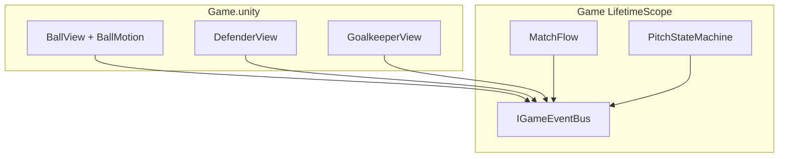

---
tags:
  - architecture
  - di
  - scene
aliases:
  - Связь сцены и кода
---

# Связь сцены с кодом

← [[DI и LifetimeScope]] | [[Принципы проектирования]]

Объекты на `Game.unity` — **MonoBehaviour** + точечный pure C# (`BallMotion`). Сервисы матча — в DI. Связь с HUD/FSM — **шина**.

## Схема



1. `GameState.Enter` → `RegisterGameScope()` → bus, сервисы
2. Каждый view: `Initialize(IGameEventBus bus)`
3. `BallView` создаёт `BallMotion` (pure C#), тикает в `Simulating`
4. Сброс матча — `bus.Publish(MatchResetEvent)`; view сами реагируют

---

## Initialize

```csharp
public interface IGameSceneInitializable
{
    void Initialize(IGameEventBus bus);
}

// GameState.Enter:
foreach (var o in FindObjectsByType<MonoBehaviour>(...)
    .OfType<IGameSceneInitializable>())
    o.Initialize(bus);
```

Или registry, если объектов много.

---

## Registry

| Задача | Как |
|--------|-----|
| Реакция на свой урон | bus + фильтр `slotId` |
| Сброс всего матча | `MatchResetEvent` на шине |
| Найти мяч один раз | `Find` на Enter — допустимо |

---

## Что куда

| Тип | Где | Связь |
|-----|-----|-------|
| `BallView`, `DefenderView`, … | Game.unity | `Initialize(bus)` |
| `BallMotion` | внутри `BallView` | не в DI |
| `MatchFlow`, FSM | DI | публикуют в bus |
| HUD, меню | Root / prefab | подписка на bus |

---

## Чего избегать

- Отдельный Entity-класс на каждый prefab без нужды
- `Find` в игровом цикле
- Прямой вызов HUD из view

## Связанные заметки

- [[Принципы проектирования]]
- [[Движение мяча]]
- [[Шина событий]]
