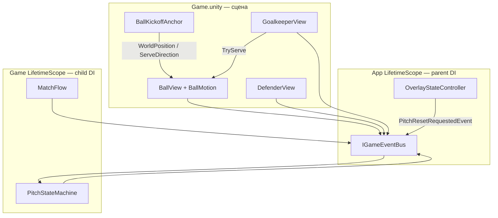

---
tags:
  - architecture
  - di
  - scene
aliases:
  - Связь сцены и кода
---

# Связь сцены с кодом

← [[DI и LifetimeScope]] | [[Принципы проектирования]]

Объекты на `Game.unity` — **MonoBehaviour** + точечный pure C# (`BallMotion`). Сервисы матча — в DI. Связь с HUD/FSM — **шина**.

## Схема



1. `GameState.Enter` → child `RegisterGameScope(gameScene)`
2. `RegisterComponentInScene<T>` — явная регистрация ключевых компонентов сцены
3. `InjectGameObject` на root-объектах — `[Inject]` в views и widgets
4. `BallView` создаёт `BallMotion` (pure C#), тикает в `Simulating`
5. Сброс поля — `PitchResetRequestedEvent` на шине

---

## Связь view ↔ DI (актуально)

```csharp
// GameScopeExtensions — упрощённо
builder.RegisterComponentInScene<GoalAnchor>(gameScene);
builder.RegisterComponentInScene<BallView>(gameScene);
builder.RegisterComponentInScene<GoalkeeperView>(gameScene);
builder.RegisterComponentInScene<DefenderGridRegistry>(gameScene);
// …
builder.RegisterBuildCallback(resolver => {
    foreach (var root in gameScene.GetRootGameObjects())
        resolver.InjectGameObject(root);
});
```

`GoalAnchor`, `DefenderView`, `DefenderHealth` — через **inject**, не `GetComponent` / `Find` в рантайме.

View с `[Inject]`:

```csharp
[Inject]
public void Construct(IGameEventBus bus, DefenderGridRegistry registry, GoalAnchor goalAnchor) { … }
```

> [!note] Устаревший вариант
> Ручной `IGameSceneInitializable` + `FindObjectsByType` — **не используем**. Заменён на VContainer inject.

---

## Registry

| Задача | Как |
|--------|-----|
| Реакция на свой урон | bus + фильтр `slotId` |
| Сброс поля перед матчем | `PitchResetRequestedEvent` на шине |
| Найти мяч один раз | `Find` на Enter — допустимо |

---

## Что куда

| Тип | Где | Связь |
|-----|-----|-------|
| `BallKickoffAnchor` | Game.unity | SerializeField на `BallView` / `GoalkeeperView` |
| `GoalAnchor` | `Defenders/` на Game | DI: `RegisterComponentInScene<GoalAnchor>` |
| `BallView`, `GoalkeeperView`, `DefenderView` | prefab / Game | `[Inject]` + bus |
| `DefenderHealth`, `DefenderViewGizmos` | Defender prefab | SerializeField ссылки на root |
| `CharacterAnimationPresenter` | Visual (GK + Defender) | Idle/Run + flip |
| `BallMotion` | внутри `BallView` | не в DI |
| `MatchFlow`, FSM | DI | публикуют в bus |
| HUD, меню | Root / prefab | подписка на bus |

`BallView` **не** ссылается на `GoalkeeperView` — только на `BallKickoffAnchor`. Вратарь вызывает `ball.TryServe(direction)` по Пробелу.

---

## Чего избегать

- Отдельный Entity-класс на каждый prefab без нужды
- `Find` в игровом цикле
- Прямой вызов HUD из view

## Связанные заметки

- [[Принципы проектирования]]
- [[Движение мяча]]
- [[Сборка поля Game]]
- [[Шина событий]]
