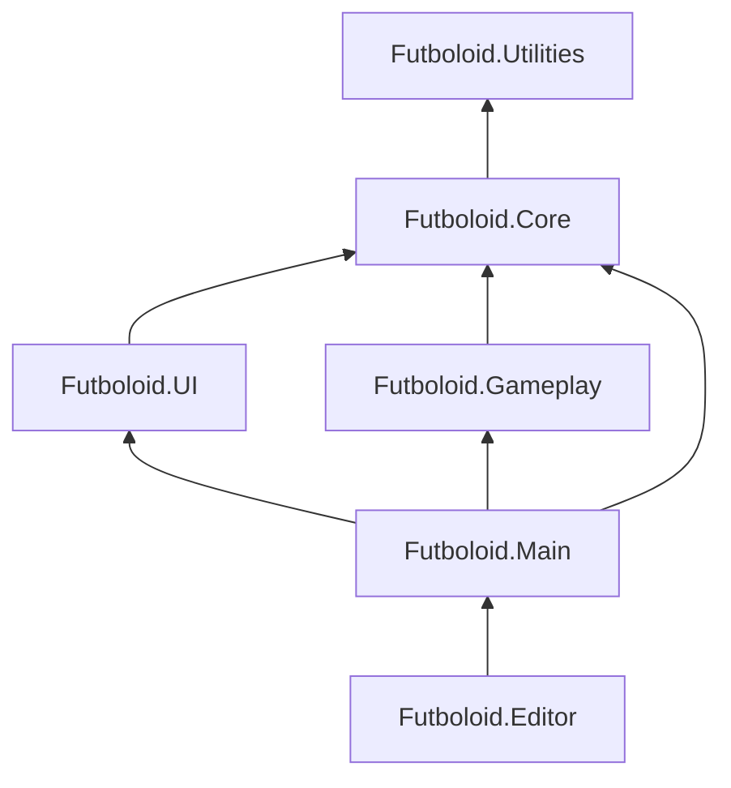

---
tags:
  - architecture
  - folders
  - conventions
aliases:
  - Структура папок
  - Folder structure
---

# Структура папок проекта

← [[Индекс архитектуры]] | [[Обзор архитектуры]]

Как разложить **Assets** в ФУТБОЛОИД: удобно в редакторе, согласовано с [[DI и LifetimeScope|DI]], [[Сцены и Startup|сценами]] и [[Принципы проектирования|принципами]].

Всё игровое содержимое — в `Assets/_Projects/` (префикс `_` поднимает папку вверх в Project window).

---

## Главный принцип

```
Assets/
├── _Projects/          ← ВСЁ своё: код, арт, сцены, prefab'ы, данные
├── Plugins/            ← Сторонние плагины (DOTween, VContainer…)
├── Settings/           ← URP, Input (можно оставить как у Unity)
└── TextMesh Pro/       ← Пакет Unity (не трогаем)
```

> [!tip] Префикс `_Projects`
> Подчёркивание поднимает папку **вверх** в Project window. Внутри неё — только контент игры, без мусора из корня `Assets/`.

**Не кладём** в корень `Assets/`: разрозненные `Scripts/`, `Sprites/`, `all audio/` — всё переезжает в `_Projects`.

---

## Дерево папок (целевое)

```
Assets/
└── _Projects/
    ├── Code/                          # C# + asmdef
    │   ├── Futboloid.Core/            # Интерфейсы, DI-хелперы, save, executor base
    │   ├── Futboloid.Main/            # Startup, GameDirector, AppStates, DI extensions
    │   ├── Futboloid.Gameplay/        # Мяч, вратарь, защитники, Pitch FSM, боты
    │   ├── Futboloid.UI/              # Виджеты, HUD, меню, scene transition
    │   ├── Futboloid.Utilities/       # Extensions, общие хелперы без геймплея
    │   └── Futboloid.Editor/          # Editor-only скрипты
    │
    ├── Scenes/
    │   ├── Startup.unity
    │   └── Game.unity                 # бывш. SampleScene
    │
    ├── Resources/                     # То, что грузим через Resources.Load
    │   ├── Prefabs/
    │   │   ├── UI/                    # MainMenu, HUD, Pause, Tournament…
    │   │   ├── Systems/               # EventSystem, AudioRoot, SceneTransition
    │   │   └── Gameplay/              # Мяч, эффекты (если спавним из кода)
    │   ├── Data/                      # ScriptableObject: настройки, баланс
    │   │   ├── Settings/              # GameAppSettings, InputSettings…
    │   │   ├── Bonuses/
    │   │   └── Tournament/
    │   └── Audio/                     # Clips для Resources (если нужно)
    │
    ├── Art/
    │   ├── Sprites/
    │   │   ├── Field/
    │   │   ├── Characters/
    │   │   ├── Ball/
    │   │   └── UI/
    │   ├── Animations/                # Animator controllers, clips
    │   ├── Materials/
    │   ├── Shaders/                   # Свои шейдеры (если появятся)
    │   └── Fonts/
    │
    ├── Audio/
    │   ├── Music/
    │   ├── SFX/
    │   │   ├── Ball/
    │   │   ├── UI/
    │   │   └── Crowd/
    │   └── Mixers/                    # AudioMixer assets
    │
    ├── Prefabs/                       # Prefab'ы сцены (не из Resources)
    │   ├── Game/                      # Объекты для расстановки в Game.unity
    │   └── VFX/
    │
    └── UI/                            # Исходники UI (опционально)
        ├── Sprites/                   # Дубликат не нужен — лучше Art/Sprites/UI
        └── Layouts/                   # PSD / Figma exports, если храните
```

---

## Сборки кода (asmdef)

Разбиение **по слоям** (core / gameplay / ui), не «всё в одну кучу».

| Сборка | Содержимое | Зависит от |
|--------|------------|------------|
| `Futboloid.Utilities` | Extensions, чистые хелперы | — |
| `Futboloid.Core` | `IGameDirector`, `IGameEventBus`, save, `PitchPhase`, tournament interfaces | Utilities |
| `Futboloid.UI` | Виджеты, `UIService`, HUD | Core |
| `Futboloid.Gameplay` | Ball, Goalkeeper, MatchFlow, Pitch FSM, боты | Core |
| `Futboloid.Main` | Startup, states, installers, GameDirector | Core, UI, Gameplay |
| `Futboloid.Editor` | Custom inspectors, меню | Main (Editor only) |



> [!warning] Циклические ссылки
> `Gameplay` **не** должен ссылаться на `UI`. События — через интерфейсы в `Core` или C# events из сервисов.

### Папки внутри каждой сборки

Не плодим глубину ради глубины. Достаточно:

```
Futboloid.Core/
├── Bus/
│   ├── IGameEventBus.cs
│   ├── GameEventBus.cs
│   └── Events/                  # PitchResetRequestedEvent, GoalScoredEvent…
├── PitchPhase.cs
├── TournamentRunState.cs
└── IGameDirector.cs, ITournamentRunService…

Futboloid.Main/
├── Startup.cs
├── GameDirector.cs
├── GameStartupHandler.cs
├── GameAppStates/
│   ├── AppRootState.cs
│   ├── AppGameState.cs
│   └── GameState.cs
├── Navigation/
│   ├── OverlayStateController.cs
│   ├── MatchEndHandler.cs
│   └── NavigationInputHost.cs
├── Session/
│   └── TournamentRunService.cs
├── UI/
│   ├── MatchHudController.cs
│   └── TournamentController.cs
└── DI/
    ├── RootScopeExtensions.cs
    ├── AppScopeExtensions.cs
    └── GameScopeExtensions.cs

Futboloid.Gameplay/
├── Match/
│   ├── MatchFlow.cs
│   └── PitchStateMachine.cs
├── Ball/
│   ├── BallMotion.cs            # pure C# — режимы полёта
│   └── BallView.cs
├── Goalkeeper/
│   └── GoalkeeperView.cs        # + GoalkeeperMotor позже, если разрастётся
├── Defenders/
│   ├── DefenderView.cs
│   └── DefenderHitBehavior.cs   # SO: reflect / directed / curved / hold
├── Bots/
│   └── BotSimulationController.cs

Futboloid.UI/
├── Base/
│   ├── UIService.cs
│   └── IWidget.cs
├── Views/
│   ├── MainMenu/
│   ├── Hud/
│   ├── Pause/
│   ├── Tournament/
│   └── SceneTransition/
└── Widgets/
```

---

## Сцены

| Файл | Папка | В Build |
|------|-------|---------|
| `Startup.unity` | `_Projects/Scenes/` | ✅ index 0 |
| `Game.unity` | `_Projects/Scenes/` | ❌ грузится additive |

**Не храним** `MainMenu.unity` — меню в prefab: `Resources/Prefabs/UI/MainMenuWidget.prefab`.

На корне `Game.unity` — поле и view-объекты. Логика — в DI + registry.

- [[Связь сцены с кодом]]

---

## Resources — что класть и зачем

`Resources/` — только то, что **обязательно** грузится по строке при boot:

| Путь | Пример |
|------|--------|
| `Resources/Prefabs/Systems/` | EventSystem, AudioRoot, SceneTransition |
| `Resources/Prefabs/UI/` | Оверлеи, если показываем до полной инициализации |
| `Resources/Data/` | `ContentDatabase`, `GameAppSettings` |

**Не кладём** в Resources весь арт проекта — это замедляет старт и раздувает память.

> Позже, при росте проекта: **Addressables** для музыки и турнирных ассетов. На jam-этапе достаточно `Resources` + прямые ссылки в сцене.

---

## Art и Audio — именование

### Спрайты

```
Art/Sprites/Characters/Goalkeeper/goalkeeper_idle.png
Art/Sprites/Ball/ball.png
Art/Sprites/Field/field_bg.png
```

**Правило:** `категория/сущность/имя_вариант.ext` — lowercase, snake_case.

### Аудио

```
Audio/Music/track_match_01.mp3
Audio/SFX/Ball/ball_punch_01.ogg
Audio/SFX/Crowd/crowd_cheer_01.ogg
Audio/Mixers/MainMixer.mixer
```

Группы в микшере: `Music`, `SFX`, `UI`, `Crowd`.

### ScriptableObject

```
Resources/Data/Settings/GameAppSettings.asset
Resources/Data/Bonuses/Bonus_SpeedBoost.asset
```

---

## Prefabs: два места — зачем

| Место | Когда |
|-------|-------|
| `_Projects/Prefabs/Game/` | Стоит на сцене `Game.unity`, ссылка в инспекторе |
| `_Projects/Resources/Prefabs/` | `Instantiate` из кода при старте (UI, системы) |

Один prefab — **одно** место. Не дублировать.

---

## Plugins и Settings

```
Assets/
├── Plugins/
│   ├── Demigiant/          # DOTween (если так поставлен)
│   └── …
├── Settings/               # URP assets Unity
└── TextMesh Pro/
```

Свой код **никогда** в `Plugins/`.

---

## Что оставить в корне Assets (Unity default)

| Папка | Действие |
|-------|----------|
| `Settings/` | Оставить (URP) |
| `TextMesh Pro/` | Не трогать |
| `UniversalRenderPipelineGlobalSettings.asset` | Оставить |
| `_Recovery/` | Можно удалить |

---

## Маппинг: сейчас → целевая структура

| Сейчас | Куда переехать |
|--------|----------------|
| `Assets/Scripts/*.cs` | `_Projects/Code/Futboloid.*/` по слоям |
| `Assets/Scripts/Audio scripts/` | `Futboloid.Gameplay/Audio/` или `Futboloid.Utilities/Audio/` |
| `Assets/Sprites/` | `_Projects/Art/Sprites/` |
| `Assets/all audio/` | `_Projects/Audio/` (переименовать, разложить) |
| `Assets/Scenes/SampleScene.unity` | `_Projects/Scenes/Game.unity` |
| `Assets/Scenes/MainMenu.unity` | Удалить → prefab в `Resources/Prefabs/UI/` |
| `Assets/NewAudioMixer 1.mixer` | `_Projects/Audio/Mixers/MainMixer.mixer` |
| `Assets/InputSystem_Actions.inputactions` | `_Projects/Settings/Input/` или корень `_Projects/` |

См. [[Миграция с текущего кода]].

---

## Правила на каждый день

1. **Новый скрипт** — сразу в правильную asmdef-папку, не в «временный» `Scripts/`.
2. **MonoBehaviour + BallMotion** — pure C# только для мяча; остальное во view ([[Принципы проектирования]])
3. **Сцена** — view на поле, матч в сервисах ([[Связь сцены с кодом]])
4. **UI** — prefab + `*Layout.cs` + `*Widget.cs`
5. **Мета-файлы** — не переименовывать папки в Explorer; только через Unity.
6. **Пробелы в именах папок** — избегать (`all audio` → `Audio`). Unity терпит, git и консоль — нет.

---

## Минимальная структура «на старт миграции»

Если не хочется переезжать всё сразу — создай скелет и переноси по этапам:

```
_Projects/
├── Code/
│   ├── Futboloid.Core/
│   ├── Futboloid.Main/
│   ├── Futboloid.Gameplay/
│   └── Futboloid.UI/
├── Scenes/
├── Resources/Prefabs/UI/
├── Art/Sprites/
└── Audio/
```

Этап 1 из [[Миграция с текущего кода]]: `Futboloid.Main` + `Startup.unity` в `_Projects/Scenes/`.

---

## Связанные заметки

- [[Сцены и Startup]]
- [[DI и LifetimeScope]]
- [[UI и оверлеи]]
- [[Миграция с текущего кода]]
