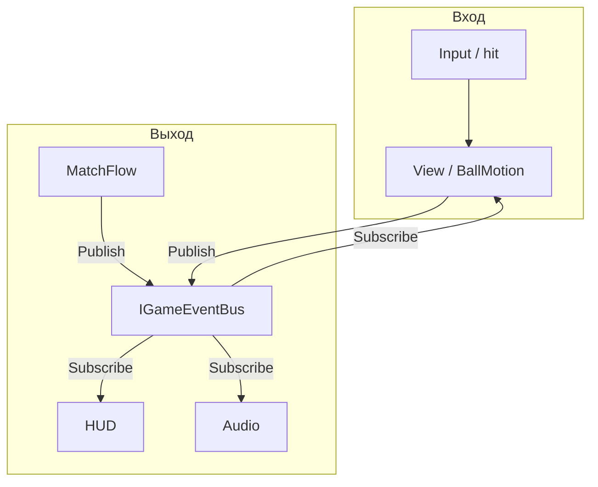

---
tags:
  - architecture
  - events
  - messaging
aliases:
  - Event Bus
  - Шина событий
---

# Шина событий

← [[Принципы проектирования]] | [[Индекс архитектуры]]

Связь **логика → отображение** идёт через **шину**. MonoBehaviour и сервисы **не вызывают** HUD/view напрямую.

## Зачем

| Без шины | Со шиной |
|----------|----------|
| `view.PlayFx()` из сервиса | `bus.Publish(DefenderHitEvent)` |
| HUD подписан на 5 сервисов | HUD слушает `ScoreChangedEvent` |
| View знает все детали логики | View реагирует на сообщения «что случилось» |

## Поток данных



**Вход:** view / `BallMotion` обрабатывает касание.  
**Выход:** `bus.Publish(...)` — HUD и VFX подписаны.

---

## Контракт шины

```csharp
public interface IGameEventBus
{
    void Publish<T>(T message) where T : struct; // или class — зафиксировать один стиль
    IDisposable Subscribe<T>(Action<T> handler);
    IDisposable Subscribe<T>(Action<T> handler, Predicate<T> filter);
}
```

- Регистрируется в **App LifetimeScope** (`Futboloid.Core.Bus`) — инфраструктура, не геймплей
- Game scope сервисы получают ту же шину из parent container
- App ↔ Game **без** scope-bridge: сброс поля — `PitchResetRequestedEvent`, не прямой вызов `PitchStateMachine` из App

### Стили сообщений

```csharp
// Пример: view → HUD
public readonly struct DefenderDamagedEvent
{
    public int SlotId { get; }
    public int RemainingHp { get; }
    public Vector2 HitPosition { get; }
}

public readonly struct ScoreChangedEvent
{
    public int PlayerScore { get; }
    public int ComboMultiplier { get; }
}
```

Сообщения — **immutable** (`readonly struct` или record), с данными для отрисовки, без ссылок на `MonoBehaviour`.

---

## Пример: DefenderView

```csharp
public sealed class DefenderView : MonoBehaviour
{
    [SerializeField] int slotId;
    [SerializeField] DefenderHitBehavior hitBehavior;
    int hp;
    IGameEventBus bus;

    public void Initialize(IGameEventBus bus) => this.bus = bus;

    void OnBallContact(BallMotion ball)
    {
        hitBehavior.ApplyTo(ball);
        hp--;
        bus.Publish(new DefenderDamagedEvent(slotId, hp));
        if (hp <= 0) bus.Publish(new DefenderDestroyedEvent(slotId));
    }

    void OnDefenderDamaged(DefenderDamagedEvent e)
    {
        if (e.SlotId != slotId) return;
        // DOTween flash — только визуал
    }
}
```

Логика удара по мячу — в `DefenderHitBehavior` (SO). HP — в view. **Отдельный `DefenderEntity` не нужен.**

---

## Кто ещё публикует

| Источник | Примеры событий | Кто слушает |
|----------|-----------------|-------------|
| `BallView` / `BallMotion` | `BallServed`, `BallReturnedToKeeper`, `DefenderHit`, `GoalScored` | `MatchFlow`, `ComboScoreService` |
| `StatusEffectService` | `StatusEffectApplied`, `Removed`, `Refreshed`, `ChargesChanged` | HUD баффов, VFX |
| `MatchFlow` | `MatchTimerChanged`, `MatchScoreChanged`, `MatchEnded`, `MatchTimeAdjusted` | `MatchHudController` (Game), `PitchStateMachine` |
| `PitchStateMachine` | `PitchPhaseChanged` | Views, боты, input gates |
| `OverlayStateController` | `NavigationChanged`, `PitchResetRequested` | UI, `PitchStateMachine`, views |

Сервисы оркестрируют матч через bus и публичные методы — **не** `defenderView.PlayAnim()` напрямую.

---

## Подписки и утечки

- Подписка в `OnEnable` / при показе widget, отписка в `OnDisable` / `Close`
- View на сцене: фильтр по `SlotId` / `EntityId`, чтобы не ловить чужие события
- При `AppGameState.Exit` — dispose App scope → новый bus при следующем входе

---

## Альтернативы (не используем сейчас)

| Подход | Почему нет |
|--------|------------|
| C# `event` на view | HUD не услышит |
| Entity-слой на каждый prefab | лишний boilerplate для нашего масштаба |

При росте можно обернуть шину в UniRx / MessagePipe — интерфейс `IGameEventBus` сохраняем.

---

## Связанные заметки

- [[Принципы проектирования]]
- [[Связь сцены с кодом]]
- [[DI и LifetimeScope]]
- [[MatchFlow и таймер]]
