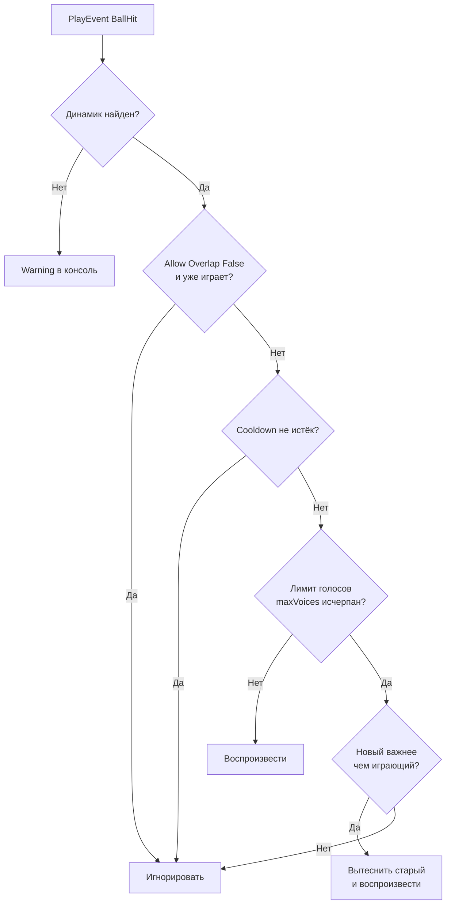
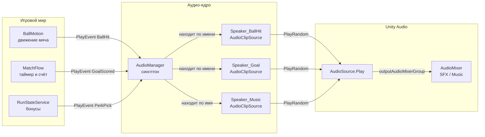
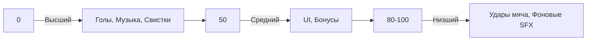

---
tags:
  - audio
  - architecture
  - manager
aliases:
  - Звук
  - Audio
  - Аудио система
---

# Аудио Менеджер

← [[Home|Главная]] | [[Архитектура/Индекс архитектуры|Архитектура]]

> [!date] Обновлено
> **05.07.2026** — Свисток при начале матча, пауза музыки при выходе в меню.

> [!warning] Важно
> В этой статье описана **текущая** архитектура. История изменений и детали миграции — в [[Контекст/Контекст чата 04.07.2026|Контекст чата 04.07]] и [[Контекст/Контекст чата 05.07.2026|Контекст чата 05.07]].

---

## 📖 Краткая выжимка

Аудио-система ФУТБОЛОИДа — это **прямой вызов** без DI, без шины событий, без подписок.

```
Игровой скрипт → AudioManager.Instance.PlayEvent("BallHit") → Динамик → Звук
```

Каждый тип звука — отдельный дочерний объект `AudioManager` с набором звуковых файлов. При событии выбирается случайный звук из массива.

---

## 🧠 Как это работает (пошагово)

### Шаг 1: Игровое событие

Что-то происходит в игре: мяч ударился о стену, забит гол, начался таймер.

```csharp
// Пример из BallMotion.cs — мяч ударился
AudioManager.Instance.PlayEvent("BallHit");

// Пример из MatchFlow.cs — гол забит
AudioManager.Instance.PlayEvent("GoalScored");
```

### Шаг 2: AudioManager ищет динамик

`AudioManager` — это **синглтон** (один экземпляр на всю игру). Он хранит словарь всех динамиков:

```
Ключ: "BallHit"     → Динамик: Speaker_BallHit
Ключ: "GoalScored"  → Динамик: Speaker_Goal
Ключ: "MusicStart"  → Динамик: Speaker_Music
```

### Шаг 3: Проверки перед воспроизведением

Прежде чем играть, `AudioManager` проверяет 4 условия:



### Шаг 4: Воспроизведение звука

Динамик выбирает случайный `AudioClip` из массива и запускает `AudioSource.Play()`.

Если включён **Fade In** — громкость нарастает от 0% до 100% за `fadeDuration` секунд.

---

## 🏗️ Архитектура

### Компоненты системы



### Иерархия в Unity

```
AudioManager (GameObject)
├── Speaker_BallHit (AudioClipSource)
│   ├── eventName: "BallHit"
│   ├── clips: [bop1.wav, bop2.wav, bop3.wav]
│   ├── priority: 80
│   ├── cooldown: 0.3
│   ├── loop: false
│   ├── enableFade: false
│   └── mixerGroup: SFX
├── Speaker_Goal (AudioClipSource)
│   ├── eventName: "GoalScored"
│   ├── clips: [goal1.ogg, goal2.ogg]
│   ├── priority: 0
│   ├── cooldown: 1.0
│   ├── loop: false
│   ├── enableFade: true
│   ├── fadeDuration: 0.5
│   └── mixerGroup: SFX
├── Speaker_GoalConceded (AudioClipSource)
│   ├── eventName: "GoalConceded"
│   ├── priority: 0
│   └── ...
├── Speaker_Start (AudioClipSource)
│   ├── eventName: "MatchStart"
│   ├── priority: 5
│   └── ...
├── Speaker_End (AudioClipSource)
│   ├── eventName: "MatchEnd"
│   ├── priority: 5
│   └── ...
└── Speaker_Music (AudioClipSource)
    ├── eventName: "MusicStart"
    ├── loop: true ⚠️
    ├── enableFade: true
    ├── fadeDuration: 1.5
    ├── priority: 0
    └── mixerGroup: Music
```

---

## 📂 Файлы системы

### `AudioManager.cs`

**Путь:** `Assets/_Projects/Code/Futboloid.Core/AudioManager.cs`

**Что делает:** Главный мозг. Синглтон с `Instance`. Собирает все дочерние `AudioClipSource` при `Awake()`, маппит их по `eventName` в словарь.

**Ключевые методы:**
- `PlayEvent(string eventName)` — найти динамик и запустить
- `StopEvent(string eventName)` — остановить динамик с фейдом
- `EnableFade` — глобальный тумблер Fade In/Out

**Почему синглтон, а не DI:** Проще для новичков. Не нужно настраивать LifetimeScope. Вызов: `AudioManager.Instance.PlayEvent("BallHit")`.

---

### `AudioClipSource.cs`

**Путь:** `Assets/_Projects/Code/Futboloid.Core/AudioClipSource.cs`

**Что делает:** Конкретный динамик. Вешается на дочерний объект `AudioManager`. Содержит `AudioSource`, массив звуков и настройки воспроизведения.

**Ключевые поля:**

| Поле | Тип | Зачем |
|------|-----|-------|
| `eventName` | string | Имя события. Маппится в AudioManager |
| `clips` | AudioClip[] | Массив звуков. Выбирается случайный |
| `priority` | int | Приоритет (0-100). 0 = высший |
| `allowOverlap` | bool | False = нельзя играть поверх себя |
| `cooldown` | float | Минимальный интервал между воспроизведениями (сек) |
| `loop` | bool | True = музыка, играет бесконечно |
| `enableFade` | bool | Включить плавное появление/затухание |
| `fadeDuration` | float | Длительность фейда в секундах |
| `mixerGroup` | AudioMixerGroup | Группа микшера (SFX, Music, UI) |

**Ключевые методы:**
- `PlayRandom()` — выбрать случайный клип и запустить
- `Stop()` — остановить с фейдом
- `FadeIn()` / `FadeOut()` — плавное изменение громкости через корутину

---

## 🎛️ Настройка в Unity

### 1. Найдите AudioManager

Откройте сцену `Game.unity` (папка `_Projects/Scenes/Game.unity`). В Hierarchy найдите объект `AudioManager`.

### 2. Создайте динамик

1. Правой кнопкой на `AudioManager` → `Create Empty`
2. Назовите: `Speaker_НазваниеСобытия`
3. Добавьте компонент `AudioClipSource` (Add Component → AudioClipSource)

### 3. Заполните поля Inspector

#### Блок "Настройки"

| Поле | Что делать | Пример |
|------|------------|--------|
| **Event Name** | Имя события из кода | `BallHit` |
| **Clips** | Перетащите звуки из Project | 3-5 файлов ударов |

> [!howto] Как перетащить звуки
> 1. В Project окне найдите папку со звуками
> 2. Растяните поле `Clips` (Number) до нужного количества
> 3. Перетащите файлы из Project в слоты Clips

#### Блок "Кулдаун"

| Поле | Значение | Зачем |
|------|----------|-------|
| **Cooldown** | `0.3` | Минимум 0.3 сек между ударами |

#### Блок "Loop"

| Поле | Значение | Зачем |
|------|----------|-------|
| **Loop** | `False` | Для музыки — `True` |

#### Блок "Fade In/Out"

| Поле | Значение | Зачем |
|------|----------|-------|
| **Enable Fade** | `True` | Плавное появление/затухание |
| **Fade Duration** | `1.0` | Длительность в секундах |

#### Блок "Микшер"

| Поле | Что делать | Зачем |
|------|------------|-------|
| **Mixer Group** | Перетащите группу из микшера | Чтобы видеть индикацию |

> [!howto] Как найти группу микшера
> 1. В Project найдите `MainMixer.mixer`
> 2. Дважды кликните — откроется Audio Mixer
> 3. Найдите группу `SFX` или `Music`
> 4. Перетащите в поле Mixer Group

---

## 🎯 Каталог событий

### События, которые уже работают

| Динамик | Event Name | Описание | Где вызывается в коде |
|---------|------------|----------|---------------------|
| `Speaker_BallHit` | `BallHit` | Удар о стену/защитника/вратаря | `BallMotion.ResolveHit()` |
| `Speaker_Goal` | `GoalScored` | Гол забит | `BallMotion.TryScoreGoal()` |
| `Speaker_GoalConceded` | `GoalConceded` | Гол пропущен | `BallMotion.TryScoreGoal()` |
| `Speaker_Start` | `MatchStart` | Свисток перед матчем | `BallMotion.Serve()` |
| `Speaker_End` | `MatchEnd` | Свисток конца матча | `MatchFlow.EndMatch()` |
| `Speaker_Music` | `MusicStart` | Музыка матча (loop) | `MatchFlow.OnBallServed()` |
| `Speaker_Perk` | `PerkPick` | Выбор бонуса | `RunStateService.ApplyPerkPick()` |

---

## 🎵 Пауза музыки

### Как работает

1. При выходе в главное меню (`OnField → MainMenu`) музыка ставится на паузу
2. Позиция воспроизведения сохраняется
3. При возврате в игру (`MainMenu → OnField`) музыка возобновляется с того же места
4. Используется `AudioSource.Pause()` и `AudioSource.Play()` — позиция не сбрасывается

### Код

```csharp
// В OverlayStateController.cs:
if (next == NavigationState.MainMenu && previous == NavigationState.OnField)
{
    AudioManager.Instance.PauseMusic();
}
else if (next == NavigationState.OnField && previous == NavigationState.MainMenu && wasPausedInMenu)
{
    AudioManager.Instance.ResumeMusic();
}
```

---

### Как добавить новый звук

**Шаг 1:** Создайте динамик в Unity (как описано выше).

**Шаг 2:** В коде найдите место, где нужно воспроизвести звук:

```csharp
// В любом MonoBehaviour:
AudioManager.Instance.PlayEvent("MyNewSound");
```

**Всё!** Больше ничего делать не нужно.

---

## ⚙️ Приоритеты и контроль

### Priority (0-100)



**Правило:** Если лимит голосов (8) исчерпан, новый звук с **меньшим** числом приоритета **вытеснит** звук с **большим** числом.

### Allow Overlap

- `True` — звук может играть поверх себя (для ударов мяча)
- `False` — если звук уже играет, новый вызов игнорируется (для голосов)

### Cooldown

Минимальный интервал между воспроизведениями. Предотвращает "лавину" одинаковых звуков.

---

## 🎵 Музыка

### Как работает

1. При подаче мяча (`OnBallServed`) вызывается `PlayEvent("MusicStart")`
2. Динамик `Speaker_Music` выбирает случайный трек и запускает с `loop=true`
3. При рестарте (`Reset`) или конце матча (`EndMatch`) вызывается `StopEvent("MusicStart")`
4. Музыка плавно затухает за `fadeDuration` секунд и останавливается
5. При выходе в главное меню музыка ставится на паузу (`PauseMusic()`)
6. При возврате в игру музыка возобновляется с того же места (`ResumeMusic()`)

### Настройка музыки

| Поле | Значение | Зачем |
|------|----------|-------|
| **Event Name** | `MusicStart` | Событие запуска |
| **Clips** | 1-2 трека | Случайный выбор |
| **Loop** | `True` ⚠️ | Обязательно! |
| **Enable Fade** | `True` | Плавный старт/стоп |
| **Fade Duration** | `1.5` | Длинный фейд для плавности |
| **Priority** | `0` | Не прерывается |
| **Mixer Group** | `Music` | Отдельная группа |

---

## 🐛 Частые проблемы

### Звуки не играют

**Причины:**
1. Динамик не создан в Unity
2. Event Name не совпадает с кодом (регистр важен!)
3. Clips пустой

**Решение:** Проверьте, что динамик существует, Event Name точно совпадает, и звуки перетащены в Clips.

### Нет индикации на микшере

**Причина:** Не назначена Mixer Group.

**Решение:** Перетащите группу из AudioMixer в поле Mixer Group динамика.

### Музыка не играет циклично

**Причина:** Loop = False.

**Решение:** У `Speaker_Music` установите Loop = True.

### Звуки сливаются в кашу

**Причина:** Слишком маленький Cooldown.

**Решение:** Увеличьте Cooldown у `Speaker_BallHit` до `0.5`.

### Fade не работает

**Причины:**
1. Enable Fade выключен в AudioManager
2. Enable Fade выключен в конкретном динамике

**Решение:** Включите Enable Fade в AudioManager и в нужных динамиках.

---

## 📊 Рекомендуемые настройки

| Динамик | Priority | Overlap | Cooldown | Loop | Fade | Mixer |
|---------|----------|---------|----------|------|------|-------|
| `Speaker_Music` | 0 | False | 0 | True | 1.5s | Music |
| `Speaker_Goal` | 0 | False | 1.0s | False | 0.5s | SFX |
| `Speaker_GoalConceded` | 0 | False | 1.0s | False | 0.5s | SFX |
| `Speaker_Start` | 5 | False | 0.5s | False | 0.3s | SFX |
| `Speaker_End` | 5 | False | 0 | False | 1.0s | SFX |
| `Speaker_BallHit` | 80 | True | 0.3s | False | False | SFX |
| `Speaker_Perk` | 10 | False | 0.5s | False | 0.5s | SFX |

---

## 🧠 Как всё работает (простыми словами)

```
1. Игрок бьёт по мячу
2. Код в BallMotion.cs видит удар и пишет:
   AudioManager.Instance.PlayEvent("BallHit")
3. AudioManager ищет динамик с Event Name = "BallHit"
4. Находит Speaker_BallHit
5. Выбирает случайный звук из Clips
6. Воспроизводит через AudioSource
7. Звук попадает в группу SFX микшера
8. Вы слышите звук! 🎧
```

**Fade In:** Звук не появляется резко. Громкость нарастает от 0 до 100% за 1 секунду.

**Fade Out:** Звук не обрывается резко. Громкость падает от 100% до 0% за 1 секунду, потом звук останавливается.

**Приоритеты:** Если играет 8 звуков и новый звук важнее — менее важный останавливается.

**Cooldown:** Один и тот же звук не может играть чаще, чем раз в N секунд.

**Loop:** Если включено, звук повторяется бесконечно (для музыки).

---

## 📚 Связанные страницы

- [[Контекст/Контекст чата 05.07.2026]] — свисток и пауза музыки
- [[Контекст/Контекст чата 04.07.2026]] — история изменений и решения
- [[Контекст/Контекст чата 30.06.2026]] — первые шаги и ошибки
- [[Архитектура/Шина событий]] — как события работают в игре
- [[Архитектура/Движение мяча]] — где публикуются события удара
- [[Архитектура/MatchFlow и таймер]] — где запускается музыка
- [[Полная инструкция]] — пошаговое руководство для новичков

---

## 📝 Чек-лист настройки

- [ ] AudioManager существует на сцене Game.unity
- [ ] Enable Fade включён в AudioManager
- [ ] Speaker_BallHit создан, Event Name = `BallHit`, Clips заполнены
- [ ] Speaker_Goal создан, Event Name = `GoalScored`, Clips заполнены
- [ ] Speaker_GoalConceded создан, Event Name = `GoalConceded`, Clips заполнены
- [ ] Speaker_Start создан, Event Name = `MatchStart`, Clips заполнены
- [ ] Speaker_End создан, Event Name = `MatchEnd`, Clips заполнены
- [ ] Speaker_Music создан, Event Name = `MusicStart`, Clips заполнены, Loop = True
- [ ] У всех динамиков назначена Mixer Group
- [ ] Приоритеты настроены (музыка = 0, удары = 80)
