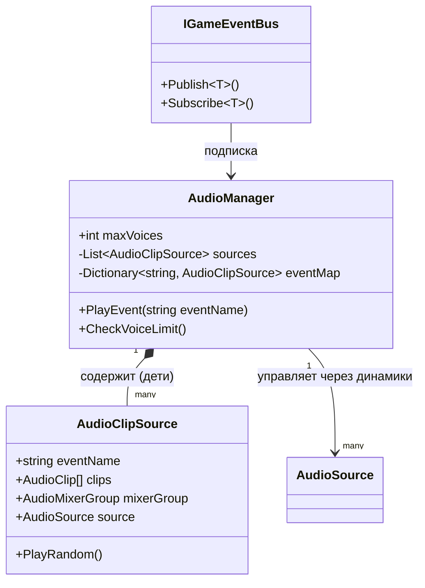

---
tags:
  - architecture
  - audio
  - manager
  - events
aliases:
  - Звук
  - Audio
  - События звука
---

# Аудио Менеджер и События

← [[Home|Главная]] | [[Архитектура/Индекс архитектуры|Архитектура]]

> [!date] Обновлено
> **30.06.2026** — Полная переделка архитектуры. Теперь используется система **«динамиков»** (AudioClipSource).

Централизованная система управления звуком в **ФУТБОЛОИД**. 
Принимает события из шины (`IGameEventBus`) и воспроизводит случайный звук из настроенной папки.

---

## Роль в архитектуре

Аудиоменеджер живет на **Game.unity** (как и шина событий). Он не знает о геймплее, только о названиях событий.

| Компонент | Роль |
|-----------|------|
| **Игровая сцена / FSM** | Публикует событие (например, `GoalScoredEvent`) в шину |
| **Шина событий** | Транслирует событие слушателям |
| **AudioManager** | Слушает событие, ищет нужный «динамик», выбирает случайный звук |
| **AudioClipSource** | Динамик — дочерний объект с AudioSource и массивом звуков |
| **AudioMixer** | Громкость и эффекты |

---

## Архитектура «Динамики»

### Как это работает

```
Событие в шине → AudioManager слушает → ищет динамик по имени
→ Выбирает случайный звук из массива → AudioSource.Play() → AudioMixer
```

**Ключевая идея:** каждый тип звука — это отдельный дочерний объект (`AudioClipSource`) внутри `AudioManager`. У каждого динамика:
- Свой `AudioSource`
- Массив звуков (`AudioClip[]`)
- Имя события (например, `"BallHit"`)
- Группа микшера

### Диаграмма



---

## Каталог событий (Event Mapping)

События шины маппятся на имена динамиков.

> [!info] Логика звука мяча
> По умолчанию звук удара **не зависит** от того, во что попал мяч (стена это или игрок).
> Создаётся **один динамик `BallHit`**, который берет случайный звук из своего массива.

| Имя динамика (Event Name) | Событие в шине | Описание | Где вызывается (Код) |
| ------------------ | -------------- | ---------- | -------------------- |
| **`BallHit`** | `BallReturnedToKeeperEvent`, `BallHitEvent` | Удар о вратаря / стену / защитника | `BallMotion.ResolveHit()` |
| **`GoalScored`** | `GoalScoredEvent` (isPlayerGoal=true) | Гол забит | `BallMotion.TryScoreGoal()` |
| **`GoalConceded`** | `GoalScoredEvent` (isPlayerGoal=false) | Гол пропущен | `BallMotion.TryScoreGoal()` |
| **`MatchStart`** | `BallServedEvent` | Свисток судьи перед началом | `BallMotion.Serve()` |
| **`MatchEnd`** | `MatchEndedEvent` | Свисток конца матча | `MatchFlow` |

---

## Настройка в Инспекторе

### 1. Создаём динамики

1.  Найди объект `AudioManager` на сцене **`Game.unity`**.
2.  Внутри него создай **пустые объекты (Child Objects)**. Каждый — отдельный динамик.
3.  Назови их по имени события: `Speaker_BallHit`, `Speaker_Goal`, `Speaker_Start` и т.д.

### 2. Настройка динамика

На каждый дочерний объект повесь скрипт `AudioClipSource`. В Inspector:

| Поле | Описание |
|------|----------|
| **Event Name** | Имя события в шине (например, `BallHit`). Должно совпадать с тем, что в коде. |
| **Clips** | Массив звуков. При срабатывании выбирается случайный. |
| **Mixer Group** | Группа AudioMixer (например, `SFX`). Если пусто — звук в общий канал. |

### 3. Глобальные настройки AudioManager

| Поле | Описание |
|------|----------|
| **Max Voices** | Максимальное количество одновременных звуков (по умолчанию 8). Если лимит превышен — самый старый звук останавливается. |

### Пример настройки

| Динамик | Event Name | Clips | Mixer Group |
|---------|------------|-------|-------------|
| `Speaker_BallHit` | `BallHit` | [bop1.wav, bop2.wav, thud.wav] | `SFX` |
| `Speaker_Goal` | `GoalScored` | [goal1.ogg, goal2.ogg] | `SFX` |
| `Speaker_Start` | `MatchStart` | [whistle.wav] | `SFX` |

---

## Код

### AudioClipSource.cs
**Файл:** `Assets/_Projects/Code/Futboloid.Core/AudioClipSource.cs`

Компонент-динамик. Вешается на дочерние объекты `AudioManager`.

```csharp
public class AudioClipSource : MonoBehaviour
{
    public string eventName;           // Имя события в шине
    public AudioClip[] clips;          // Массив звуков
    public AudioMixerGroup mixerGroup; // Группа микшера
    public AudioSource source;         // AudioSource (создаётся автоматически)

    public void PlayRandom();          // Воспроизвести случайный звук
    public void Stop();                // Остановить звук
}
```

### AudioManager.cs
**Файл:** `Assets/_Projects/Code/Futboloid.Core/AudioManager.cs`

Управляет пулом динамиков, слушает шину событий.

```csharp
public class AudioManager : MonoBehaviour
{
    [SerializeField] private int maxVoices = 8;
    private List<AudioClipSource> sources;
    private Dictionary<string, AudioClipSource> eventMap;
    private IGameEventBus _bus;

    public AudioManager(IGameEventBus bus); // Конструкторный инжект

    private void Awake();       // Собирает все дочерние AudioClipSource
    private void OnEnable();    // Подписывается на события шины
    private void PlayEvent(string eventName); // Вызывается при событии
    private void CheckVoiceLimit();           // Останавливает старые звуки
}
```

### Подписка на события

В `OnEnable()` `AudioManager` подписывается на события шины:

```csharp
_bus.Subscribe<GoalScoredEvent>(e => PlayEvent("GoalScored"));
_bus.Subscribe<BallReturnedToKeeperEvent>(e => PlayEvent("BallHit"));
_bus.Subscribe<BallHitEvent>(e => PlayEvent("BallHit"));
_bus.Subscribe<BallServedEvent>(e => PlayEvent("MatchStart"));
_bus.Subscribe<MatchEndedEvent>(e => PlayEvent("MatchEnd"));
```

---

## Инструкция по применению

### Для разработчиков

1.  **Добавить новый звук:**
    - Создай дочерний объект в `AudioManager`.
    - Назови по имени события (например, `Speaker_Explosion`).
    - Повесь `AudioClipSource`, заполни `Clips` и `Mixer Group`.
    - В `AudioManager.OnEnable()` добавь подписку: `_bus.Subscribe<ExplosionEvent>(e => PlayEvent("Explosion"))`.

2.  **Вызвать звук из кода (если нужно вручную):**
    ```csharp
    audioManager.PlayEvent("BallHit");
    ```

### Для дизайнеров / саунд-дизайнеров

1.  Открой `AudioManager` на сцене `Game.unity`.
2.  Найди нужный динамик (например, `Speaker_BallHit`).
3.  В `Clips` перетащи новые звуки.
4.  В `Mixer Group` выбери группу микшера.
5.  Звук будет воспроизводиться **случайно** из массива при каждом событии.

---

## История изменений

> [!note] 30.06.2026 — Полная переделка
> - Было: один `_mainSpeaker`, события в `AudioEventMapping[]`.
> - Стало: система **«динамиков»** (`AudioClipSource`), каждый тип звука — отдельный дочерний объект.
> - Исправлены ошибки: `NullReferenceException` в `Update()`, доступ к приватному `source`.
> - Добавлено событие `BallHitEvent` для удара о стену/защитника.
> - `AudioManager` теперь слушает шину напрямую через DI.

---

## Связанные страницы

- [[Архитектура/Шина событий]] — как работают события
- [[Архитектура/DI и LifetimeScope]] — как `AudioManager` получает `IGameEventBus`
- [[Архитектура/Движение мяча]] — где публикуются события удара