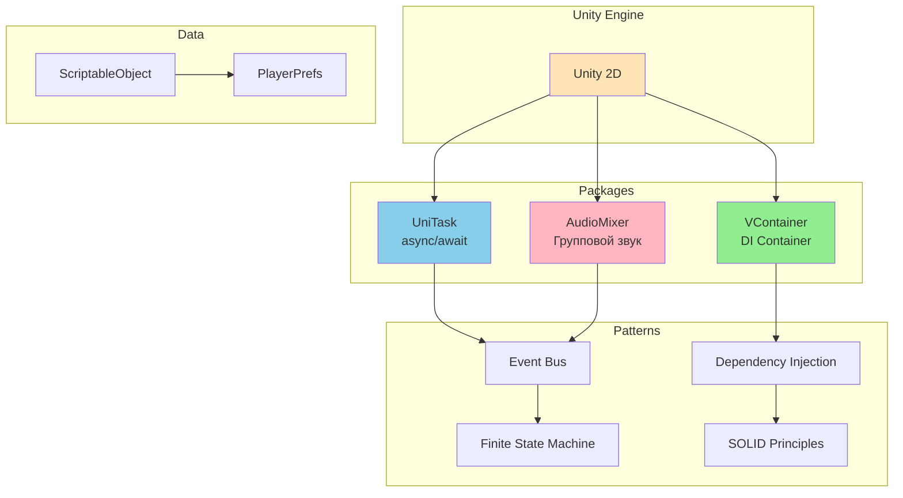
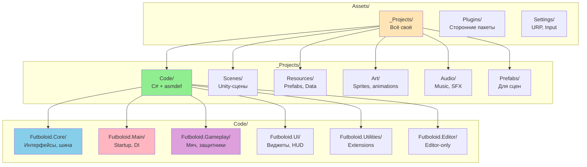

# 📊 ДИАГРАММЫ И МЕТРИКИ — ВВЕДЕНИЕ

---

## 📈 Метрики проекта Futboloid

### Общие показатели

| Метрика | Значение | Описание |
|---------|----------|----------|
| Сборок | 6 | Futboloid.Core, Main, Gameplay, UI, Utilities, Editor |
| Сцен | 2 | Root.unity, Game.unity |
| DI-контейнеров | 3 | Root, App, Game Scope |
| Событий на шине | 15+ | Структурные события |
| Состояний навигации | 4 | MainMenu, OnField, Pause, Tournament |
| Фаз поля | 5 | KickoffWait, Simulating, Reshuffle, BonusPick, MatchEnded |
| Аудио-голосов | 12 | 1 music + 1 pause + 8 SFX + 3 UI |
| Аудио-каналов | 3 | Music, GameplaySfx, UiSfx |
| Звуков в каталоге | 20+ | SoundDefinition'ы |

---

## 🏗️ Диаграмма стека технологий

---

## 📁 Диаграмма структуры папок

---

## 📊 Метрики архитектуры

| Метрика | Значение | Описание |
|---------|----------|----------|
| Сборок | 6 | asmdef модулей |
| Сцен | 2 | Root.unity, Game.unity |
| DI-контейнеров | 3 | Root, App, Game Scope |
| Событий на шине | 15+ | Структурные события |
| Состояний навигации | 4 | MainMenu, OnField, Pause, Tournament |
| Фаз поля | 5 | KickoffWait, Simulating, Reshuffle, BonusPick, MatchEnded |

---

*← [[01_Введение/01_Введение]] | [[02_Архитектура/02_Архитектура|→ Глава 2: Архитектура]]*
