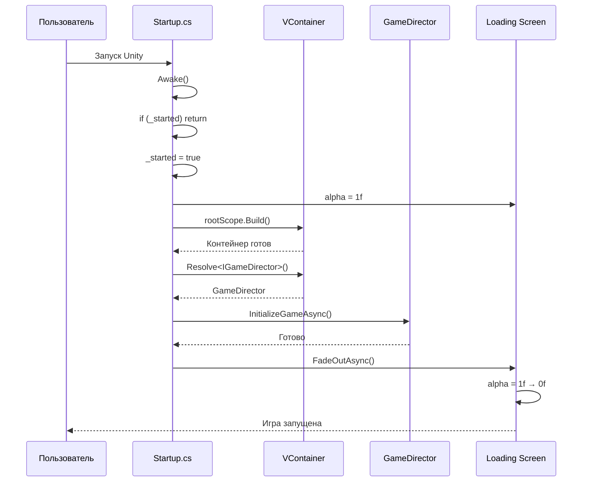

# 📊 ДИАГРАММЫ И МЕТРИКИ — КОД: STARTUP

---

## 📈 Метрики Startup

| Метрика | Значение | Описание |
|---------|----------|----------|
| Полей | 3 | `_started`, `_rootScope`, `_loadingScreen` |
| Методов | 3 | `Awake`, `BootAsync`, `FadeOutLoadingAsync` |
| Сложность | Низкая | Простая последовательность шагов |
| Зависимостей | 2 | `RootLifetimeScope`, `CanvasGroup` |
| Строки кода | ~50 | Основной файл |

---

## 🚀 Диаграмма жизненного цикла Startup



---

## 🔄 Диаграмма методов Startup

```mermaid
graph TD
    subgraph "Awake()"
        A1[if _started return]
        A2[_started = true]
        A3[BootAsync().Forget()]
    end
    
    subgraph "BootAsync()"
        B1[loadingScreen.alpha = 1f]
        B2[rootScope.Build()]
        B3[Resolve<IGameDirector>]
        B4[director.InitializeGameAsync]
        B5[FadeOutLoadingAsync]
    end
    
    subgraph "FadeOutLoadingAsync()"
        F1[t = 0f]
        F2[t < 1f?]
        F3[alpha = Lerp 1→0]
        F4[t += unscaledDeltaTime]
    end
    
    A1 --> A2
    A2 --> A3
    A3 --> B1
    B1 --> B2
    B2 --> B3
    B3 --> B4
    B4 --> B5
    B5 --> F1
    F1 --> F2
    F2 -->|true| F3
    F3 --> F4
    F4 --> F2
    F2 -->|false| F5[alpha = 0f]
    
    style A1 fill:#FFE4B5
    style B2 fill:#90EE90
    style B3 fill:#87CEEB
    style F3 fill:#FFB6C1
```

---

## 📊 Метрики Startup

| Метрика | Значение | Описание |
|---------|----------|----------|
| Полей | 3 | `_started`, `_rootScope`, `_loadingScreen` |
| Методов | 3 | `Awake`, `BootAsync`, `FadeOutLoadingAsync` |
| Сложность | Низкая | Простая последовательность шагов |
| Зависимостей | 2 | `RootLifetimeScope`, `CanvasGroup` |
| Строки кода | ~50 | Основной файл |

---

*← [[02_Архитектура/02.1_Код_Startup]] | [[02_Архитектура/02.2_Код_DI|→ Код: DI]]*
