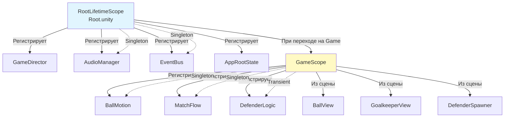
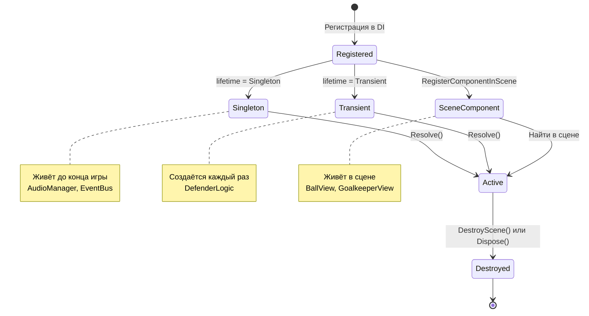
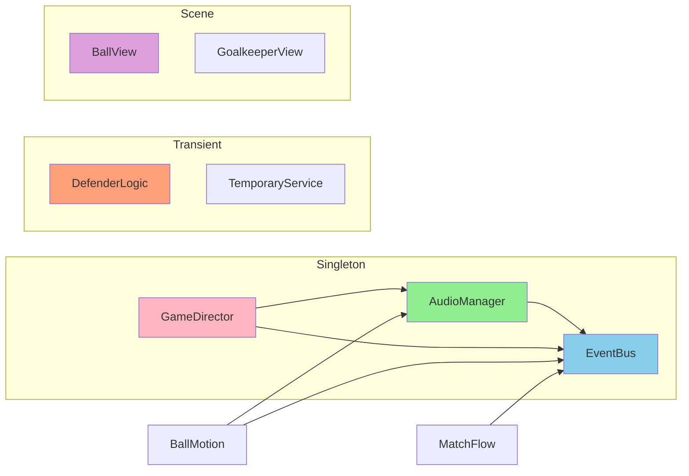

# 📊 ДИАГРАММЫ И МЕТРИКИ — КОД: DI

---

## 📈 Метрики DI

| Метрика | Значение | Описание |
|---------|----------|----------|
| Singleton-сервисов | 10+ | EventBus, AudioManager, и др. |
| Transient-сервисов | 5+ | DefenderLogic, Temporary objects |
| Компонентов из сцены | 8+ | BallView, GoalkeeperView, и др. |
| LifetimeScope | 2 | Root, Game |
| Строки кода | ~300 | Все LifetimeScope файлы |

---

## 🏗️ Диаграмма иерархии LifetimeScope

---

## 🔄 Диаграмма жизненного цикла объектов

---

## 🔗 Диаграмма зависимостей DI

---

## 📊 Метрики DI

| Метрика | Значение | Описание |
|---------|----------|----------|
| Singleton-сервисов | 10+ | EventBus, AudioManager, и др. |
| Transient-сервисов | 5+ | DefenderLogic, Temporary objects |
| Компонентов из сцены | 8+ | BallView, GoalkeeperView, и др. |
| LifetimeScope | 2 | Root, Game |
| Строки кода | ~300 | Все LifetimeScope файлы |

---

*← [[02_Архитектура/02.2_Код_DI]] | [[02_Архитектура/02.3_Код_EventBus|→ Код: Event Bus]]*
