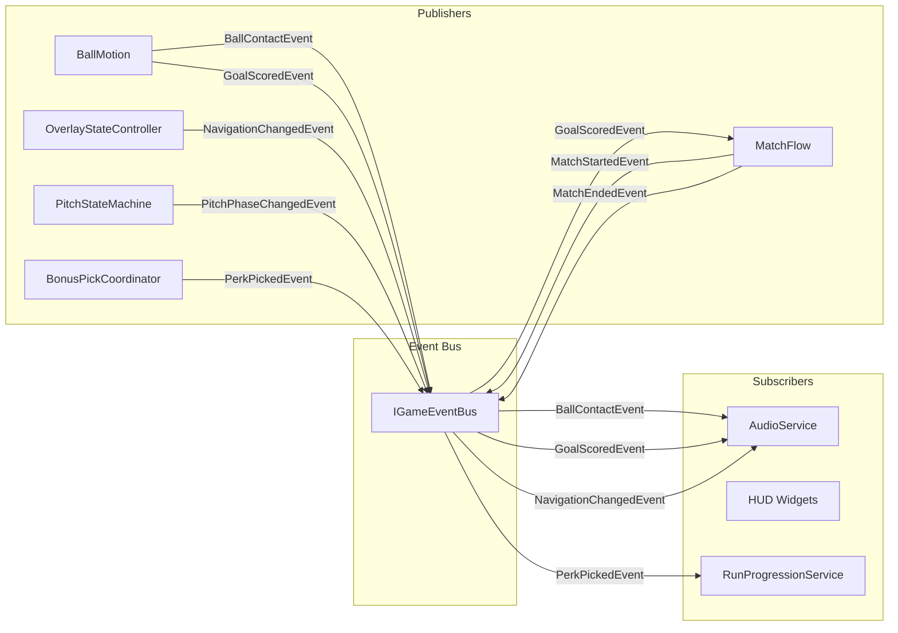
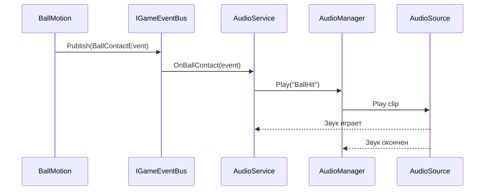

# 📊 ДИАГРАММЫ И МЕТРИКИ — КОД: EVENT BUS

---

## 📈 Метрики Event Bus

| Метрика | Значение | Описание |
|---------|----------|----------|
| Событий | 15+ | Различных структур |
| Подписчиков | ~5 | Сервисы слушают события |
| Публикаторов | ~8 | Компоненты публикуют |
| Связей | 30+ | Publish/Subscribe связи |
| Строки кода | ~100 | Event Bus + события |

---

## 🔗 Диаграмма шины событий

---

## 🔄 Диаграмма последовательности: событие мяча

---

## 📊 Метрики Event Bus

| Метрика | Значение | Описание |
|---------|----------|----------|
| Событий | 15+ | Различных структур |
| Подписчиков | ~5 | Сервисы слушают события |
| Публикаторов | ~8 | Компоненты публикуют |
| Связей | 30+ | Publish/Subscribe связи |
| Строки кода | ~100 | Event Bus + события |

---

*← [[02_Архитектура/02.3_Код_EventBus]] | [[03_Геймплей/03_Геймплей|→ Глава 3: Геймплей]]*
