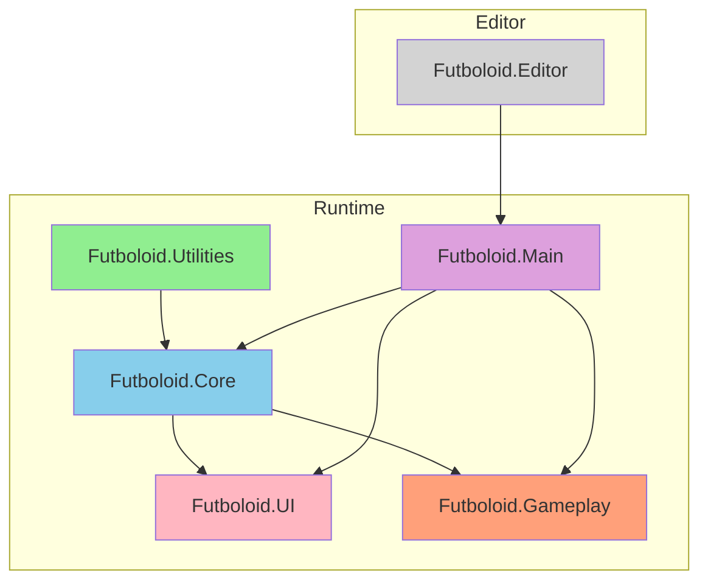
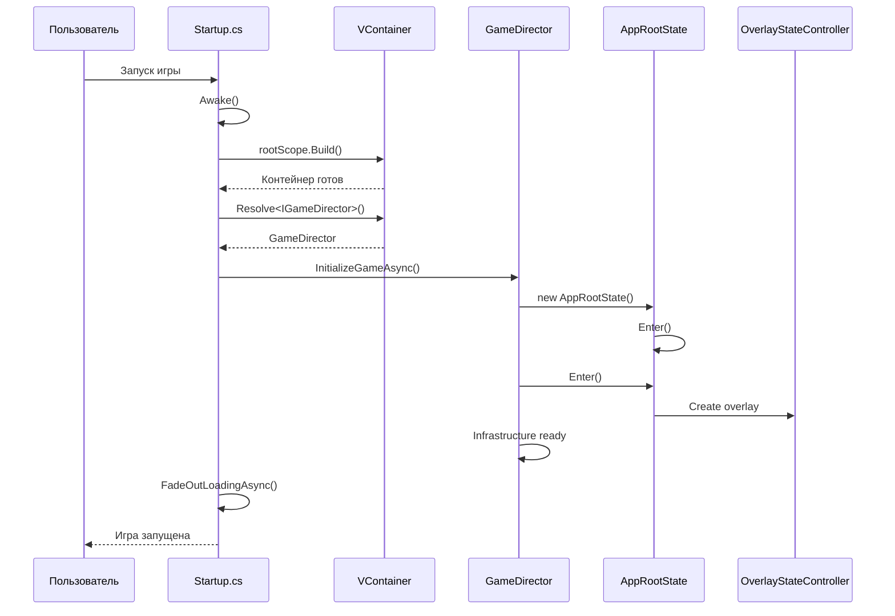
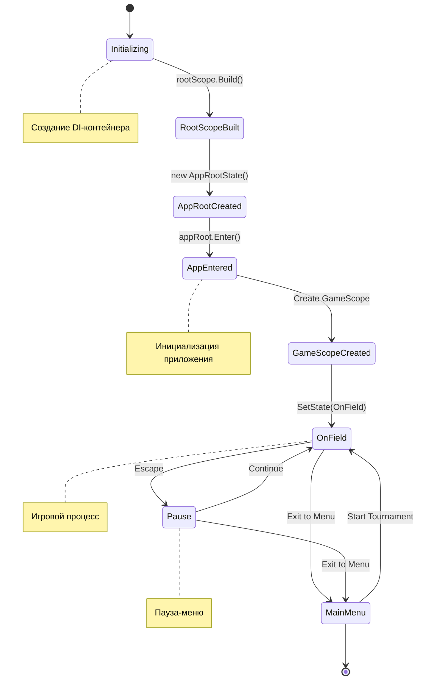

# 📊 ДИАГРАММЫ И МЕТРИКИ — АРХИТЕКТУРА

---

## 📈 Метрики архитектуры

| Метрика | Значение | Описание |
|---------|----------|----------|
| Сборок | 6 | Futboloid.Core, Main, Gameplay, UI, Utilities, Editor |
| Зависимостей между сборками | 8 | asmdef зависимости |
| DI-контейнеров | 3 | Root, App, Game Scope |
| Событий на шине | 15+ | Структурные события |
| Состояний навигации | 4 | MainMenu, OnField, Pause, Tournament |
| Фаз поля | 5 | KickoffWait, Simulating, Reshuffle, BonusPick, MatchEnded |

---

## 🔗 Диаграмма зависимостей между сборками

---

## 🚀 Диаграмма запуска приложения

---

## 🔄 Диаграмма жизненного цикла GameDirector

---

## 📊 Метрики архитектуры

| Метрика | Значение | Описание |
|---------|----------|----------|
| Сборок | 6 | asmdef модулей |
| Зависимостей между сборками | 8 | asmdef зависимости |
| DI-контейнеров | 3 | Root, App, Game Scope |
| Событий на шине | 15+ | Структурные события |
| Состояний навигации | 4 | MainMenu, OnField, Pause, Tournament |
| Фаз поля | 5 | KickoffWait, Simulating, Reshuffle, BonusPick, MatchEnded |

---

*← [[02_Архитектура/02_Архитектура]] | [[02_Архитектура/02.1_Код_Startup|→ Код: Startup]]*
