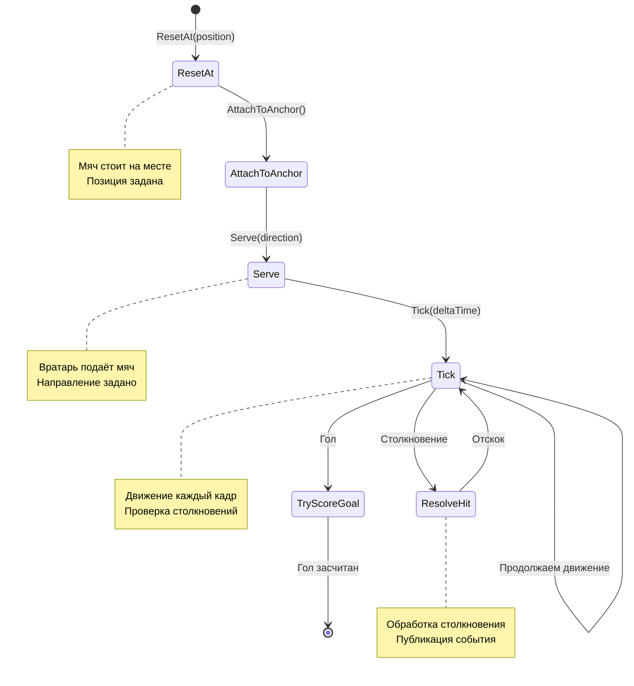

# 📊 ДИАГРАММЫ И МЕТРИКИ — КОД: BALLMOTION

---

## 📈 Метрики BallMotion

| Метрика | Значение | Описание |
|---------|----------|----------|
| Полей | 12 | Position, Direction, Speed, и др. |
| Методов | 15+ | Tick, Serve, ReflectFromHit, и др. |
| Событий | 3 | BallContactEvent, GoalScoredEvent |
| Зависимостей | 5 | BallSettings, IGameEventBus, и др. |
| Строки кода | ~294 | Основной файл |

---

## 🔄 Диаграмма жизненного цикла мяча

---

## 📊 Метрики BallMotion

| Метрика | Значение | Описание |
|---------|----------|----------|
| Полей | 12 | Position, Direction, Speed, и др. |
| Методов | 15+ | Tick, Serve, ReflectFromHit, и др. |
| Событий | 3 | BallContactEvent, GoalScoredEvent |
| Зависимостей | 5 | BallSettings, IGameEventBus, и др. |
| Строки кода | ~294 | Основной файл |

---

*← [[03_Геймплей/03.1_Код_BallMotion]] | [[03_Геймплей/03.2_Код_MatchFlow|→ Код: MatchFlow]]*
