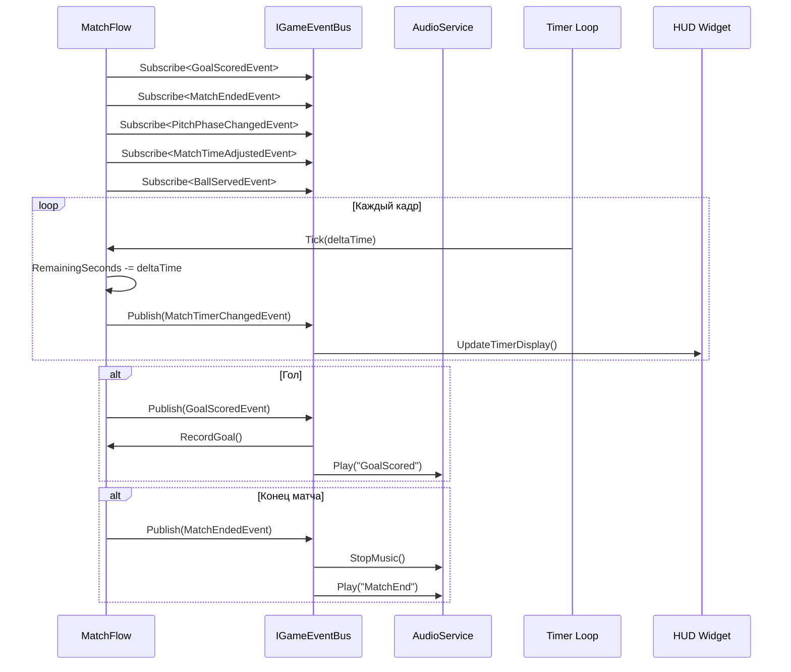
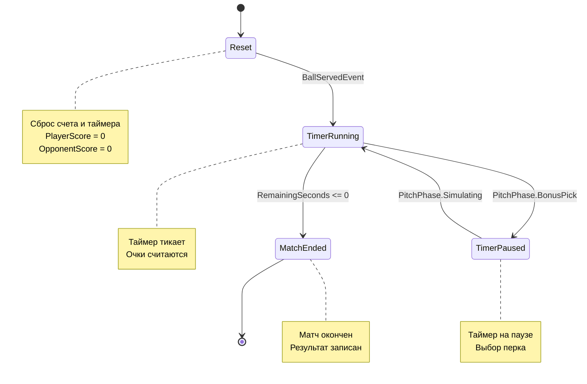

# 📊 ДИАГРАММЫ И МЕТРИКИ — КОД: MATCHFLOW

---

## 📈 Метрики MatchFlow

| Метрика | Значение | Описание |
|---------|----------|----------|
| Подписок | 5 | Subscribe в конструкторе |
| Методов | 12+ | Reset, RecordGoal, AdjustTime, и др. |
| Состояний | 4 | TimerRunning, TimerPaused, MatchEnded, и др. |
| Полей | 10 | PlayerScore, OpponentScore, и др. |
| Строки кода | ~237 | Основной файл |

---

## 🔄 Диаграмма жизненного цикла матча

---

## 🔄 Диаграмма состояний MatchFlow

---

## 📊 Метрики MatchFlow

| Метрика | Значение | Описание |
|---------|----------|----------|
| Подписок | 5 | Subscribe в конструкторе |
| Методов | 12+ | Reset, RecordGoal, AdjustTime, и др. |
| Состояний | 4 | TimerRunning, TimerPaused, MatchEnded, и др. |
| Полей | 10 | PlayerScore, OpponentScore, и др. |
| Строки кода | ~237 | Основной файл |

---

*← [[03_Геймплей/03.2_Код_MatchFlow]] | [[04_Аудио/04_Аудио|→ Глава 4: Аудио]]*
