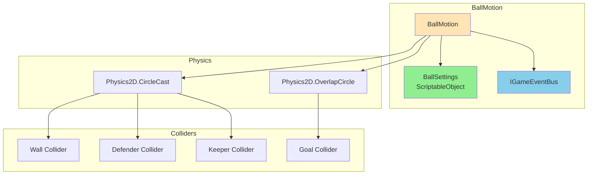
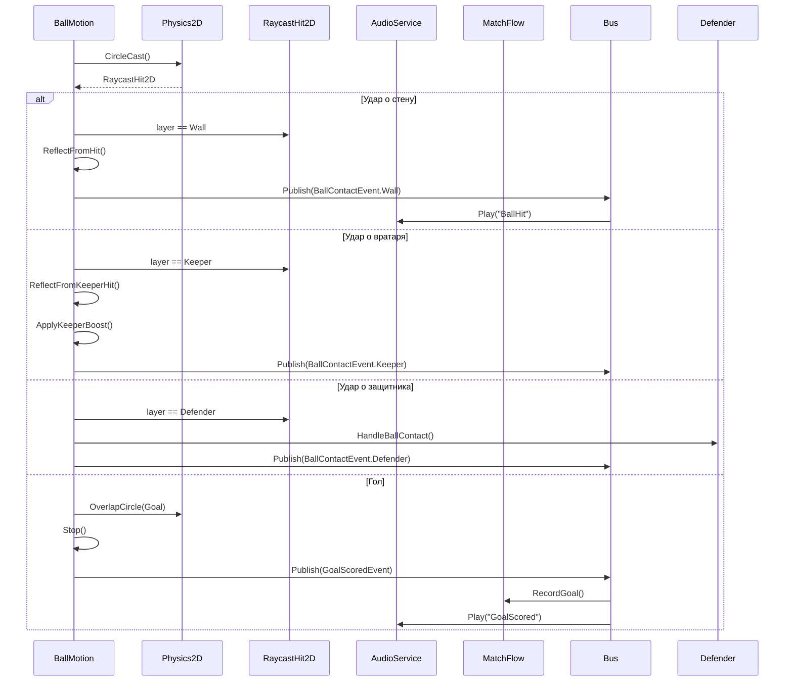

# 📊 ДИАГРАММЫ И МЕТРИКИ — ГЕЙМПЛЕЙ

---

## 📈 Метрики геймплея

| Метрика | Значение | Описание |
|---------|----------|----------|
| Компонентов геймплея | 10+ | BallMotion, MatchFlow, DefenderLogic, и др. |
| Событий геймплея | 8+ | BallContactEvent, GoalScoredEvent, и др. |
| Методов BallMotion | 15+ | Tick, Serve, ReflectFromHit, и др. |
| Методов MatchFlow | 12+ | Reset, RecordGoal, AdjustTime, и др. |
| Зависимостей | 15+ | BallSettings, IGameEventBus, и др. |

---

## 🏀 Диаграмма физики мяча

---

## 🔄 Диаграмма столкновений мяча

---

## 📊 Метрики геймплея

| Метрика | Значение | Описание |
|---------|----------|----------|
| Компонентов геймплея | 10+ | BallMotion, MatchFlow, DefenderLogic, и др. |
| Событий геймплея | 8+ | BallContactEvent, GoalScoredEvent, и др. |
| Методов BallMotion | 15+ | Tick, Serve, ReflectFromHit, и др. |
| Методов MatchFlow | 12+ | Reset, RecordGoal, AdjustTime, и др. |
| Зависимостей | 15+ | BallSettings, IGameEventBus, и др. |

---

*← [[03_Геймплей/03_Геймплей]] | [[03_Геймплей/03.1_Код_BallMotion|→ Код: BallMotion]]*
