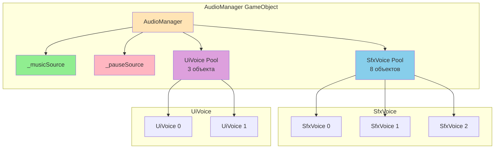
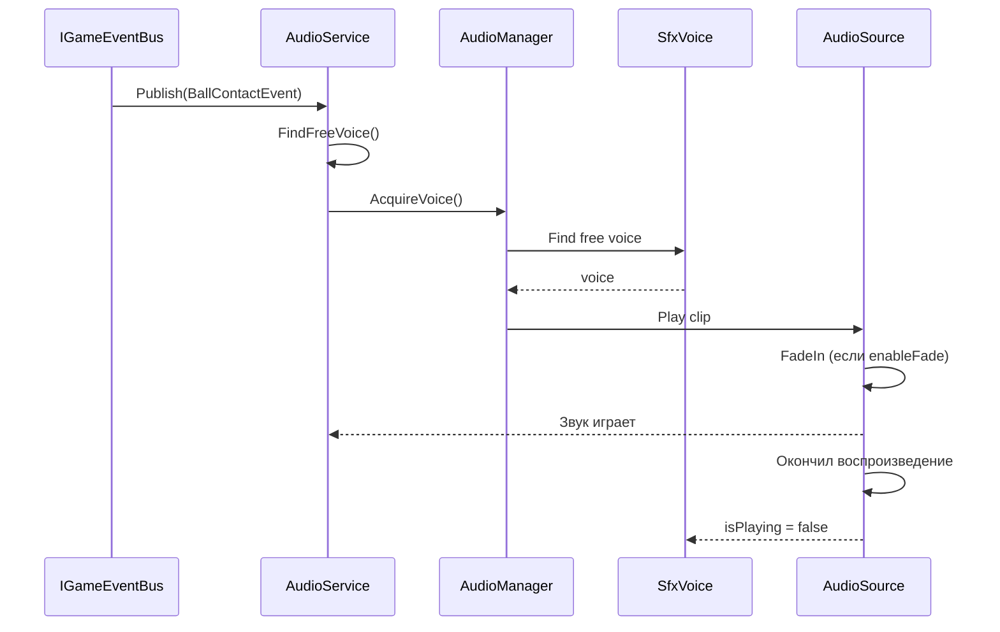
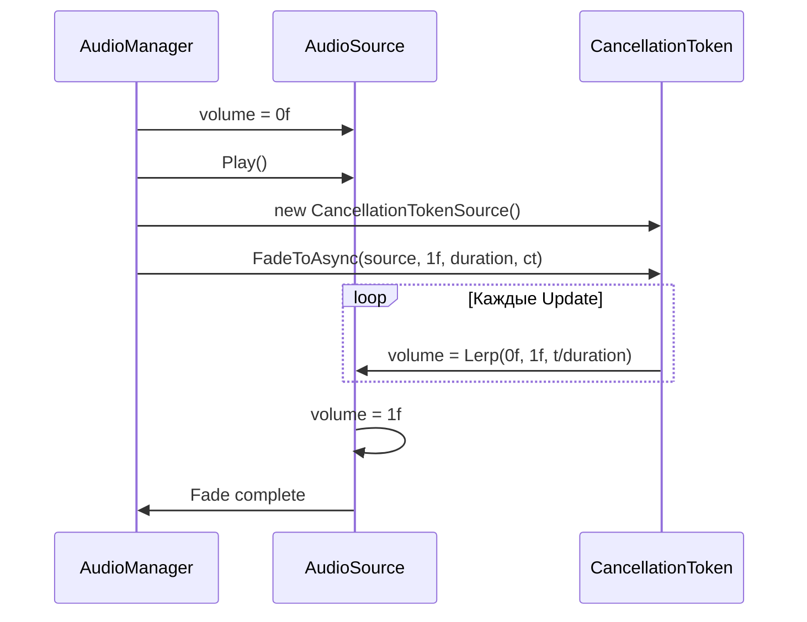
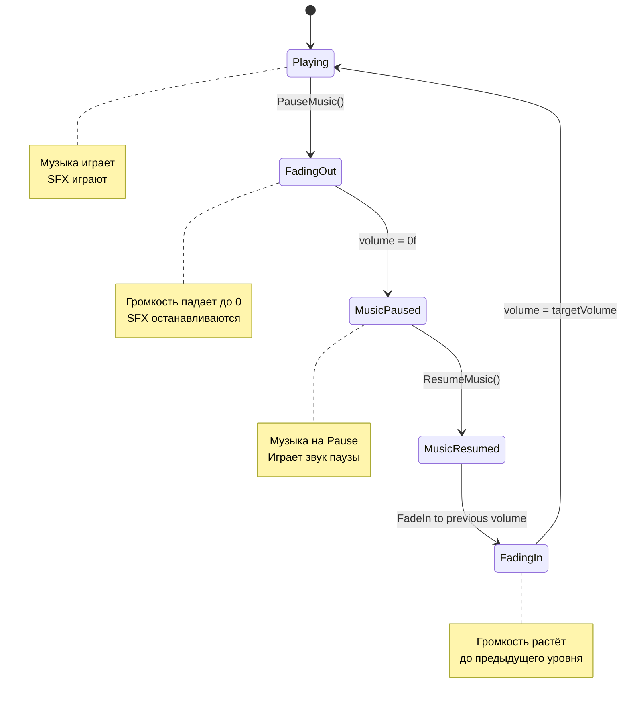

# 📊 ДИАГРАММЫ И МЕТРИКИ — КОД: AUDIOMANAGER

---

## 📈 Метрики AudioManager

| Метрика | Значение | Описание |
|---------|----------|----------|
| AudioSource | 12 | 1 music + 1 pause + 8 SFX + 3 UI |
| Полей | 15+ | config, mixer, sfxPoolSize, и др. |
| Методов | 25+ | Play, Stop, PauseMusic, FadeToAsync, и др. |
| Пулов | 2 | SFX (8), UI (3) |
| Строки кода | ~608 | Основной файл |

---

## 🏗️ Диаграмма структуры AudioManager

---

## 🔄 Диаграмма жизненного цикла звука

---

## 🔄 Диаграмма Fade In/Out

---

## 🔄 Диаграмма паузы

---

## 📊 Метрики AudioManager

| Метрика | Значение | Описание |
|---------|----------|----------|
| AudioSource | 12 | 1 music + 1 pause + 8 SFX + 3 UI |
| Полей | 15+ | config, mixer, sfxPoolSize, и др. |
| Методов | 25+ | Play, Stop, PauseMusic, FadeToAsync, и др. |
| Пулов | 2 | SFX (8), UI (3) |
| Строки кода | ~608 | Основной файл |

---

*← [[04_Аудио/04.1_Код_AudioManager]] | [[04_Аудио/04.2_Код_AudioService|→ Код: AudioService]]*
