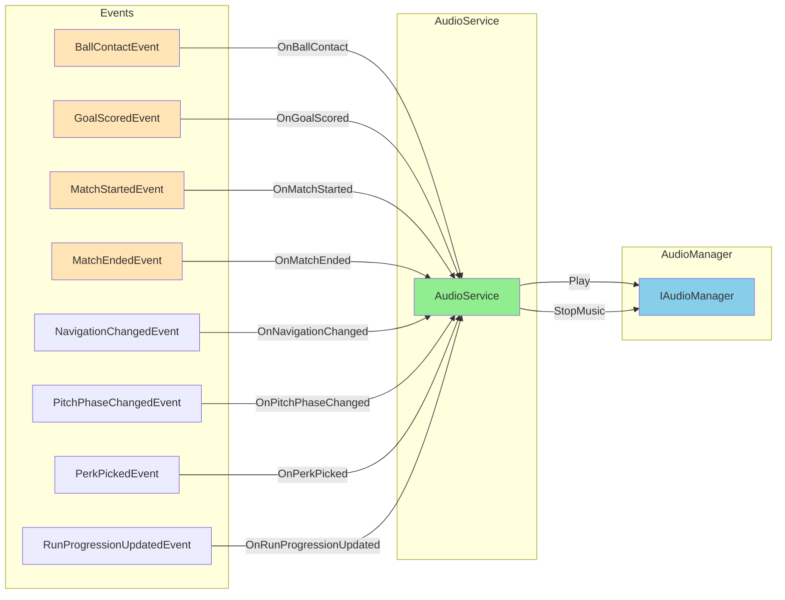
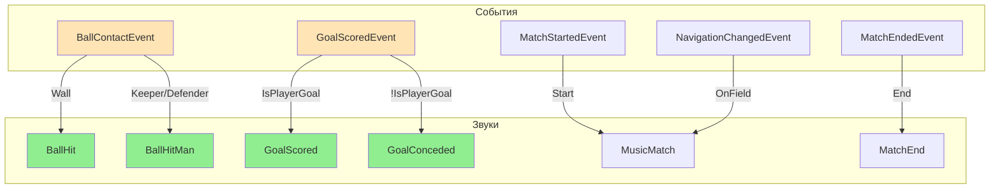

# 📊 ДИАГРАММЫ И МЕТРИКИ — КОД: AUDIOSERVICE

---

## 📈 Метрики AudioService

| Метрика | Значение | Описание |
|---------|----------|----------|
| Подписок | 8+ | Subscribe в конструкторе |
| Методов | 15+ | OnBallContact, OnGoalScored, и др. |
| Событий | 8+ | Различных типов событий |
| Полей | 5 | _bus, _audio, _subscriptions, _lastRunLevel, _onField |
| Строки кода | ~253 | Основной файл |

---

## 🔗 Диаграмма подписок AudioService

---

## 🔄 Диаграмма маппинга событий на звуки

---

## 📊 Метрики AudioService

| Метрика | Значение | Описание |
|---------|----------|----------|
| Подписок | 8+ | Subscribe в конструкторе |
| Методов | 15+ | OnBallContact, OnGoalScored, и др. |
| Событий | 8+ | Различных типов событий |
| Полей | 5 | _bus, _audio, _subscriptions, _lastRunLevel, _onField |
| Строки кода | ~253 | Основной файл |

---

*← [[04_Аудио/04.2_Код_AudioService]] | [[05_Прогрессия/05_Прогрессия|→ Глава 5: Прогрессия]]*
