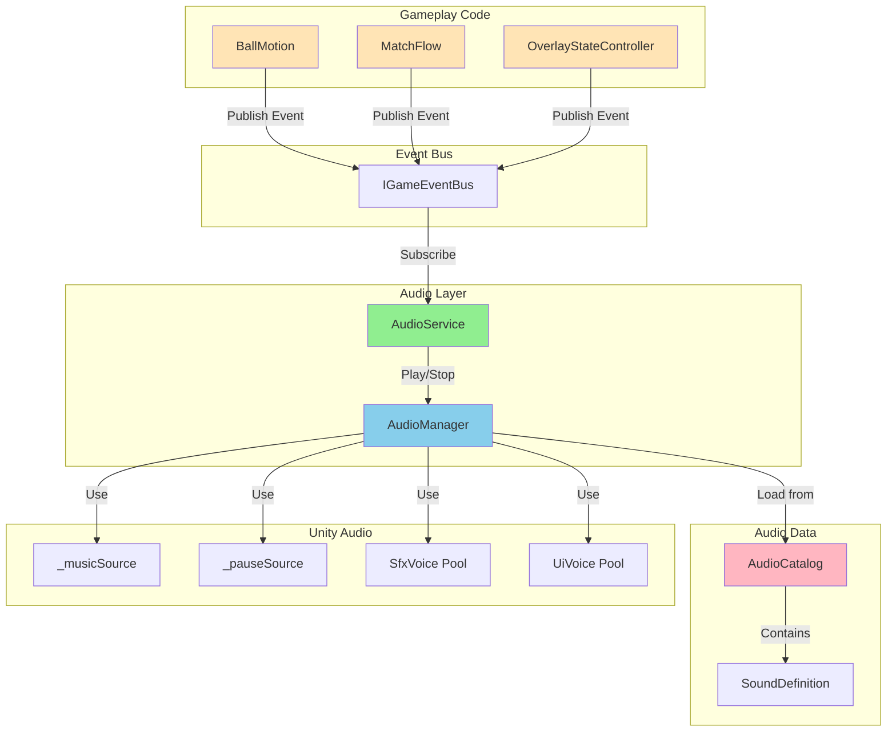

# 📊 ДИАГРАММЫ И МЕТРИКИ — АУДИО

---

## 📈 Метрики аудио-системы

| Метрика | Значение | Описание |
|---------|----------|----------|
| Компонентов | 6 | IAudioManager, AudioManager, AudioService, и др. |
| Методов IAudioManager | 12 | Play, Stop, PauseMusic, ResumeMusic, и др. |
| Подписок AudioService | 20+ | Subscribe в конструкторе |
| Каналов | 3 | Music, GameplaySfx, UiSfx |
| Голосов SFX | 8 | _sfxVoices |
| Голосов UI | 3 | _uiVoices |
| Звуков в каталоге | 20+ | SoundDefinition'ы |
| Строки кода | ~900 | Все аудио файлы |

---

## 🏗️ Диаграмма архитектуры аудио-системы

---

## 📊 Метрики аудио-системы

| Метрика | Значение | Описание |
|---------|----------|----------|
| Компонентов | 6 | IAudioManager, AudioManager, AudioService, и др. |
| Методов IAudioManager | 12 | Play, Stop, PauseMusic, ResumeMusic, и др. |
| Подписок AudioService | 20+ | Subscribe в конструкторе |
| Каналов | 3 | Music, GameplaySfx, UiSfx |
| Голосов SFX | 8 | _sfxVoices |
| Голосов UI | 3 | _uiVoices |
| Звуков в каталоге | 20+ | SoundDefinition'ы |
| Строки кода | ~900 | Все аудио файлы |

---

*← [[04_Аудио/04_Аудио]] | [[04_Аудио/04.1_Код_AudioManager|→ Код: AudioManager]]*
