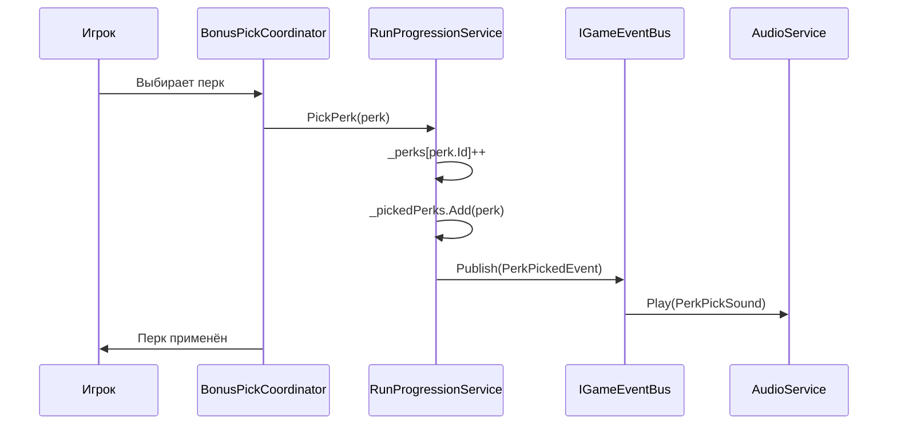
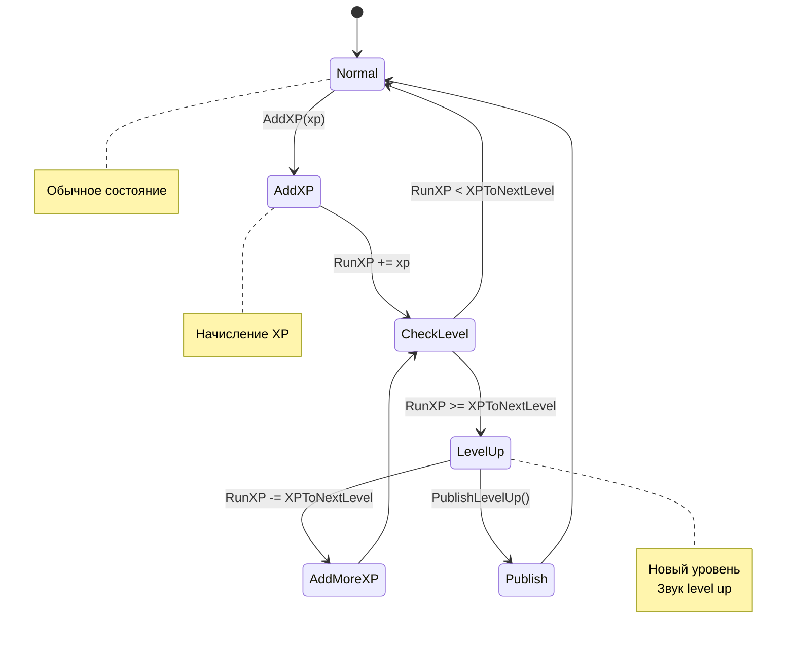

# 📊 ДИАГРАММЫ И МЕТРИКИ — КОД: PROGRESSION

---

## 📈 Метрики Progression

| Метрика | Значение | Описание |
|---------|----------|----------|
| Методов | 10+ | AddXP, PickPerk, Reset, и др. |
| Полей | 5 | RunLevel, RunXP, _perks, _pickedPerks, и др. |
| Событий | 3 | LevelUp, PerkPicked, Reset |
| Зависимостей | 2 | IGameEventBus, PerkDefinition |
| Строки кода | ~150 | Все прогрессия файлы |

---

## 🔄 Диаграмма жизненного цикла перка

---

## 🔄 Диаграмма начисления XP

---

## 📊 Метрики Progression

| Метрика | Значение | Описание |
|---------|----------|----------|
| Методов | 10+ | AddXP, PickPerk, Reset, и др. |
| Полей | 5 | RunLevel, RunXP, _perks, _pickedPerks, и др. |
| Событий | 3 | LevelUp, PerkPicked, Reset |
| Зависимостей | 2 | IGameEventBus, PerkDefinition |
| Строки кода | ~150 | Все прогрессия файлы |

---

*← [[05_Прогрессия/05.1_Код_Progression]] | [[06_Практика/06_Практика|→ Глава 6: Практика]]*
