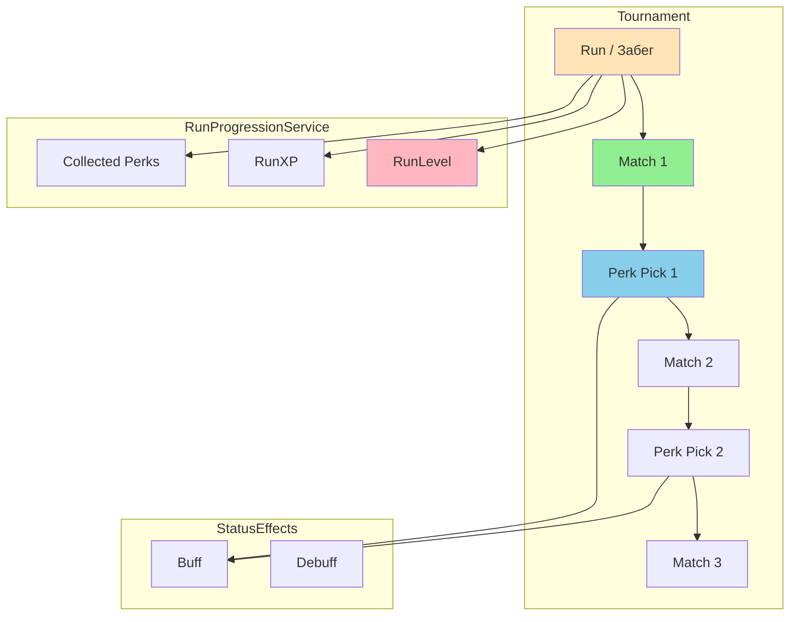
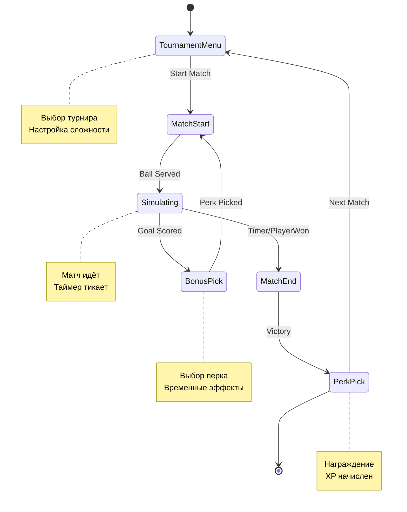

# 📊 ДИАГРАММЫ И МЕТРИКИ — ПРОГРЕССИЯ

---

## 📈 Метрики прогрессии

| Метрика | Значение | Описание |
|---------|----------|----------|
| Сервисов | 3 | IRunProgressionService, TournamentRunService, PerkDefinition |
| Состояний | 6 | TournamentMenu, MatchStart, Simulating, BonusPick, PerkPick, MatchEnd |
| Эффектов | 5+ | Buff, Debuff, и др. |
| Перков | 10+ | PerkDefinition'ы |
| Строки кода | ~150 | Все прогрессия файлы |

---

## 🔄 Диаграмма прогрессии забега

---

## 🔄 Диаграмма жизненного цикла забега

---

## 📊 Метрики прогрессии

| Метрика | Значение | Описание |
|---------|----------|----------|
| Сервисов | 3 | IRunProgressionService, TournamentRunService, PerkDefinition |
| Состояний | 6 | TournamentMenu, MatchStart, Simulating, BonusPick, PerkPick, MatchEnd |
| Эффектов | 5+ | Buff, Debuff, и др. |
| Перков | 10+ | PerkDefinition'ы |
| Строки кода | ~150 | Все прогрессия файлы |

---

*← [[05_Прогрессия/05_Прогрессия]] | [[05_Прогрессия/05.1_Код_Progression|→ Код: Progression]]*
